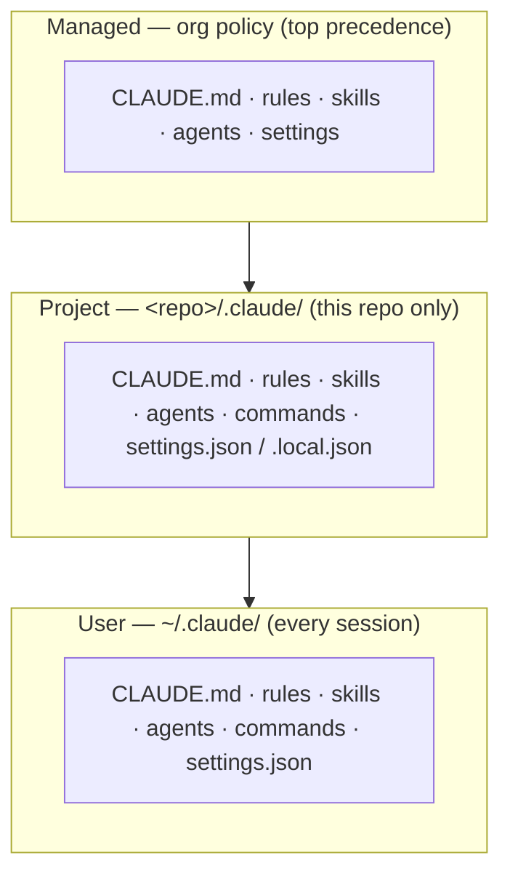
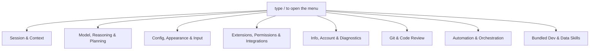
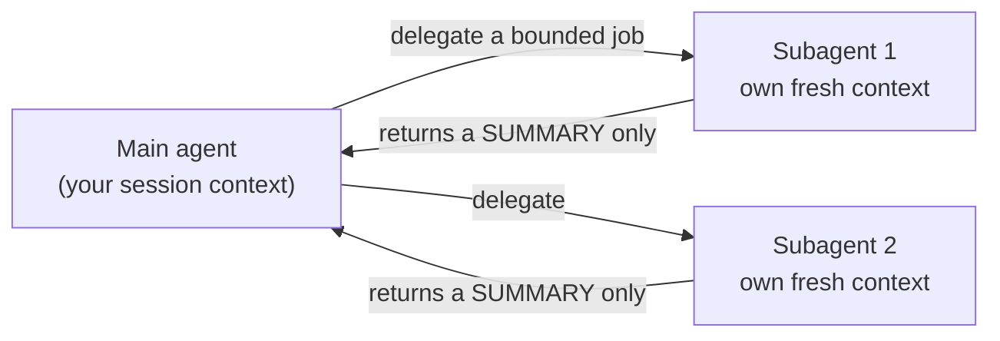
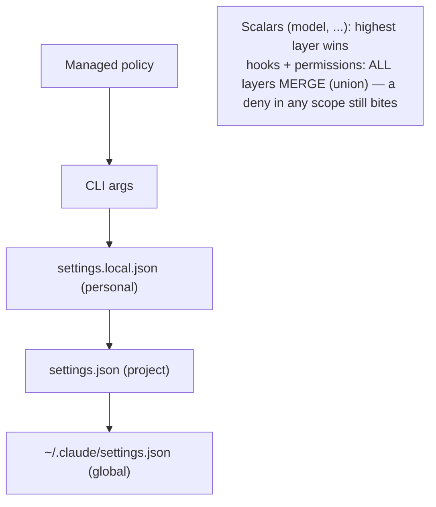
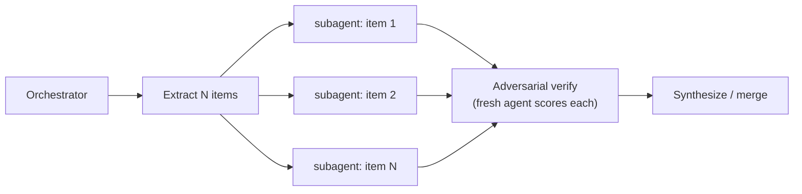

<!-- SPDX-License-Identifier: MIT · Copyright (c) 2026 Neill Prohaska <forest.microclimate@gmail.com> -->
# Claude Code — Architecture & Advanced Use

> ⚠ **Superseded (2026-07-07)** by the multi-document Advanced guide set in `advanced/` — start at `advanced/00_overview.md`. This single-file version is retained as historical source; safe to delete once the set is confirmed.

This is the human twin (`ADVANCED.md`) of the authoritative machine root `ADVANCED.machine.md`; this version and its PDF are derived from that root and rendered with `/folio`. It is written for a user past the basics who wants to *extend and orchestrate* Claude Code — its architecture (scopes, skills, agents, settings, hooks), its advanced automation (loops, dynamic workflows), and authoring your own extensions.

## A0 · Orientation

This is the advanced guide to Claude Code's extension architecture and advanced orchestration, for a user already past `QUICKSTART` and `USAGE_DETAILED`. Read it as a map first (§A1), then take one section per extension point: skills and commands (§A2), agents (§A3), context and memory (§A4), settings (§A5), hooks (§A6), and automation (§A7); after that come the methodology sources (§A8), an authoring loop (§A9), references (§A10), and the glossary (§A11).

Hit a term from the basics? It is defined in the `USAGE_DETAILED` glossary. Hit a new advanced term? Jump to §A11.

Every section reads in the same shape — what it is *for*, a *handle* (a mental model), the *mechanics*, the one load-bearing *invariant*, and how it *feeds* the rest — and this guide is itself a machine→human→PDF artifact: you are reading the human twin (`ADVANCED.md`), translated from the machine root.

## A1 · The Map — the Extension Architecture

Everything that customizes Claude Code — instructions, skills, agents, commands, hooks, settings — installs as *files* under a `.claude/` directory. What differs is not the kind of file but *where* it lives: three **scopes** decide who gets a given customization.

The mental model is layering on a global baseline. Your **User** scope holds your defaults everywhere; a **Project** scope adds this repo's contributions; and **Managed** policy sits on top as organization policy. The three scopes are:

- **User** (`~/.claude/`) — applies to *every* session you run.
- **Project** (`<repo>/.claude/`) — applies only when you launch Claude Code inside that repo.
- **Managed** (enterprise/admin policy) — applies organization-wide, set by an administrator.

Each scope holds the *same kinds* of thing: `CLAUDE.md` (instructions), `rules/*.md`, `skills/<name>/SKILL.md`, `agents/*.md`, `commands/*.md`, and `settings.json` (which is where `hooks` register).

Crucially, scopes **stack** rather than replace. A Project scope *adds* to the User baseline — both load — and Managed sits above both. Specific scopes stack onto the global baseline rather than overwriting it. (When two scopes set the *same settings key*, that precedence conflict resolves as described in §A5.)

The invariant to hold onto: **scope is just install location, and location alone decides reach.** The same `x.md` file under `~/.claude/skills/` is global; under `<repo>/.claude/skills/` it is repo-only. Move the file and you change its reach — nothing else.

This map is the grid every later section fills in: skills and commands (§A2), agents (§A3), `CLAUDE.md` and memory (§A4), settings and precedence (§A5), and hooks (§A6) all resolve through these three scopes.

**Figure — the three scopes (User/Project/Managed) and what loads from each.**

## A2 · Skills & Slash Commands (one merged mechanism)

A skill (or slash command) packages a reusable instruction or capability that you trigger by name or let Claude auto-invoke. The realization that matters for power users is that these are *one* mechanism with two file shapes: a "command" is the thin form and a "skill" is the folder form, but both mint the same `/x`.

Concretely, both `<repo>/.claude/commands/x.md` and `<repo>/.claude/skills/x/SKILL.md` produce a `/x` that behaves the same way. There are two paths to invocation: Claude *auto-invokes* the skill when your task matches it (its `description:` is always in context), or you *force* it by typing `/name`.

Arguments work like this: any trailing text after the name becomes `$ARGUMENTS` (so `/fix-issue 123` sets `$ARGUMENTS` to `123`), and you can also read positional `$1`, `$2`, … or `$ARGUMENTS[N]`.

Skills stack: you can chain them, so `/code-review /fix-issue 123` runs both, composed in a single turn.

Two independent frontmatter switches control invocation, and they are orthogonal:

- `disable-model-invocation: true` stops Claude from auto-invoking the skill, but you can still run it with `/name`.
- `user-invocable: false` hides it from the `/` menu, but Claude can still invoke it.

Together these produce four states: **on** (auto-invoke and `/name`), **name-only** (`disable-model-invocation` set), **user-invocable-only** (Claude-only, hidden from the menu), and **off** (both switches set).

On a name clash, the skill beats the command.

To author one, create `~/.claude/skills/<name>/SKILL.md` with frontmatter — `name`, `description`, `argument-hint`, `allowed-tools`, `model`, and so on. Because a skill is a *folder*, it can carry references and scripts alongside `SKILL.md`.

Progressive disclosure keeps this cheap: only the `description` loads up front, and the body loads on demand when the skill is invoked — so keeping many skills installed costs little.

The load-bearing invariant: `description:` is the *matcher* for auto-invocation, so write it as a specific, positive, trigger-phrased sentence that names *when* it fires — not a vague summary.

Feeds: skills *are* slash commands (this is the merged mechanism the basics simply call "skills"); agents (§A3) are the delegated cousin; and the toolkit's own `/baton`, `/folio`, `/machine-md`, and `/solo` are skills authored in exactly this way (§A9).

## A2b · The Stock Slash Commands (built-in catalog)

This is the *complete* set of Anthropic-shipped `/commands` you can type in a 2.1.201 session — the built-in verbs of the tool, as opposed to the skills and agents you author yourself (§A2/§A3). Think of it as a control panel with one row per built-in action: type `/` to filter the live menu, and read this as its annotated map.

Read each entry as `/name <args>` — what it does — then `EX:` a concrete call. `<arg>` is required and `[arg]` is optional. A `[Skill]` or `[Workflow]` tag marks an Anthropic-*bundled* skill or workflow (a prompt Claude can also auto-invoke) — still stock, just not a hard-coded command. The catalog is sourced from the 2.1.201 binary's command registry (`type:"local"|"local-jsx"|"prompt",name:…`) cross-checked against the published `/commands` reference; only enabled, user-facing entries appear.

### Session & Context

Managing the conversation itself — context, checkpoints, resuming, background work, and the working directory.

- `/clear [name]` — start a fresh conversation with empty context (the prior one stays in `/resume`); aliases `/reset`, `/new`. EX: `/clear`.
- `/compact [instructions]` — summarize the conversation so far to free context, with an optional focus. EX: `/compact keep the AR1 model contract + the file paths we're editing`.
- `/context [all]` — visualize what is filling the context window as a colored grid. EX: `/context`.
- `/rewind` — roll code and/or the conversation back to a checkpoint, or summarize from a message; aliases `/checkpoint`, `/undo`. EX: `/rewind`.
- `/resume [session]` — reopen a past conversation by id/name or via the picker; alias `/continue`. EX: `/resume`.
- `/branch [name]` — fork the conversation at this point into a copy you switch into (the original is preserved). EX: `/branch try-brms`.
- `/fork <directive>` — spawn a background subagent that inherits the full conversation and works the directive while you continue. EX: `/fork draft unit tests for the gap-fill splice`.
- `/export [filename]` — export the conversation as plain text (to a file, or the clipboard). EX: `/export session.txt`.
- `/copy [N]` — copy the last (or Nth-latest) assistant response to the clipboard. EX: `/copy 2`.
- `/rename [name]` — rename the session; with no argument it auto-generates one from history. EX: `/rename model-refit`.
- `/btw <question>` — ask an ephemeral side question (full context, no tools) that never enters history. EX: `/btw which tz did we standardize on?`.
- `/recap` — generate a one-line summary of the session on demand. EX: `/recap`.
- `/memory` — edit `CLAUDE.md` files and view/toggle auto-memory. EX: `/memory`.
- `/add-dir <path>` — grant file access to another working directory for this session. EX: `/add-dir ../shared-data`.
- `/cd <path>` — move the session to a new working directory (the cache is kept; the new `CLAUDE.md` is appended). EX: `/cd projects/omega`.
- `/diff` — open an interactive viewer of uncommitted changes and per-turn diffs. EX: `/diff`.
- `/focus` — toggle the focus view (last prompt, a one-line tool summary, and the final response); fullscreen only. EX: `/focus`.
- `/tasks` — view/manage everything running in the background this session; alias `/bashes`. EX: `/tasks`.
- `/background [prompt]` — detach the whole session to run as a background agent, freeing the terminal; alias `/bg`. EX: `/background`.
- `/stop` — stop the current background session (the transcript and worktree are kept). EX: `/stop`.

### Model, Reasoning & Planning

Choosing the model, how hard it thinks, and whether to plan first.

- `/model [model]` — switch model and save it as the default for new sessions (`s` = this session only). EX: `/model opus`.
- `/effort [level|auto]` — set reasoning effort (`low`…`max`, `ultracode`); with no argument it opens a slider. EX: `/effort high`.
- `/fast [on|off]` — toggle fast mode. EX: `/fast on`.
- `/advisor [model|off]` — enable/disable a second model that advises at key moments during a task. EX: `/advisor sonnet`.
- `/plan [description]` — enter plan mode, optionally seeded with a task. EX: `/plan refactor the bam AR1 wrapper`.

### Config, Appearance & Input

Settings UI, theming, the status line, keyboard/terminal setup, and input modes.

- `/config [key=value …]` — open the Settings UI, or set keys inline; alias `/settings`. EX: `/config theme=dark`.
- `/theme` — change the color theme (auto/light/dark/daltonized/ANSI/custom). EX: `/theme`.
- `/statusline` — configure the status line (describe it, or auto-detect from your shell prompt). EX: `/statusline show git branch + model`.
- `/keybindings` — open your keyboard-shortcuts file. EX: `/keybindings`.
- `/terminal-setup` — install Shift+Enter and other keybindings for terminals that need it (VS Code, Zed, …). EX: `/terminal-setup`.
- `/color [color|default]` — set the prompt-bar color for this session. EX: `/color cyan`.
- `/tui [default|fullscreen]` — set the renderer and relaunch (fullscreen = flicker-free alt-screen). EX: `/tui fullscreen`.
- `/scroll-speed` — adjust mouse-wheel scroll speed (fullscreen only). EX: `/scroll-speed`.
- `/voice [hold|tap|off]` — toggle voice dictation or set its mode (needs a claude.ai account). EX: `/voice tap`.
- `/ide` — manage IDE integrations and show status. EX: `/ide`.
- `/chrome` — open Claude-in-Chrome settings. EX: `/chrome`.

### Extensions, Permissions & Integrations

Permissions, hooks, MCP, plugins/skills reloading, and one-time integration installers.

- `/permissions` — manage allow/ask/deny tool rules and working dirs; alias `/allowed-tools`. EX: `/permissions`.
- `/hooks` — view hook configurations for tool events. EX: `/hooks`.
- `/mcp [reconnect|enable|disable …]` — manage MCP server connections and OAuth. EX: `/mcp`.
- `/plugin [subcommand]` — manage plugins (`list`/`install`/`enable`/`disable`). EX: `/plugin list`.
- `/reload-plugins [--force]` — reload active plugins without restarting. EX: `/reload-plugins`.
- `/reload-skills` — re-scan skill/command dirs so on-disk changes load without a restart. EX: `/reload-skills`.
- `/skills` — list available skills (filter by name; `t` sorts by tokens; `Space` toggles visibility). EX: `/skills`.
- `/agents` — print a reminder to ask Claude to create/manage subagents (or edit `.claude/agents/`). EX: `/agents`.
- `/sandbox` — toggle sandbox mode (supported platforms only). EX: `/sandbox`.
- `/init` — generate a starter `CLAUDE.md` for the repo. EX: `/init`.
- `/install-github-app` — install the Claude GitHub App (plus optional Actions setup). EX: `/install-github-app`.
- `/install-slack-app` — install the Claude Slack app via OAuth. EX: `/install-slack-app`.
- `/setup-bedrock` — configure Amazon Bedrock auth/region/model pins (shows when `CLAUDE_CODE_USE_BEDROCK=1`). EX: `/setup-bedrock`.
- `/setup-vertex` — configure Google Vertex auth/project/region (shows when `CLAUDE_CODE_USE_VERTEX=1`). EX: `/setup-vertex`.
- `/web-setup` — connect your GitHub account to Claude Code on the web via local `gh`. EX: `/web-setup`.
- `/design-login` — authorize design-system access for `/design-sync`. EX: `/design-login`.
- `/design-sync [hint]` `[Skill]` — convert your repo's React design system and upload it to Claude Design. EX: `/design-sync Acme DS`.

### Info, Account & Diagnostics

Help, status/usage, health checks, account and platform, plus the odd extras.

- `/help` — show help and available commands. EX: `/help`.
- `/status` — open Settings on the Status tab (version, model, account, connectivity); works mid-response. EX: `/status`.
- `/usage` — show session cost, plan limits, and activity stats; aliases `/cost`, `/stats`. EX: `/usage`.
- `/usage-credits` — configure usage credits to keep working past a limit (was `/extra-usage`). EX: `/usage-credits`.
- `/release-notes` — view the changelog in an interactive version picker. EX: `/release-notes`.
- `/doctor` — diagnose and verify the install/settings (`f` = have Claude fix the issues). EX: `/doctor`.
- `/heapdump` — write a JS heap snapshot and memory breakdown to `~/Desktop` for high-memory diagnosis. EX: `/heapdump`.
- `/insights` — a report analyzing your sessions (project areas, interaction patterns, friction points). EX: `/insights`.
- `/team-onboarding` — generate a team onboarding guide from your last 30 days of usage. EX: `/team-onboarding`.
- `/login` — sign in to your Anthropic account. EX: `/login`.
- `/logout` — sign out of your Anthropic account. EX: `/logout`.
- `/upgrade` — open the plan-upgrade page (Pro/Max only). EX: `/upgrade`.
- `/privacy-settings` — view/update privacy settings (Pro/Max only). EX: `/privacy-settings`.
- `/feedback [report]` — submit feedback, report a bug, or share the conversation; aliases `/bug`, `/share`. EX: `/feedback the diff viewer flickers on branch switch`.
- `/desktop` — continue the session in the Claude Code desktop app (macOS/Windows and a subscription); alias `/app`. EX: `/desktop`.
- `/mobile` — show a QR code to download the mobile app; aliases `/ios`, `/android`. EX: `/mobile`.
- `/powerup` — learn features through quick interactive lessons with animated demos. EX: `/powerup`.
- `/passes` — share a free week of Claude Code with friends (if eligible). EX: `/passes`.
- `/stickers` — order Claude Code stickers. EX: `/stickers`.
- `/radio` — open Claude FM lo-fi radio in the browser. EX: `/radio`.
- `/exit` — exit the CLI (detaches if attached to a background session); alias `/quit`. EX: `/exit`.

### Git & Code Review

Reviewing the working diff or a PR, security scans, and automated PR fixing.

- `/code-review [low|…|max|ultra] [--fix] [--comment] [target]` `[Skill]` — review the working diff for correctness bugs and cleanups; `--fix` applies them, `--comment` posts PR comments, and `ultra` runs in the cloud. EX: `/code-review high --fix`.
- `/simplify [target]` `[Skill]` — a cleanup-only review (reuse/simplify/efficiency/altitude) that applies fixes, with no bug-hunt. EX: `/simplify R/gapfill.R`.
- `/review [PR]` — run the `/code-review` engine on a GitHub PR (with no argument it lists open PRs). EX: `/review 123`.
- `/security-review` — scan the branch's pending changes for security vulnerabilities (injection/auth/exposure). EX: `/security-review`.
- `/ultrareview [PR]` — deep multi-agent cloud review; the preferred form is now `/code-review ultra`. EX: `/code-review ultra`.
- `/autofix-pr [prompt]` — spawn a cloud session that watches the branch's PR and pushes fixes on CI/review failures. EX: `/autofix-pr only fix lint + type errors`.

### Automation & Orchestration

Running work unattended — loops, goals, schedules, batches, and cloud/remote sessions.

- `/loop [interval] [prompt]` `[Skill]` — re-run a prompt on an interval (omit the interval to run self-paced); alias `/proactive`. EX: `/loop 5m check if the bam fit finished`.
- `/goal [condition|clear]` — keep working across turns until a verifiable condition is met. EX: `/goal every gam.check k-index > 0.95`.
- `/schedule [description]` — create/list/run cloud routines on a cron; alias `/routines`. EX: `/schedule nightly QC report at 6am`.
- `/batch <instruction>` `[Skill]` — decompose a large codebase change into 5–30 units, one background subagent per git worktree. EX: `/batch add roxygen docs to every R/ function`.
- `/workflows` — open the workflow progress view (watch/pause/resume/save). EX: `/workflows`.
- `/deep-research <question>` `[Workflow]` — fan out web searches, cross-check sources, and synthesize a cited report. EX: `/deep-research recent evidence on stomatal-optimization models`.
- `/ultraplan <prompt>` — draft a plan in a cloud session, review it in-browser, then execute remotely or send it back. EX: `/ultraplan design the next analysis phase`.
- `/remote-control` — make this local session controllable from claude.ai; alias `/rc`. EX: `/remote-control`.
- `/remote-env` — choose the default environment for cloud agents. EX: `/remote-env`.
- `/teleport` — pull a Claude-Code-on-the-web session into this terminal; alias `/tp`. EX: `/teleport`.

### Bundled Dev & Data Skills

Here a `[Skill]` tag marks an Anthropic-shipped skill, auto-invocable.

- `/debug [description]` `[Skill]` — enable session debug logging and troubleshoot by reading the debug log. EX: `/debug chains split at iteration 3500`.
- `/verify` `[Skill]` — confirm a change works by building and running the app and observing it, not just tests. EX: `/verify`.
- `/run` `[Skill]` — launch and drive your project's app to see a change working. EX: `/run`.
- `/run-skill-generator` `[Skill]` — author a per-project skill teaching `/run` and `/verify` how to build/launch/drive the app. EX: `/run-skill-generator`.
- `/dataviz [request]` `[Skill]` — chart/dashboard design guidance (form, colorblind-safe palette, marks, accessibility). EX: `/dataviz seasonal flux by sensor height`.
- `/claude-api [migrate|managed-agents-onboard]` `[Skill]` — load the Claude API reference for your language; `migrate` upgrades model IDs. EX: `/claude-api`.
- `/fewer-permission-prompts` `[Skill]` — scan transcripts for common read-only calls and add a project allowlist. EX: `/fewer-permission-prompts`.

**Not in this catalog** (present in the 2.1.201 binary yet not user-facing):

- *Removed* — `/pr-comments` (gone since 2.1.91 — ask Claude to view PR comments instead) and `/vim` (gone since 2.1.92 — use `/config` then Editor mode).
- *Disabled / flag-gated* (`isEnabled` false) — `/wellbeing`, `/brief`, `/version`, `/loops`, `/update`.
- *Internal actions the harness fires* (not typed) — `autocompact`, `daemon`, `session`, `pause-memory`, `skill-doctor`, `pro-trial-expired`, `rate-limit-options`, `design-consent`/`design-revoke`, and `extra-usage` (a legacy alias of `/usage-credits`).

The invariant here is that availability is *conditional*: an entry appears only when its `isEnabled()` check passes for your platform, plan, and environment — `/setup-bedrock` needs `CLAUDE_CODE_USE_BEDROCK=1`, `/upgrade` is Pro/Max, and so on. So the live `/` menu is the ground truth for *your* session, and this catalog is the 2.1.201 superset.

Feeds: these built-ins compose with the skills and commands you author (§A2 — remember a `SKILL` beats a built-in on a name clash) and with agents (§A3). The automation verbs (`/loop`, `/goal`, `/schedule`, `/workflows`, `/batch`) are the §A7 layer, and `/config`, `/permissions`, `/hooks`, and `/mcp` are the front doors to §A5 and §A6.

**Figure — the stock `/` menu grouped by category (session · model · config · info · git · automation · skills).**

## A3 · Agents & Subagents (the same thing)

An agent lets you hand a bounded job to a *separate* context window so the main thread stays clean. A "subagent" is just an agent that the main agent calls — the word names the *relationship*, not a different kind of thing. When the main agent invokes one, it runs in its own fresh context window, and only its *summary* returns to the main thread.

Agents are defined in `.claude/agents/*.md`. The frontmatter requires `name` and `description`, with optional `tools`, `model`, `effort`, and `isolation`. There are three ways to invoke one: (1) automatic delegation when the `description` matches the task, (2) `@agent-<name>` to force a specific one, or (3) the Agent tool programmatically (this was renamed from Task; `Task()` still aliases it). Three built-ins ship: `Explore` (read-only search), `Plan` (design a plan), and `general-purpose` (catch-all).

One important variant is a **fork**: a `fork` inherits the full parent conversation — it starts *with* the main thread's context — in contrast to a normal subagent, which starts fresh (empty).

The invariant that makes agents worth using: a subagent spends a *separate* context window, so its intermediate exploration and verification do not accrue to the main thread — only the distilled summary comes back. That isolation *is* the reason to delegate.

Feeds: dynamic workflows (§A7) orchestrate many subagents into a harness; the toolkit's five agents — research-facing (`code-review-debugger`, `machine-doc-reviewer`, `version-control-docs`) plus two toolkit-builder agents (`agent-tooling-engineer`, `research-data-manager`) — are authored this way (§A9); and delegating is what keeps the main context clean (§A4).

**Figure — main agent delegating to isolated subagent contexts, each returning a summary.**

## A4 · Context, Memory & CLAUDE.md

This section is about what Claude *knows* at the start of a turn, which arrives through two channels: auto-memory (which *Claude* writes) and `CLAUDE.md` (which *you* write). The handle: memory is a notebook Claude keeps for itself across sessions, while `CLAUDE.md` is the standing orders you pin.

**Auto-memory** lives at `~/.claude/projects/<git-root-slug>/memory/`, keyed by the git *repo root*, machine-local, where Claude writes its learnings. Only the first ~200 lines / 25 KB of `MEMORY.md` load at the start of a session, so keep the top dense.

**`CLAUDE.md`** is where *you* write instructions, and it loads in full with no truncation — the place for durable directives. The hierarchy concatenates from broad to specific: managed → `~/.claude/CLAUDE.md` → `./CLAUDE.md` or `./.claude/CLAUDE.md` → `./CLAUDE.local.md`. Every level that is present combines. An `@import <path>` directive pulls another file's content in, with nesting depth up to 4.

Rules in `.claude/rules/*.md` load like `CLAUDE.md` (always on); a `paths:` frontmatter entry scopes a rule to file globs so it loads only when a matching file is in play.

The **managed block** is how this toolkit stays re-installable without clobbering you: it assembles its global `CLAUDE.md` inside markers — `<!-- >>> claude-research-toolkit (managed) >>> -->` … `<!-- <<< claude-research-toolkit (managed) <<< -->` — so a re-install regenerates *only* that block and your content outside the markers survives.

**Transcripts** are the full turn history, stored at `~/.claude/projects/<slug>/<sessionId>.jsonl`; `claude --resume`, `--continue`, and `--fork-session` re-open them, and the `.jsonl` is portable across machines.

The invariant: memory is truncated at load (~200 lines / 25 KB) while `CLAUDE.md` is not — so anything that *must* always be seen belongs in `CLAUDE.md` or a rule, not buried deep inside a memory file.

Feeds: the always-on rules ride this same loader; the managed block is why the toolkit re-installs without clobbering you (§A5); and transcripts underpin resume (§A8).

## A5 · Settings, Scopes & the Directory Hierarchy

Settings configure the harness — model, permissions, env, hooks, output style — per scope. The handle is a *precedence ladder*: the closer or more-privileged the layer, the higher it wins — but two keys, `hooks` and `permissions`, *combine* instead of fighting.

Precedence, high to low: Managed > CLI args > `<repo>/.claude/settings.local.json` (personal, gitignored) > `<repo>/.claude/settings.json` (shared, committed) > `~/.claude/settings.json` (global).

The important exception is that `hooks` and `permissions` **merge, not replace**, across *all* scopes: every layer's entries combine rather than overriding one another. (Scalar keys like `model` instead take the single highest-precedence value.)

The main keys are `model`, `permissions` (allow/ask/deny), `env`, `hooks`, `outputStyle`, `autoMemoryEnabled`, `statusLine`, and more.

This is what lets you run different rules per project: shared, committed guidance goes in each `<repo>/.claude/` (its `CLAUDE.md`, rules, and `settings.json`); personal per-repo bits go in `<repo>/.claude/settings.local.json` and `CLAUDE.local.md` (gitignored); and cross-project defaults live in `~/.claude/`. This toolkit itself deep-merges `~/.claude/settings.json` from four fragments — the install tiers: core (`permissions.deny` plus four dev-hook registrations across the PostToolUse, UserPromptSubmit, and Stop events), ambient-time (`ambient_time.py` on UserPromptSubmit and SessionStart), ergonomics (the xbeep hooks), and personal (model/theme/tui/effort/plugin) — so a re-install adds keys without clobbering existing ones.

The invariant: for `hooks` and `permissions`, more layers means *more* entries (a union) — a deny in any scope still bites and a hook in any scope still fires. You cannot un-set them from a lower layer; you can only add.

Feeds: the merged `permissions.deny` is the safety boundary; the merged `hooks` are the subject of §A6; and this deep-merge is why the toolkit's tiers compose (§A9).

**Figure — settings precedence ladder + which layers merge vs override.**

## A6 · Hooks, Deeply

Hooks are deterministic automation that the *harness* runs on events — not something Claude chooses to do. The handle: think of them as event listeners for your session — a script fires on "edit happened," "prompt submitted," or "Claude stopped," every time, mechanically.

Mechanically, hooks are scripts the harness executes on events (deterministic — Claude does not decide whether they run). You configure them in `settings.json` under `hooks → <Event> → [{ matcher, hooks: [{ type: "command", command }] }]`. There are roughly 30 events, including `PreToolUse`, `PostToolUse`, `UserPromptSubmit`, `Stop`, `SubagentStop`, `SessionStart`, `PreCompact`, and `Notification`.

The I/O contract is simple: context arrives as JSON on STDIN; exit 0 means OK (and stdout *may* carry JSON to control the harness), while exit 2 blocks the action and feeds stderr back to Claude.

To author your own, add a script and register it in `settings.json` under the event. This toolkit ships live examples: `post-edit-review.sh` (PostToolUse on `Edit|Write`, an R-edit review nudge), `pre-complete-verification.sh` (UserPromptSubmit, a verify-before-"done" checklist), and `xbeep` (Notification / Stop / UserPromptSubmit beeps). One gotcha: read STDIN, not env — current Claude Code passes hook data as JSON on STDIN (the old `CLAUDE_*` env vars are no longer set), so parse, for example, `tool_input.file_path` from stdin.

The invariant: hooks run on the *event*, not on Claude's judgment — which makes them the right tool for "always do X when Y happens." A memory or preference can't guarantee that; a hook can.

Feeds: hooks are registered via the settings `hooks` key (§A5, which merges across scopes, so a hook in any scope fires), and the toolkit ships them in the core and ergonomics tiers (§A9).

## A7 · Automation — Loops & Dynamic Workflows

This section is about running work *unattended* — either repeating on a schedule (loops) or orchestrating many agents to beat single-context failure modes (workflows). The handle: a loop is a cron for one command; a workflow is a purpose-built assembly line of subagents.

### Loops

`/loop <interval> <command>` re-runs a command every interval. EX: `/loop 5m check my PR, address review comments, fix failing CI`. `/schedule` moves a loop to the *cloud* so it runs without your terminal open. `/goal <objective>, stop after N tries` iterates until a *verifiable* condition is met (or after N attempts).

Use loops when the work recurs and has clear, verifiable exit criteria; prefer deterministic tests over judgment; and manage your tokens — pilot small, and match the interval to the real rate of change.

### Workflows / Harnesses

A dynamic workflow auto-generates a multi-agent *harness* — a JS file coordinating subagents with isolated contexts — to combat single-context failure modes (stopping early, self-preference bias, goal drift). Trigger one by asking for a "workflow" or by saying `ultracode`.

There are five patterns:

- **classify-and-act** — a router hands off to specialists.
- **fan-out-and-synthesize** — split into N, one agent per item, a barrier, then merge.
- **adversarial-verification** — a *fresh* agent scores each output.
- **tournament** — N approaches, judged pairwise.
- **loop-until-done** — spawn until "no new findings."

Use workflows for complex, high-value tasks (they cost more tokens), so set a token budget. To save one, press "s" and it is stored in `~/.claude/workflows`.

The invariant: the leverage is *isolated contexts*. Each subagent gets a clean window, so an adversarial verifier or a per-item worker cannot inherit the orchestrator's bias or bloat — and that separation is what beats the single-context failure modes.

Feeds: harnesses are subagent orchestration (§A3) at scale, and loops and goals are the automation layer over the whole toolkit.

**Figure — a fan-out-and-synthesize harness: extract → per-item subagents → adversarial verify → merge.**

## A8 · The Methodology Docs

These are the canonical write-ups behind the toolkit's headline behaviors — shipped, but currently *undocumented* in the two usage guides. Think of them as the three "why/how" source docs that specific skills and rules *derive* from: edit the source to change the behavior. They live at `~/.claude/methodology/` as three machine docs:

- **`AUTONOMY_MANDATE`** — the canonical autonomy rule that `/solo` derives from.
- **`HANDOFF_PROTOCOL`** — how to write a resumable handoff; underpins `/baton`.
- **`DOC_STYLE_MACHINE_VS_HUMAN`** — the machine-vs-human doc method; underpins the `doc-style` rule and `/folio`.

The invariant: each doc is the *authoritative* source its skill or rule points back to — so you change a behavior by editing the methodology doc, not the derived skill in isolation.

Feeds: `/solo` (§A2), `/baton`, `/folio`, and the `doc-style` rule (§A4/§A5).

## A9 · Authoring Your Own Extensions

This is a repeatable loop for building your own skill, agent, rule, or hook to the toolkit's own standard. The loop: draft with `/machine-md` (which applies LLM-doc best-practices), audit with the `machine-doc-reviewer` agent, then render a human/PDF twin with `/folio`. It applies to skills, agents, rules, and hooks — any `.claude/` extension.

Tying it all together: everything in this guide is a *file* under a scope (§A1), so authoring an extension means writing the file in the right *shape* — a skill folder (§A2), an agent `.md` (§A3), a rule with `paths:` (§A4), or a hook script plus a `settings.json` registration (§A6) — placing it in the *scope* whose reach you want (§A1/§A5), then restarting the session to load it. The `/machine-md` → `machine-doc-reviewer` → `/folio` loop keeps the machine root, its audit, and its human twin in sync, and the `doc-style` rule keeps the machine `.machine.md` as the authoritative source with the human `.md` and PDF as derived artifacts.

## A10 · References

**Blogs**

- [How we use Skills](https://claude.com/blog/lessons-from-building-claude-code-how-we-use-skills)
- [Getting started with loops](https://claude.com/blog/getting-started-with-loops)
- [A harness for every task: dynamic workflows](https://claude.com/blog/a-harness-for-every-task-dynamic-workflows-in-claude-code)

**Docs**

- [Skills](https://code.claude.com/docs/en/skills)
- [Subagents](https://code.claude.com/docs/en/sub-agents)
- [Memory](https://code.claude.com/docs/en/memory)
- [Settings](https://code.claude.com/docs/en/settings)
- [Hooks](https://code.claude.com/docs/en/hooks)
- [Slash commands](https://code.claude.com/docs/en/slash-commands)
- [Common workflows](https://code.claude.com/docs/en/common-workflows)
- [Interactive mode](https://code.claude.com/docs/en/interactive-mode)
- [CLI reference](https://code.claude.com/docs/en/cli-reference)

## A11 · Glossary (advanced)

- **scope** — the install location (User `~/.claude/`, Project `<repo>/.claude/`, or Managed) that decides a customization's reach (§A1).
- **managed policy** — enterprise/admin-set config and permissions that apply org-wide and take *top* precedence (§A5).
- **fork** — a subagent that inherits the full parent conversation (versus a fresh, empty subagent) (§A3); also `--fork-session` on a transcript (§A4).
- **`$ARGUMENTS`** — the trailing text passed to a slash command (`/fix-issue 123` gives `123`); positional `$1` / `$ARGUMENTS[N]` (§A2).
- **skill stacking** — chaining skills/commands so they compose in one turn (`/code-review /fix-issue 123`) (§A2).
- **harness** — an auto-generated JS orchestrator coordinating subagents in isolated contexts (§A7).
- **orchestration pattern** — a harness shape: classify-and-act, fan-out-and-synthesize, adversarial-verification, tournament, or loop-until-done (§A7).
- **transcript** — the `~/.claude/projects/<slug>/<sessionId>.jsonl` full turn history that `--resume` / `--continue` / `--fork-session` re-open (§A4).
- **managed block** — the `>>> claude-research-toolkit (managed) >>>` … `<<<` markers the installer regenerates, leaving your out-of-block content intact (§A4).
- **`@import`** — a `CLAUDE.md` directive that pulls another file's content in (nesting depth up to 4) (§A4).
