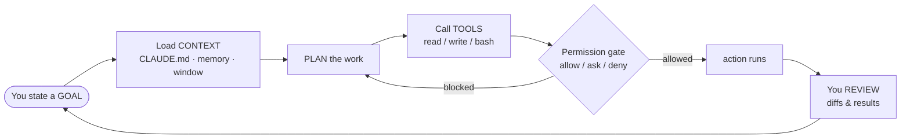
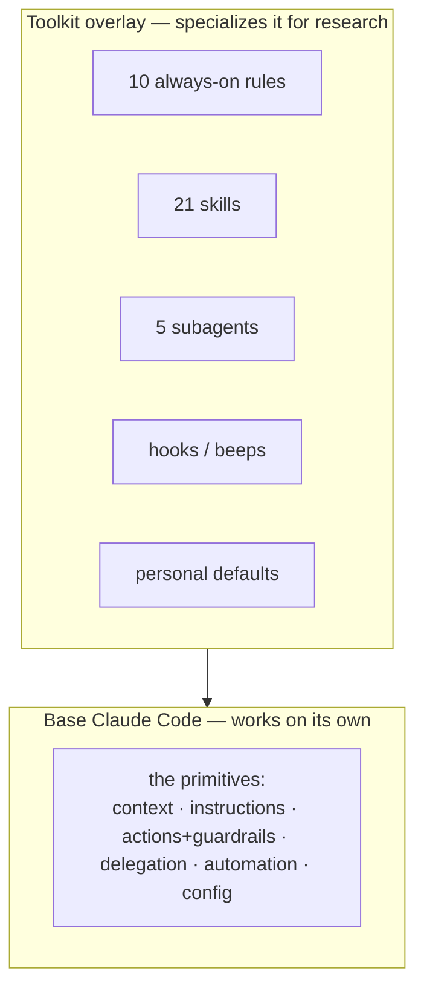

<!-- SPDX-License-Identifier: MIT · Copyright (c) 2026 Neill Prohaska <forest.microclimate@gmail.com> -->
# Claude Code for Research — The Detailed Guide

Welcome. This is the thorough, read-at-your-own-pace manual for using Claude Code as a research collaborator. It assumes you can open a terminal and start a `claude` session, but almost nothing beyond that. By the end you will understand how Claude Code works from near-zero, what the **Claude Research Toolkit** adds on top of it, and how to put the whole thing to work on real analysis.

A word on how this guide is built, because it doubles as a small demonstration. What you are reading is the *human render* of a machine-optimized source file, `USAGE_DETAILED.machine.md`. That machine file is the authoritative root; the human `.md` and the `.pdf` are both derived from it (rendered with the `/folio` skill). Whenever the guide is updated, the change is made in the machine root first and then propagated outward — machine to human to PDF. You will meet that idea again when we reach skills and memory.

## About This Guide

Two guides ship with the toolkit. The **Quickstart** is a day-one primer, one to two pages long — read it first if you are new. This **Detailed Guide** is the reference you are in now. Between them they teach three things, in order: (a) the fundamentals of Claude Code itself, (b) the augmentations the toolkit layers on top, and (c) how to use it all for research. Both guides are themselves machine-to-human-to-PDF artifacts, so — as noted above — the version you are reading is the human render of a `.machine.md` root.

The skeleton of this guide is deliberate: it *is* Claude Code's functional architecture. Rather than memorizing a feature list, you will learn a small set of building blocks — the **primitives** — and then reason about what Claude Code can do from those. The order follows that plan: a **Map** (the mental model), then **Part A** (base Claude Code, one function at a time), then **Part B** (the toolkit overlay), then **Part C** (in practice).

One last thing: if you hit a term you do not recognize, jump to the **Glossary** at the end, where every piece of jargon is defined in a single line.

## The Map — What Claude Code Is, and Its Architecture

### What it is

Claude Code is an **agent in your terminal** — an agentic pair-scientist that reads and writes files and runs shell commands directly in your repository. It is not a chat box that hands you snippets to paste. It edits real files and runs real code, and all of it is visible in the transcript.

### How it runs: the turn loop

Claude Code works in a **turn loop**. You state a **goal**; it **loads context**; it **plans**; it **calls tools** — reading, writing, running bash — within the **permissions** you have granted; then **you review**; and the cycle repeats. Every capability in this guide is simply one layer that this loop passes through.

### The primitives (the whole mental model)

Those layers are the **primitives**, and they are the entire mental model. Part A takes them one at a time, but here they are at a glance:

- **Context** — what Claude *sees*: the live window, `CLAUDE.md`, memory, and settings.
- **Instructions** — how you *steer* it: models, effort, the slash commands and skills you fire, and `CLAUDE.md`.
- **Actions and guardrails** — what it *does*, plus the permission gate every action passes through: tools, edits, bash, the allow/ask/deny verdicts, and plan mode.
- **Delegation** — handing bounded jobs to **subagents**, and running work in the **background** and in parallel.
- **Automation** — event-driven **hooks**, plus loops and workflows.
- **Config and scope** — where settings live, and how scopes *merge* (global plus project plus local).

The one line to carry from the map: **everything Claude Code can do is one of these primitives, inside the turn loop.** Learn the primitives, and you can derive the features.

**Figure — the turn loop wrapping the primitive layers: goal → context-load → plan → tool-calls ↔ permission-gate → review → repeat. Each step is one primitive — context, instructions, actions and guardrails, delegation, automation — that the loop passes through.**

## Part A — Base Claude Code, by Function

Each of the sections below covers one primitive, and each follows the same short arc, so you always know where you are: **what it is for** (its role), **a handle** (a quick analogy to hang it on), the **mechanics** (how it actually works), the **one line to carry** (the single invariant worth remembering), and **where it connects** (the other primitives it couples to).

### The Loop, and Driving It

**What it is for:** running and steering Claude turn by turn — this is the driver's seat. **A handle:** think of it as pair-programming out loud — you set direction, Claude acts, you correct, and you repeat.

**Getting started.** `cd` into your project directory and run `claude`. Whatever directory you launch from becomes the working directory — the repository Claude acts on — so choose it deliberately. Launching from the repository **root** has a bonus: Claude auto-loads that repo's `CLAUDE.md` and everything in `.claude/rules/*` (that is the Context primitive at work; see *Context — What Claude Sees* below).

*New to the terminal? Only if you need it:* the terminal is a text window where you type commands. `cd <path>` changes directory, `ls` lists files, and `pwd` shows the directory you are in. Quote paths that contain spaces (`cd "My Folder/proj"`). Pressing **Enter** runs a command or submits a prompt.

**Writing a prompt.** There is an input box at the bottom of the screen; type an instruction and press Enter. The single biggest lever on quality is specificity: **be specific and name your deliverables.** For example, *"fit a `bam` AR1 model to `sandbox/x.rds`, save the diagnostic plot to `sandbox/`."* And **paste file paths, not file contents** — Claude can open the file itself. Just above the input box sits the mode label, which we come to in a moment.

**Turns and review.** You state a goal, Claude plans and acts, and then you review. The transcript scrolls the full history of everything that happened — every action is shown, and edits appear as diffs that you approve. Nothing is hidden.

**Steering mid-task.** You can jump in while a step is still running: type a correction and press Enter, and Claude folds it into what it is doing. **`Esc`** interrupts the current action while keeping the session alive; **`Ctrl+C`** cancels the input or interrupts; **`Ctrl+D`** exits the session. If a task is going wrong, `Esc` and restate the goal — that beats letting it run to the end.

**Interactive by default.** Claude pauses at genuine decision points. The toolkit's always-on autonomy and no-check-in rules (from Part B) keep it brisk and non-nagging — it will not ask "should I continue?" after every trivial step — so a curt "just do it" is perfectly fine; just expect periodic check-ins. When you want it to run all the way through with **no** stops, hand the task off with **`/solo`** (see *Instructions — How You Steer It*). In short: the default is brisk but interactive, and `/solo` is run-to-completion.

**The modes (Shift+Tab).** **Shift+Tab cycles the permission posture,** and the label just above the prompt is the source of truth for which one you are in — trust the label, not your memory. There are three:

- **normal** — asks before edits or commands (the most control).
- **auto-accept edits** — file edits apply without a per-edit confirmation (fast, once you trust the plan).
- **plan mode** — fully read-only: it explores and proposes, but changes nothing (there is a deep-dive under *Actions and Guardrails*).

When to use which: reach for **plan mode** for anything nontrivial or unfamiliar; switch to **auto-accept edits** when iterating fast on a task you already know; and stay in **normal** when touching production or canonical files. Whatever the mode, a deny-listed command stays **blocked** (again, see *Actions and Guardrails*).

**The one line to carry:** Claude works in reviewable turns on real files — you can interrupt (`Esc`) and redirect at any moment, and nothing is hidden.

**Where this connects:** the modes here set the posture you will meet again at the permission gate (*Actions and Guardrails*); `/solo` and the no-check-in behavior come from *Instructions* and the Part B overlay; and the auto-load-on-launch is really a *Context* feature.

### Context — What Claude Sees

**What it is for:** everything Claude can see this turn — its working memory. **A handle:** a desk, with a permanent shelf always in reach and a workbench that fills up and then gets tidied.

Context comes in two kinds. The first is **persistent** — auto-loaded every turn and surviving across sessions: your `CLAUDE.md` files, auto-memory, and settings. `CLAUDE.md` loads at *every* level (the global one in `~/.claude`, each repo's `.claude`, and subdirectories); the repo-root load is the one that happens when you launch from it (see *The Loop, and Driving It*). This is the channel through which durable preferences and rules reach Claude (more in *Instructions* and Part B). The second kind is **recomputed each turn** — the live window: this session's turns, the files read, the tool outputs. It is finite, though large: `claude-fable-5[1m]` holds roughly one million tokens.

**As the window fills,** Claude **auto-compacts**: it summarizes older turns to make room. You keep the thread of the conversation, but fine detail can blur. Your controls:

- **`/context`** shows current usage.
- **`/compact`** summarizes right now so you can keep going with a smaller footprint. It uses the same mechanism as auto-compaction, so it discards older detail — which means Claude can suddenly **forget** compacted specifics, a real risk on long sessions.
- **`/compact focus: <what to keep front-and-center>`** steers what survives — for example, `/compact focus: keep the gold model formula and the file paths we're editing`. That trailing instruction cuts the forgetting risk (and it is a nice example of a slash command taking trailing text; see *Instructions*).
- **`/clear`** wipes the window for a fresh, unrelated task — the fastest clean separation.

For long or complex work, write a handoff with **`/baton`** *before* compaction kicks in, so a fresh session can resume from the document (see *Delegation and Scale*).

**The one line to carry:** persistent context (`CLAUDE.md`, memory, settings) always returns; the live window is summarized as it fills — so protect long work with `/compact focus:` or `/baton`, and keep one task per session (`/clear` between unrelated tasks).

**Where this connects:** the *content* of `CLAUDE.md`, memory, and rules is detailed in Part B; the `/baton` handoff belongs to *Delegation*; and the trailing `focus:` is an *Instructions* feature.

### Instructions — How You Steer It

**What it is for:** the dials that direct *how* Claude works — the model, the reasoning budget, and the `/`-commands and skills you fire. **A handle:** a control panel — you pick the engine (the model), the gear (effort), and the tool you reach for (a skill or command).

**Models.** `/model` switches the model mid-session and does *not* clear your context. **Fable 5** is the most capable (hard reasoning and modeling); **Opus 4.8** is the capable workhorse; **Sonnet** is fast and strong for routine coding; **Haiku** is the fastest and cheapest (trivial edits). The toolkit default is **`claude-fable-5[1m]`** — Fable 5 with a one-million-token context (see *Context*) — set in `~/.claude/settings.json`. **Model policy: Claude Opus 5 runs only under supervision.** It is permitted in exactly one position — a tightly scoped child, launched as the project-scoped `opus5-executor` agent, while a planner actively watches the run for three things: drift off the briefed scope, thrashing between approaches, and false-positive over-caution. The watch is what makes it permissible, and it exists because of the much higher observed rate of failure modes and logical errors (this constrained use replaced a flat ban on 2026-08-04). It stays barred as your session default, as a coordinator or sub-planner, and as a model named directly in a plan's routing table. Never use the bare `opus` alias — since Claude Code 2.1.219 it resolves to Opus 5, and an alias re-resolves silently whenever Claude Code remaps it. Always name full IDs (`claude-opus-4-8`, `claude-fable-5`) where you pick the session's own model. As a heuristic, stay on Fable 5 or Opus 4.8 for research, modeling, and debugging, and drop to Sonnet or Haiku only for bulk mechanical edits to save time or cost.

**Which model a subagent runs on** is a separate question from the one `/model` answers, and four settings can decide it. Highest is the `CLAUDE_CODE_SUBAGENT_MODEL` environment variable, which overrides both settings below it and should sit at `inherit` so they can take effect. Next is the `model` parameter on the launch itself, which accepts only the short names `sonnet`, `opus`, `haiku`, and `fable`, and rejects exact version strings. Next is the agent file's own `model:` field, where exact version strings *are* accepted — that is how the supervised `opus5-executor` gets its exact version. If none of those is set, the subagent runs on whatever the main session runs on. Leaving the parameter off therefore requests the main model rather than any particular tier (measured 2026-08-04), so name the tier you want: `sonnet` or `haiku` for cheaper work, `fable` for the hardest pieces, and a project-level agent file where an exact version matters. For the hardest pieces there is now a built route that avoids the substitution described next — the project-scoped `fable-executor` agent, launched with no model parameter so its own pinned version governs; reach for it first, and name `fable` directly only when the child needs tools that agent does not carry.

Requesting a model is not the same as getting one. Measured across one session of 134 subagents on 2026-08-04, launches that resolved to Fable 5 were answered by Opus 5 about 94 percent of the time (49 of 52) when the subagent carried the full tool set, while subagents with a restricted tool set were usually answered as requested. Every other model was served as requested. A nine-cell experiment then narrowed the trigger to one thing: granting the subagent the Skill tool. Adding only that grant flipped the serving to Opus 5 three times out of three, removing only it held Fable 5 twice out of two, and the Agent, Bash, and web grants were each served as asked. Request size was cleared up to about 87,000 tokens. The grant is enough to trigger it but is not proven necessary, so a size-like condition above roughly 90,000 tokens may still coexist; the cause is on the vendor's side, is not yet known, and has been reported. What follows from the experiment is a working route: an agent pinned to Fable 5, granted only reading, editing, writing, searching, and shell access, holding neither the Skill tool nor the ability to launch its own children, and launched without a model parameter. That shape passed five launches out of five with every turn served as asked. Skills reach such an agent as files — the brief names the skill file and the agent reads it. So treat a model claim as verified only when the child's own transcript shows it: each assistant turn records the serving side's `model` field, and that field is the evidence. The header on an opened subagent shows what the launch resolved to, which is the request. Asking a subagent what it is running on was wrong three times in five, because it answers from whatever its loaded documents call the default.

**Effort** is the reasoning spent *before* Claude acts. The toolkit sets it to maximum via `CLAUDE_CODE_EFFORT_LEVEL=max`, together with `alwaysThinkingEnabled: true` (which is why you see a thinking phase) — so you need not touch it. The levels run **low < medium < high < xhigh < max**; higher is better on hard problems and slightly slower. You can lower it per-session for faster, cheaper trivial turns; leave it at max with Fable 5 or Opus 4.8 for the hardest modeling and debugging.

**Slash commands and skills are one mechanism** — this is the key idea. Custom commands are merged into skills: a command file `.claude/commands/x.md` and a skill `.claude/skills/x/SKILL.md` both create `/x` and work the same way. (The toolkit proves it: `/xbeep` ships as `commands/xbeep.md`, the twenty-one skills ship as `skills/*/SKILL.md`, and all of them fire as `/name`.) A **skill is the superset** — it adds a bundle directory for supporting files, plus frontmatter that lets Claude auto-load it when relevant; and on a name clash, the skill wins.

Type **`/`** to see the menu. The built-ins are `/help`, `/clear`, `/compact`, `/context`, `/model`, `/config`, and `/agents`.

**Trailing text** after `/name` becomes `$ARGUMENTS` and is interpreted as instructions — the command *names* the action, and the trailing text *refines* it. A few examples: `/xbeep off`; `/compact focus: keep the file paths` (see *Context*); `/folio docx, please use Charter` (which renders the docx twin *and* honors the font, adjusting `mainfont`); and `/model give me the fast one for this bulk edit`. Most commands accept this. You can also **stack** them: `/code-review /fix-issue 123` loads *both* skills and passes the trailing `123` as `$ARGUMENTS` to each.

There are two ways to reach a skill — **auto-invoke or force**: describe the task and the right skill auto-loads when relevant, or force one explicitly with `/name`.

**The twenty-one toolkit skills** (each auto-loads on its trigger, and each is also `/name`) fall into four groups: nine research-method domain skills, five workflow tools, three agency-dial modes, and four toolkit-builder skills for extending the toolkit itself.

The five **workflow** tools:

- **`/research-stats-advisor`** — choosing or defending a statistical method, checking assumptions, and interpreting a result — the *why* and *which*, not the code.
- **`/machine-md`** — author or edit an LLM-facing document. Triggers when writing any `*.machine.md` or `.claude/` file.
- **`/folio`** — translate a machine document into human prose and render a PDF (add "docx" for a Word twin). Triggers for any dual-audience document needing a human PDF. Because machine documents must preserve their **atoms** on translation, `/folio` runs an atom-check.
- **`/baton`** — write a cold-resume handoff. Triggers when pausing, before a long run, when context is filling, or at session end.

The three **agency-dial** modes — one dial, three detents (see *Actions and Guardrails*):

- **`/solo`** — autonomy maximum: run a handed-off task to completion with no check-ins.
- **`/collab`** — the middle default: surface non-trivial decisions for confirmation.
- **`/plan`** — deliberation maximum: map the territory and get your go/no-go before any scope-defining act.

The nine **domain** (research-method) skills:

- **aggregation-jensen-bias** — averaging or binning a *nonlinear* quantity; steers you to compute-then-average at native resolution.
- **brms-hierarchical-fitting** — building a brms or Stan hierarchical model; temporal AR; stalled or split chains.
- **gap-fill-imputation** — gap-filling an autocorrelated series; chunk-predict-splice (never naive concatenation).
- **julia-performance-correctness** — writing or debugging Julia hot loops; allocations; type instability.
- **mgcv-temporal-gam** — fitting a GAM or GAMM to time series; choosing `k`; AR1 via `bam`.
- **preflight-parallel** — before launching two or more independent runs; computes core headroom correctly (see *Delegation and Scale*).
- **temporal-block-cv** — cross-validation on autocorrelated or rare-event data (never an iid split); PR-AUC and calibration.
- **temporal-qc-outlier-detection** — flagging spikes, drift, or level-shifts in an environmental series.
- **tz-safe-timestamps** — building timezone-safe timestamps; joining or resampling across timezones without silent misalignment.

The four **toolkit-builder** skills (dev-facing — they fire when you extend the toolkit, not when you do science):

- **bash-hook-contract** — writing or debugging a Claude Code hook: stdin-JSON in, a documented exit-code contract out.
- **toolkit-extension-authoring** — adding or modifying a customization: the shapes of skills, agents, rules, and hooks, plus the install wiring.
- **`/capability-audit`** — inventory installed agents and skills, flag duplicates, and advise on retiring or relocating them.

**Steering persistently:** edit any `CLAUDE.md` to add durable preferences — they auto-load every turn (see *Context*) — and the toolkit's ten always-on rules ride exactly the same mechanism (Part B).

**The one line to carry:** skills *are* slash commands — describe the task and the right one auto-loads, or force any `/name`; trailing text becomes `$ARGUMENTS`, and skills stack.

**Where this connects:** the model and effort defaults are set in Part B (personal defaults); the twenty-one skills and ten rules are the overlay named in Part B; and subagents (`/agents`) belong to *Delegation*.

### Actions and Guardrails

**What it is for:** what Claude *does* — read and write files, edit, run bash — and the permission gate every action passes through. **A handle:** a workshop with a safety interlock; the tools are powerful, and the guard decides what runs unattended.

**Permission verdicts** come in three kinds: **allow** (it runs), **ask** (it prompts you), and **deny** (blocked hard). When Claude tries something not pre-approved, you get a prompt offering *allow once*, *allow always*, or *reject*.

The **safety deny-list** ships with the toolkit and is the hard boundary. It blocks `rm`, `chmod`, `curl`, `wget`, and `sudo`, along with the reading of secret files (`.env`, `.ssh`, `.aws`, `credentials.json`), so Claude cannot quietly delete your work or exfiltrate it. It is a boundary no mode overrides.

On the friendlier side, an **allow-list** in `settings.local.json` pre-approves safe, repeated commands so they run without re-prompting, and `skipAutoPermissionPrompt: true` trims prompt noise for that set. If a command you need is denied, run it yourself or add an allow entry.

**Scopes merge** — they combine, they do not replace. Permission rules and hooks from *every* scope apply together: the global `~/.claude/settings.json`, the project `.claude/settings.json`, and the local `.claude/settings.local.json`. Each scope *adds* its rules, and when they conflict, **deny wins over ask, which wins over allow.** (This is the Config-and-Scope primitive from the map.)

**Plan mode, in depth.** Enter it with Shift+Tab until the label reads "plan mode." It is **read-only** — Claude reads, searches, and analyzes, but holds all edits, writes, and state-changing commands. What comes back is a **written plan**: the approach, the list of files it intends to touch, and the steps it will take. You then approve or refine. Approving exits plan mode and executes; a rejected plan costs nothing — your files stay exactly as they were. Use plan mode for unfamiliar code, multi-file refactors, and anything you want to review before Claude acts; design and stats-advisor work happen naturally here (see *Delegation and Scale*).

**The one line to carry:** a deny-listed command is blocked in every mode; everything else is allow/ask/deny merged across scopes with deny winning — so Claude acts freely *inside* the guard, never around it.

**Where this connects:** the modes set the ask/auto posture (*The Loop*); the deny-list and local allow-list are toolkit configuration (Part B, the Config-and-Scope layer); and plan mode pairs with subagents (*Delegation*).

### Delegation and Scale

**What it is for:** keeping the main thread clean by handing bounded jobs to **subagents**, and getting more done at once with **background** and parallel runs. **A handle:** running a lab — you, the lead, delegate specialized tasks to specialists and start long instruments running while you keep working.

A **subagent** is a separate context with a specialized prompt, given one bounded job, which keeps the main thread clean. The toolkit ships five. They mostly auto-fire from context, but you can also ask for one explicitly (for example, "have the code reviewer check this function"). Three are research-facing — they fire during everyday analysis — and two are toolkit-builder agents that fire when you are extending the toolkit itself rather than doing science:

- **`code-review-debugger`** — R, Python, MATLAB, and Julia review, debugging, and optimization; fires for code QA, or to verify another agent's output. *(research-facing)*
- **`machine-doc-reviewer`** — audits a `.machine.md` or `.claude/` document against LLM-writing best-practices and atom-preservation; pairs with `/machine-md` and `/folio`. *(research-facing)*
- **`version-control-docs`** — backups before risky edits, changelogs, project structure, and lineage. *(research-facing)*
- **`agent-tooling-engineer`** — builds and maintains the customization layer itself: install tiers, settings deep-merge, hook contracts, and skill/agent wiring; fires when you are extending the toolkit. *(toolkit-builder, dev-facing)*
- **`research-data-manager`** — dataset READMEs, versioning and backup conventions, project data layout, and provenance; the data-hygiene counterpart to `version-control-docs`' code focus. *(toolkit-builder, dev-facing)*

**Background and async.** Long commands — model fits, bootstraps, simulations — run in the **background** while Claude keeps working, and you are notified on completion (push notifications plus the xbeep sound; see *Automation*). A running job never blocks: Claude advances a different thread meanwhile. One discipline matters here — **confirm "done" from the job's own output or sentinel, not from elapsed time**; silence is not the same as done (this is the `verify-local-state` rule; see Part B).

**Parallelism.** The `parallel-runs` rule says to launch independent runs *concurrently*, within a core cap of at most your core count minus two (`≤ cores−2`), and then batch-analyze — rather than serializing independent fits. The `preflight-parallel` skill computes safe core headroom first (see *Instructions*).

**The one line to carry:** delegate bounded work to a subagent to keep the main thread clean, and run independent jobs in parallel in the background — but read "done" from the job's own artifacts, never the clock.

**Where this connects:** subagents surface in plan mode (*Actions and Guardrails*); `parallel-runs` and `verify-local-state` are always-on rules (Part B); and the completion beeps and notifications come from *Automation*.

### Automation

**What it is for:** behavior the **harness** runs automatically on events — no Claude decision, no prompt needed. **A handle:** shop sensors — a chime when a job finishes, a checklist that pops up at the right moment.

**Hooks** are scripts the harness runs on events (and, like permissions, hooks merge across scopes; see *Actions and Guardrails*). The toolkit's set is the concrete example:

- **xbeep** plays a sound on prompt-submit, when Claude finishes, and on a permission prompt. Toggle it with `/xbeep` (the state is per-session). The sound is `Glass.aiff` on macOS and the terminal bell elsewhere.
- The **R-edit reminder** (`post-edit-review.sh`, on PostToolUse) fires after you edit an `.R` file, printing a review nudge (grep the pattern elsewhere, check edge cases); stats-model files get a `k`/AR1/assertion checklist.
- The **completion-claim checklist** (`pre-complete-verification.sh`, on UserPromptSubmit) fires when you type "done," "finished," or "fixed it," printing a verify-before-confirming checklist (completeness, pattern-search, semantic assertions, magnitude sanity).
- The **F1 adversary gate** (`stop-adversary-gate.sh`, on Stop) fires on a completion claim: it forks a fast `claude -p` adversary that checks your last claim for laundered reasoning (a causal verb with no observation behind it, "it exists so it works," and similar) and **blocks the stop** if it catches one. This is the one hook that is a *gate* rather than a reminder — but it fails *open* (any timeout or error simply allows the stop), so it can never wedge a session, and you can disable/observe/enable it with `crt-mode.sh`.
- The **timeline logger** (`timeline-logger.sh`, on PostToolUse, UserPromptSubmit, and Stop) appends one JSONL row per event (millisecond timestamp, epoch, session id) to `~/.claude/logs/timeline.jsonl` for later session-duration and slowest-step analysis. It is silent and passive.
- **Ambient time** (`ambient_time.py`, on UserPromptSubmit and SessionStart) injects one down-weighted `<ambient-time>` line each prompt (local time, UTC offset, epoch, and elapsed time since your last prompt). Pure standard library, no network.

So the core tier wires **five hooks**: two stderr reminders (post-edit, pre-complete) that only nudge and let the work continue, one gate (the adversary, fail-open), and two passive/injecting hooks (timeline, ambient-time).

**Loops and workflows** (a teaser): you can run a prompt or command on a recurring interval (`/loop 5m /check-prs`), and compose skills and subagents into dynamic multi-step harnesses for repeatable jobs. The deep-dive is in the Advanced guide set (`~/.claude/docs/advanced/`, starting at `00_overview` — loops in doc 06, dynamic workflows in doc 07) and the blogs in *References*.

**The one line to carry:** hooks fire on events deterministically — the harness runs them, not Claude. The beeps and reminders are automatic nudges (never gates); the one *gate* is the F1 adversary Stop-hook, and because it fails open, no hook can ever wedge a session — but the adversary can block a completion claim it judges laundered.

**Where this connects:** the xbeep completion sound and push notifications tie back to *Delegation*; the reminders encode the always-on rules (Part B); and loops and workflows point onward to the Advanced guide.

## Part B — The Toolkit Overlay

Here is the framing that keeps everything in proportion: **base Claude Code works without any of this.** The Claude Research Toolkit is an **overlay** that specializes it for tower and flux research. Nothing in the overlay changes the primitives — it simply pre-loads good defaults and domain capability onto them.

The overlay, layer by layer (each layer rides one of the Part A primitives):

**`CLAUDE.md` content** (this rides Context and Instructions). The global `CLAUDE.md` sets **autonomy** (work independently) and **no check-in** (skip "continue?" after every trivial step), which together keep Claude brisk and non-nagging while it stays **interactive by default** — periodic check-ins at real decision points, with `/solo` for run-to-completion. It also sets the **sandbox** rule (test junk goes into a `sandbox/` directory only) and a set of **debugging lessons**: clarify ambiguous terms before coding ("gaps," "clean," "fill," "fix," "test"); validate *semantic* properties, not just types; read a function's internals before trusting it; debug systematically, one variable at a time; and triage failures by rate (under 1%, 1–10%, 10–30%, and over 30%, each pointing to a different kind of cause). Roughly twenty-five folded **preferences** live here too, covering verification, statistics, workflow, and notation defaults. You can edit any `CLAUDE.md` to add your own.

**Eight always-on rules** (`.claude/rules/*`, auto-loaded — this rides Context). In one line each:

- **root-before-bandaid** — fix the *root* before suppressing a symptom (diagnose the anomaly before clamping or filtering it).
- **reproduce-before-fixing** — confirm the bug at baseline on the real configuration before building a fix.
- **refactor-invariants** — when a refactor dissolves an abstraction, re-derive the invariants under the new structure.
- **verify-local-state** — re-read cheap facts from their source, and re-verify before an irreversible act (kill, rm, overwrite).
- **verification-principles** — cite or hedge causal claims; say so when something is unchecked.
- **parallel-runs** — launch independent runs concurrently within the core cap, then batch-analyze.
- **doc-style** — machine-versus-human doc classing; the `.machine.md` is the authoritative root.
- **r-standards** — `bam(discrete=TRUE)` with `rho` for AR1 (over `gamm()`); `gam.check()` for `k`-selection; timezone consistency.

Beyond these, the **twenty-one skills** (detailed under *Instructions*), the **five subagents** (*Delegation*), the **hooks, beeps, and reminders** (*Automation*), and the safety **deny-list** (*Actions and Guardrails*) all live in Part A — here they are simply named together as the overlay set that specializes base Claude Code.

**Personal defaults** (settings, sensibly set on day one — leave them as they are): model `claude-fable-5[1m]` (Opus 5 only as a supervised `opus5-executor` child, never as this default; never the bare `opus` alias); `CLAUDE_CODE_EFFORT_LEVEL=max`; `alwaysThinkingEnabled: true`; theme `dark-daltonized`; `tui: fullscreen`; `agentPushNotifEnabled: true` (push on completion); the `feature-dev` plugin enabled; and the xbeep hooks and safety deny-list active.

**The one line to carry:** the overlay is defaults plus domain skills, rules, agents, and hooks layered onto base Claude Code — remove it and Claude Code still runs; keeping it just makes it research-ready.

**Figure — base Claude Code plus the toolkit overlay as a layer stack. The overlay sits on top of base Claude Code; remove it and Claude Code still runs.**

## Part C — In Practice

### Research Working Patterns (task → toolkit response)

Here is how common research tasks map onto the toolkit — a cheat sheet for "what happens when I ask for X":

- **Fit a hierarchical Bayesian model** — describe it and `brms-hierarchical-fitting` loads; if the fit is long, run it in the background with `preflight-parallel`.
- **Fit a big temporal GAM** — `mgcv-temporal-gam` (handles `k`-selection and `bam` AR1).
- **Gap-fill a driver series** — `gap-fill-imputation` (chunk-predict-splice, provenance tiers).
- **QC a met or flux series** — `temporal-qc-outlier-detection`.
- **Cross-validate autocorrelated data** — `temporal-block-cv` (never an iid split).
- **Join UTC satellite with local gauge data** — `tz-safe-timestamps`.
- **Debug an R or Julia result that looks wrong** — `code-review-debugger`, working alongside the reproduce-before-fixing and root-before-bandaid rules.
- **Choose a method or defend an analysis** — `research-stats-advisor` (in plan mode).
- **Pause or hand off** — `/baton`. **Run a handed-off task unattended to completion** — `/solo`. **Make a shareable PDF of a document** — `/folio` (add "docx" for a Word twin).

And two habits that always apply: **test files go to `sandbox/`**, and **independent runs go parallel and get batch-analyzed.**

### Your First Research Session, Step by Step

Putting it all together, here is a clean end-to-end walkthrough for your first real session:

1. `cd` to the repository, then run `claude`.
2. Press **Shift+Tab** to reach **plan mode**.
3. State the task concretely — the data path, the model, the output path, and "save plots to `sandbox/`."
4. Read the plan Claude returns; approve it, or refine it.
5. Approve. Claude edits and runs; watch the diffs go by and the R-edit reminders appear.
6. A long fit goes to the background — you get a beep or push notification on completion.
7. Review the results. If a number looks wrong, ask Claude to *reproduce it before fixing* rather than patch over it.
8. Run `/baton` to write a handoff.
9. Run `/folio` if you want a PDF of the write-up.
10. Run `/clear` before the next, unrelated task.

### Troubleshooting and FAQ

- **"It asked permission for something obviously safe."** Choose allow-always, or add the command to `settings.local.json`.
- **"A command was blocked."** It is on the safety deny-list (`rm`, `curl`, `sudo`, and the like) — run it yourself, or allow it.
- **"The PDF has boxes or missing glyphs."** That is the TinyTeX/MacTeX PATH-shadow problem; force `/Library/TeX/texbin/xelatex`. The `/folio` skill's QA gate catches it.
- **"It forgot earlier context."** That is auto-compaction; write a `/baton` handoff, then `/clear`.
- **"I changed a setting and nothing happened."** Hooks and settings load at startup — restart the session.
- **"It stopped and asked whether to continue."** That is expected — Claude is interactive by default and checks in at decision points; just answer it, or restate the goal. Want no stops at all? Run it under `/solo`.
- **"No beeps."** Check `/xbeep status`, and confirm the sound file is present.
- **"Wrong model, or too slow."** Switch with `/model`, or lower the effort level for trivial work.

### Glossary

- **primitive** — one of Claude Code's core capability layers (Context, Instructions, Actions-and-Guardrails, Delegation, Automation, Config-and-Scope); features derive from these.
- **turn loop** — the cycle Claude Code runs each turn: goal → load context → plan → tool-calls within permissions → review → repeat.
- **overlay** — the toolkit's added defaults, skills, rules, agents, and hooks layered onto base Claude Code (which runs without them).
- **agent / subagent** — a separate, specialized context that Claude delegates a bounded job to.
- **skill** — a packaged capability that auto-loads on a trigger; also invokable as `/name` — the *same* mechanism as a slash command.
- **slash command** — a `/name` action (skills plus built-ins, one mechanism); it accepts trailing text as `$ARGUMENTS`, and commands stack (`/a /b`).
- **hook** — a script the harness runs on an event (beeps, reminders).
- **permission (allow / ask / deny)** — whether a tool action runs, prompts you, or is blocked.
- **deny-list** — commands hard-blocked for safety.
- **mode (normal / auto-accept / plan)** — the Shift+Tab permission posture.
- **model tier (Opus / Sonnet / Haiku)** — capability versus speed and cost.
- **effort** — the reasoning budget spent before acting.
- **context window** — how much text the model holds at once.
- **compaction** — auto-summarizing older turns as context fills.
- **`/clear`** — wipe context for a fresh task.
- **background task** — a long job that runs while Claude keeps working.
- **CLAUDE.md** — an always-loaded instructions file.
- **rule** — an always-on machine directive under `.claude/rules/`.
- **sandbox** — a `sandbox/` directory for throwaway test files.
- **machine doc vs human doc** — an LLM-optimized `.machine.md` versus a human-prose `.md`.
- **atom** — a single preserved fact, rule, or step (unchanged across machine-to-human translation).
- **handoff** — a resume-from-nothing document (`/baton`).
- **render / `/folio`** — translate a machine document into human prose and produce a PDF (and a docx if you add "docx").
- **autonomous-mandate mode / `/solo`** — run a handed-off task to completion, deciding decidable things yourself and pausing only for a genuine user-only choice or a named fatal blocker.
- **`[1m]`** — the one-million-token context variant of a model.

### References

- Blogs: [How we use Skills](https://claude.com/blog/lessons-from-building-claude-code-how-we-use-skills) · [Getting started with loops](https://claude.com/blog/getting-started-with-loops) · [A harness for every task: dynamic workflows](https://claude.com/blog/a-harness-for-every-task-dynamic-workflows-in-claude-code).
- Docs: [skills](https://code.claude.com/docs/en/skills) · [sub-agents](https://code.claude.com/docs/en/sub-agents) · [memory](https://code.claude.com/docs/en/memory) · [settings](https://code.claude.com/docs/en/settings) · [hooks](https://code.claude.com/docs/en/hooks) · [slash-commands](https://code.claude.com/docs/en/slash-commands).

### Ready for More?

When you want to go further, turn to the **Advanced guide set** (`~/.claude/docs/advanced/`, starting at `00_overview.md`) — the extension architecture, loops, dynamic workflows, context engineering, and deeper automation and configuration.
