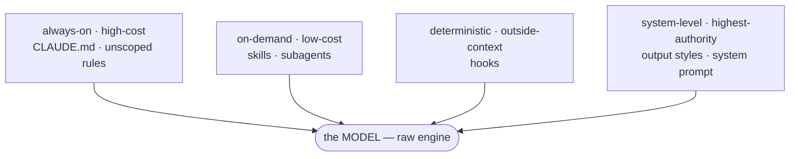
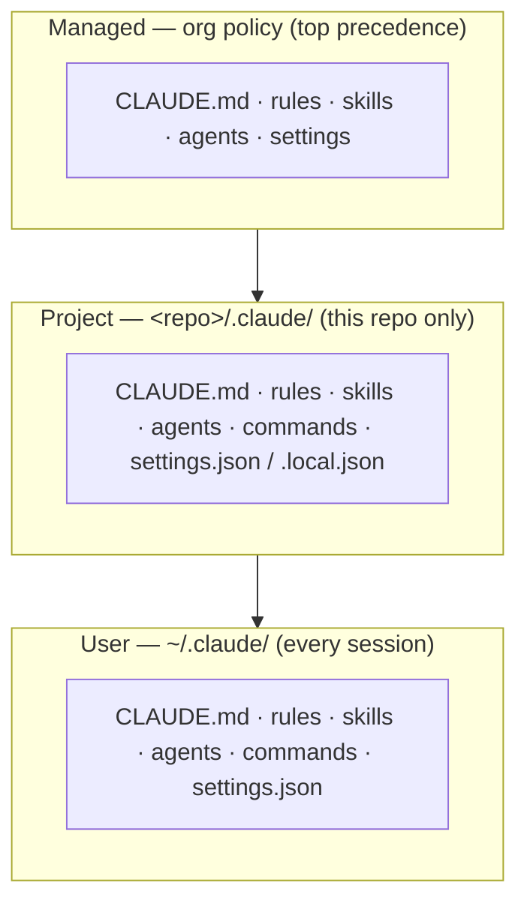

<!-- SPDX-License-Identifier: MIT · Copyright (c) 2026 Neill Prohaska <forest.microclimate@gmail.com> -->
# Overview & Map — Claude Code Advanced Guide

This is the human twin of the authoritative machine root `00_overview.machine.md`; this version and its PDF are derived from that root and rendered with `/folio`. It is the **hub** for the advanced guide: start here for the big picture and the one idea that ties everything together, then open the numbered document you need.

> **What this is.** The advanced guide to Claude Code — its *extension architecture* (the files you add under `.claude/`) and its advanced *orchestration* (agents, loops, dynamic workflows, context engineering). Eleven documents: this hub plus `01`–`10`. Read the hub for the big picture and the tying idea, then open a numbered document for the depth.

## 00.1 · Orientation

This guide is for a user already past `QUICKSTART` and `USAGE_DETAILED` — someone who wants to *extend* Claude Code (add files under `.claude/`) and *orchestrate* it (agents, loops, workflows). The question is no longer "how do I start?" but "how do I get the most out of it?"

The set splits into two halves:

- **The extension surface** (`01`, `02`, `03`, `10`) — the files you add under `.claude/` and what each one customizes. This half answers *what can I change?*
- **Methods & orchestration** (`04`, `05`, `06`, `07`, `08`, `09`) — how to wield that surface. This half answers *how do I get the most out of it?*

Every document, and every unit within it, reads in the same shape — what it is *for*, a *handle* (a mental model), the *mechanics*, the one load-bearing *invariant*, and how it *feeds* the rest.

Hit a term from the basics? It is defined in the `USAGE_DETAILED` glossary. Hit a new advanced term? Jump to the glossary in §00.5 below.

These documents are themselves machine→human→PDF artifacts: you are reading a machine root's human twin. The `.machine.md` is the authoritative source; the `.md` and the PDF are derived from it, rendered with `/folio` (the method lives in `10_authoring`, §10.2).

## 00.2 · The One Idea — the Harness Mindset

There is a single mental model behind every tactic in this guide: why the extension points exist, and when each one earns its context cost. Everything in `01`–`10` is a lever on this one idea.

The handle: the model is an *engine*; the harness is the whole car around it — the fuel lines are context, the dashboard is `CLAUDE.md`, the attachments are skills and MCP, the brakes are hooks. Tuning the car beats swapping the engine.

**The harness beats the model.** Claude Code is "built to work the way you work," and its behavior is shaped by a layered instruction system, not the raw weights ([Steering Claude Code](https://claude.com/blog/steering-claude-code-skills-hooks-rules-subagents-and-more)). The extension points form a *spectrum* by context cost and authority: always-on / high-cost (`CLAUDE.md`, unscoped rules — they load at start and survive compaction) → on-demand / low-cost (skills, subagents — "only the name and description load at session start; the full body loads when Claude invokes the skill") → deterministic / outside-context (hooks — they fire on events and bypass the window) → system-level / highest-authority (output styles, appended system prompt). So you pick the mechanism whose cost and authority fit the job: an absolute constraint calls for a hook or a managed setting ("an instruction is the wrong tool"); a procedure calls for a skill, not static docs ([Steering Claude Code](https://claude.com/blog/steering-claude-code-skills-hooks-rules-subagents-and-more)).

**Search live; don't pre-index (agentic beats RAG).** Claude Code "traverses the file system, reads files, uses grep to find exactly what it needs, and follows references across the codebase" — it retrieves like an engineer, at runtime ([How Claude Code works in large codebases](https://claude.com/blog/how-claude-code-works-in-large-codebases-best-practices-and-where-to-start)). It does *not* embed your repo into a vector index: "embedding pipelines can't keep up with active engineering teams," so "by the time a developer queries the index, it reflects the codebase as it previously existed weeks, days, or even hours before." Agentic search never goes stale — but it "works best when Claude has enough starting context to know where to look." The context-engineering twin of the same idea is to keep "lightweight identifiers (file paths, stored queries, web links)" and "dynamically load data into context at runtime," just in time, the way humans use file systems and bookmarks instead of memorizing a corpus ([Effective context engineering](https://www.anthropic.com/engineering/effective-context-engineering-for-ai-agents)).

**Budget context like it's scarce — because it is.** "Claude's context window fills up fast, and performance degrades as it fills" ([Best practices](https://code.claude.com/docs/en/best-practices)). The root cause is *context rot*: "as the number of tokens in the context window increases, the model's ability to accurately recall information from that context decreases" — a transformer's n² pairwise relationships "get stretched thin," and models saw fewer long sequences in training ([Effective context engineering](https://www.anthropic.com/engineering/effective-context-engineering-for-ai-agents)). Treat context as a depleting *attention budget*. This one constraint is *why* every method in the set exists — targeted inclusion, session hygiene, and subagent isolation are all context-preservation moves, not style preferences.

**Include on target, not on spec.** Aim for "the smallest possible set of high-signal tokens that maximize the likelihood of some desired outcome" ([Effective context engineering](https://www.anthropic.com/engineering/effective-context-engineering-for-ai-agents)) — the Goldilocks zone where "too much context loaded into every session degrades performance, while too little context leaves Claude to navigate blind" ([How Claude Code works in large codebases](https://claude.com/blog/how-claude-code-works-in-large-codebases-best-practices-and-where-to-start)). Concretely: name the in-scope files and directories up front (scope to "the part of the codebase that's actually relevant," initialize in subdirectories, `.claudeignore` the build artifacts and vendored code); keep `CLAUDE.md` "lean and layered"; and run per-task session hygiene — `/clear` between unrelated tasks, and after two failed corrections `/clear` and a sharper prompt rather than fighting a polluted window ([Best practices](https://code.claude.com/docs/en/best-practices)).

The invariant to hold onto: **the finite, degrading context window is the master constraint** — every extension point and workflow is ultimately a lever on *what* fills it and *when*. Judge any tactic by one question: does this spend high-signal tokens, or waste the budget?

This mindset feeds the rest of the guide. It is the harness applied to a task loop (`04_agentic_workflows` opens on it) and, named as its own discipline, the whole of context engineering (`08_context_engineering` — the successor to prompt engineering: curate the *whole* token set, not one turn's words). Its purest expression is skills' progressive disclosure (`02_skills_and_commands` — pay context only on demand), and its concrete knobs are subagent isolation (`03_agents`), `/clear` and `/compact` (§02.3), and a lean `CLAUDE.md` (§01.2).

**Figure — the harness: the model engine at center, ringed by the extension points, each labeled with its context-cost tier (always-on / on-demand / deterministic / system-level).**

## 00.3 · The Map — Scopes and Documents 01–10

Everything that customizes Claude Code installs as *files* under a `.claude/` directory, and three **scopes** decide who gets a given customization: **User** (`~/.claude/`) applies to every session; **Project** (`<repo>/.claude/`) applies only inside that repo; **Managed** (enterprise/admin policy) applies organization-wide and takes top precedence. Each scope holds the same kinds of file (`CLAUDE.md`, `rules/*.md`, `skills/<name>/SKILL.md`, `agents/*.md`, `commands/*.md`, `settings.json`). Scopes *stack* onto a global baseline; scope is just install location, and location alone decides reach. The full treatment is in `01_extension_architecture`, §01.1.

**Figure — the three scopes (User/Project/Managed) and what loads from each.**

The ten documents follow, in numeric order; the tag marks which half of §00.1 each belongs to.

- **`01_extension_architecture`** *(surface)* — the scope map, plus context and memory (`CLAUDE.md`), settings precedence (merge vs. override), and hooks. The static surface you customize.
- **`02_skills_and_commands`** *(surface)* — skills *are* slash commands (one merged mechanism); how to author and stack them; and the full stock-command catalog.
- **`03_agents`** *(surface)* — subagents are agents run in a *separate* context window; delegation, isolation, the built-ins, and `fork`.
- **`04_agentic_workflows`** *(methods)* — the harness mindset as a task *loop*: give Claude a verifiable check; explore → plan → code → commit; test-first; visual iteration; multi-Claude; worktrees; headless `claude -p`.
- **`05_pattern_vocabulary`** *(methods)* — workflows vs. agents; the five building-block patterns; the simplicity thesis (start simple, add machinery only when it pays).
- **`06_loops`** *(methods)* — the four loop types; the quality and token trade-offs; when each fits.
- **`07_dynamic_workflows`** *(methods)* — auto-generated *harnesses*; three failure modes; and the six orchestration patterns (the key six-panel figure).
- **`08_context_engineering`** *(methods)* — context as the master resource; just-in-time loading; compaction; and altitude (the Goldilocks system prompt).
- **`09_going_further`** *(methods)* — build *on* Claude Code: MCP and custom tools, sandboxing, plugins, and the Agent SDK / headless.
- **`10_authoring`** *(surface)* — build your *own* extension to the toolkit's standard: the `/machine-md` → `machine-doc-reviewer` → `/folio` loop, and the methodology source docs.
- **`11_references`** *(reference)* — every external source cited across `00`–`10`, collected in one place and deduplicated to canonical (post-redirect) URLs, together with the alias/migration table and the anti-rot canaries that keep the list honest.

The invariant for this hub: it is *navigation plus the tying idea*, and the depth lives in the numbered documents — so nothing here should carry mechanics that belong in a leaf; it links to the leaf instead. Every `NN_*` document, in turn, points back here for the map and the references, and the two halves (surface / methods) are the split from §00.1 made concrete.

## 00.4 · References

The consolidated source list for the whole advanced set; each `NN_*` document points here rather than repeating it. Grouped by theme, every source clickable.

**Core**

- [How we use Skills](https://claude.com/blog/lessons-from-building-claude-code-how-we-use-skills)
- [Getting started with loops](https://claude.com/blog/getting-started-with-loops)
- [A harness for every task: dynamic workflows](https://claude.com/blog/a-harness-for-every-task-dynamic-workflows-in-claude-code)

**Foundations**

- [Best practices for Claude Code](https://code.claude.com/docs/en/best-practices)
- [How Claude Code works in large codebases](https://claude.com/blog/how-claude-code-works-in-large-codebases-best-practices-and-where-to-start)
- [Steering Claude Code](https://claude.com/blog/steering-claude-code-skills-hooks-rules-subagents-and-more)
- [Building effective agents](https://www.anthropic.com/engineering/building-effective-agents)
- [Effective context engineering](https://www.anthropic.com/engineering/effective-context-engineering-for-ai-agents)
- [Multi-agent research system](https://www.anthropic.com/engineering/multi-agent-research-system)

**Skills / tools / MCP**

- [Equipping agents with Agent Skills](https://www.anthropic.com/engineering/equipping-agents-for-the-real-world-with-agent-skills)
- [Writing effective tools for agents](https://www.anthropic.com/engineering/writing-tools-for-agents)
- [Code execution with MCP](https://www.anthropic.com/engineering/code-execution-with-mcp)
- [Model Context Protocol — Introduction](https://modelcontextprotocol.io/docs/getting-started/intro)
- [Anthropic cookbook — agent patterns](https://github.com/anthropics/claude-cookbooks/tree/main/patterns/agents)

**Security / distribution / SDK**

- [Sandboxing](https://www.anthropic.com/engineering/claude-code-sandboxing)
- [Plugins](https://claude.com/blog/claude-code-plugins)
- [Agent SDK overview](https://code.claude.com/docs/en/agent-sdk/overview)
- [Headless — run programmatically](https://code.claude.com/docs/en/headless)

**Docs** (code.claude.com/docs/en/)

- [skills](https://code.claude.com/docs/en/skills) · [sub-agents](https://code.claude.com/docs/en/sub-agents) · [memory](https://code.claude.com/docs/en/memory) · [settings](https://code.claude.com/docs/en/settings) · [hooks](https://code.claude.com/docs/en/hooks) · [slash-commands](https://code.claude.com/docs/en/slash-commands) · [common-workflows](https://code.claude.com/docs/en/common-workflows) · [interactive-mode](https://code.claude.com/docs/en/interactive-mode) · [cli-reference](https://code.claude.com/docs/en/cli-reference) · [plugins](https://code.claude.com/docs/en/plugins) · [output-styles](https://code.claude.com/docs/en/output-styles) · [github-actions](https://code.claude.com/docs/en/github-actions) · [mcp](https://code.claude.com/docs/en/mcp)

## 00.5 · Glossary (advanced)

- **scope** — the install *location* (User `~/.claude/`, Project `<repo>/.claude/`, or Managed) that decides a customization's reach (`01_extension_architecture`, §01.1).
- **managed policy** — enterprise/admin-set configuration and permissions that apply organization-wide and take top precedence (§01.3).
- **fork** — a subagent that *inherits* the full parent conversation (versus a fresh, empty subagent) (`03_agents`); also `--fork-session` on a transcript (§01.2).
- **`$ARGUMENTS`** — the trailing text passed to a slash command (`/fix-issue 123` gives `123`); also positional `$1` or `$ARGUMENTS[N]` (`02_skills_and_commands`, §02.1).
- **skill stacking** — chaining skills/commands so they compose in one turn (`/code-review /fix-issue 123`) (§02.1).
- **harness** — an auto-generated JavaScript orchestrator that coordinates subagents in isolated contexts (`07_dynamic_workflows`).
- **orchestration pattern** — a harness shape: classify-and-act, fan-out-and-synthesize, adversarial-verification, tournament, generate-and-filter, or loop-until-done (the six; `07_dynamic_workflows`).
- **transcript** — the `~/.claude/projects/<slug>/<sessionId>.jsonl` full turn history that `--resume`, `--continue`, and `--fork-session` reopen (§01.2); the `.jsonl` is portable across machines.
- **managed block** — the `>>> claude-research-toolkit (managed) >>>` … `<<<` markers the installer regenerates, leaving your out-of-block content intact (§01.2).
- **`@import`** — a `CLAUDE.md` directive that pulls another file's content in (nesting depth up to 4) (§01.2).
- **context rot** — as the token count in the window grows, the model's ability to accurately *recall* any given item degrades (a transformer's n² attention stretched thin) — the reason to budget context (§00.2; `08_context_engineering`).
- **agentic search** — retrieving at *runtime* by traversing the filesystem, grepping, and following references (like an engineer), versus pre-indexing the repo into a stale vector store (RAG) (§00.2).
- **context engineering** — the discipline of curating the *smallest* high-signal token set the model sees each turn — the successor to prompt engineering (curate the whole token set, not one turn's words) (`08_context_engineering`).
- **progressive disclosure** — a skill loads only its `name` and `description` at session start; the full body loads on invocation, so you pay context only on demand (`02_skills_and_commands`; the purest expression of §00.2).
- **MCP (Model Context Protocol)** — an *open* protocol that exposes external tools and data to Claude as a client — "USB-C for AI"; a server exposes tools, resources, and prompts, and Claude Code is an MCP client (`09_going_further`).
- **sandbox** — filesystem and network *isolation* that contains an autonomous run so it needs fewer per-command prompts; credentials live *outside* it, so a prompt-injected process inside cannot exfiltrate them (`09_going_further`).
- **plugin** — an installable *bundle* of slash-commands, subagents, MCP servers, and hooks, distributed via marketplaces (a git repo of plugins) — identical capability for a teammate on day one (`09_going_further`).
- **Agent SDK** — the *same* agent loop, tools, and context manager as Claude Code, exposed as a CLI plus Python / TypeScript libraries to embed in your own scripts or CI; headless means running non-interactively, driven by a program (`09_going_further`).
