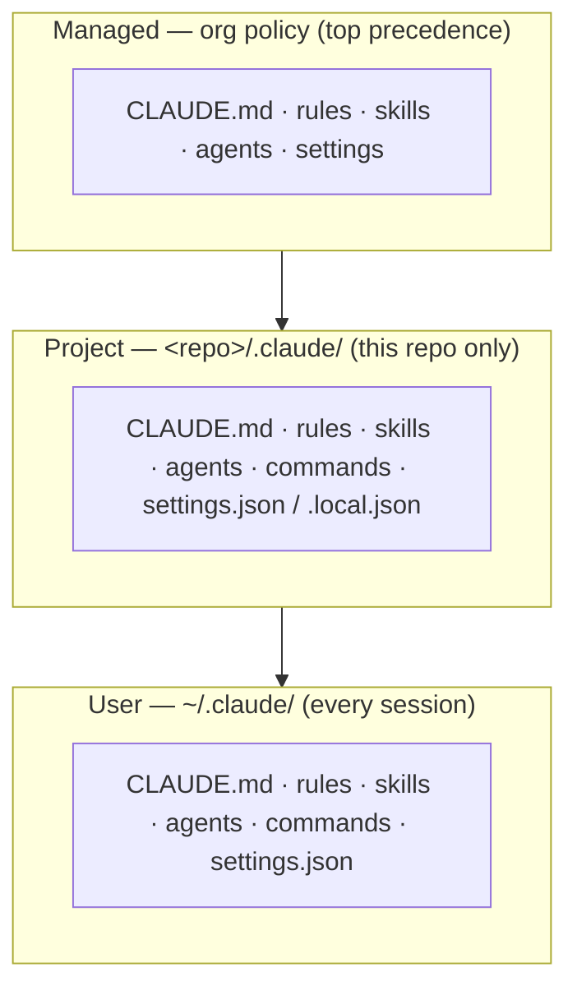
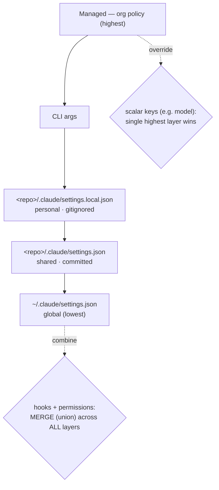

<!-- SPDX-License-Identifier: MIT · Copyright (c) 2026 Neill Prohaska <forest.microclimate@gmail.com> -->
# The Extension Architecture — Claude Code Advanced Guide

This is the human twin of the authoritative machine root `01_extension_architecture.machine.md`; this version and its PDF are derived from that root and rendered with `/folio`. It is the **static surface you customize** — written for the user configuring *what* loads and *where*: the scope map (what loads where), context and memory (`CLAUDE.md`), settings and how they resolve (merge vs. override), and how hooks fire. Part of the advanced set; the overall map and the consolidated references live in `00_overview`.

Each section below reads in the guide's standard shape — what it is *for*, a *handle* (a mental model), the *mechanics*, the one load-bearing *invariant*, and how it *feeds* the rest.

## 01.1 · The Map — The Extension Architecture

Everything that customizes Claude Code — instructions, skills, agents, commands, hooks, settings — installs the same way: as *files* under a `.claude/` directory. What differs is not the mechanism but the *reach*, and three **scopes** decide who gets a given customization.

The handle is *layers on a global baseline*: **User** is your defaults everywhere, **Project** is this repo's additions, and **Managed** is org policy laid on top. Concretely, there are three:

- **User** (`~/.claude/`) applies to *every* session you run.
- **Project** (`<repo>/.claude/`) applies only when you launch inside that repo.
- **Managed** (enterprise/admin policy) applies organization-wide and is set by an administrator.

Each scope holds the *same kinds of thing*: `CLAUDE.md` (instructions), `rules/*.md`, `skills/<name>/SKILL.md`, `agents/*.md`, `commands/*.md`, and `settings.json` — which is where `hooks` register.

They *stack*; they do not replace. A Project scope *adds* to the User baseline (both load), and Managed sits above both. Specific scopes stack onto the global baseline rather than overwriting it. (When two scopes set the same settings *key*, the conflict resolves by precedence — see §01.3.)

The invariant to hold onto: **scope is just install location, and location alone decides reach.** The same `x.md` file is global under `~/.claude/skills/` and repo-only under `<repo>/.claude/skills/` — move the file and you change its reach, nothing else.

This grid is the frame for everything that follows: every later section is one cell of it. Skills and commands (`02_skills_and_commands`), agents (`03_agents`), `CLAUDE.md` and memory (§01.2), settings and precedence (§01.3), and hooks (§01.4) all resolve through these same three scopes.

**Figure — the three scopes (User/Project/Managed) and what loads from each.**

## 01.2 · Context, Memory & CLAUDE.md

This section is about what Claude *knows* at the start of a turn, and it arrives through two channels: **auto-memory**, which Claude writes, and **`CLAUDE.md`**, which *you* write. The handle keeps them distinct — memory is a notebook Claude keeps for itself across sessions; `CLAUDE.md` is the standing orders you pin.

**Auto-memory** lives under `~/.claude/projects/<git-root-slug>/memory/`. It is keyed by the git *repo root*, is machine-local, and is where Claude writes its learnings. Only the *first* ~200 lines / 25 KB of `MEMORY.md` load at the start of a session, so keep the top of that file dense.

**`CLAUDE.md`** is the channel *you* author. It loads in *full*, with no truncation, which makes it the place for durable directives. The hierarchy *concatenates* broad → specific: managed → `~/.claude/CLAUDE.md` → `./CLAUDE.md` or `./.claude/CLAUDE.md` → `./CLAUDE.local.md`. Every level that is present combines, rather than one shadowing another. An `@import <path>` directive pulls another file's content in (nesting up to 4 levels deep).

Rules ride the same loader. Files in `.claude/rules/*.md` load like `CLAUDE.md` — always on — but a `paths:` entry in a rule's frontmatter *scopes* it to file globs, so it loads only when a matching file is in play.

One toolkit-specific mechanism matters here: the **managed block**. This toolkit assembles its global `CLAUDE.md` *inside* marker comments — `<!-- >>> claude-research-toolkit (managed) >>> -->` … `<!-- <<< claude-research-toolkit (managed) <<< -->`. A re-install regenerates *only* that block, so your own content *outside* the markers survives untouched.

Finally, **transcripts**: `~/.claude/projects/<slug>/<sessionId>.jsonl` is the full turn history. `claude --resume`, `--continue`, and `--fork-session` all re-open it, and moving the `.jsonl` to another machine is how you resume a session across machines.

The invariant: **memory is truncated at load (~200 lines / 25 KB); `CLAUDE.md` is not.** Anything that *must* always be seen belongs in `CLAUDE.md` or a rule, not buried deep inside a memory file.

This all feeds forward: the always-on rules ride this same loader; the managed block is why the toolkit can re-install without clobbering you (§01.3); and transcripts underpin resume (§10.2).

## 01.3 · Settings, Scopes & the Directory Hierarchy

Settings are how you configure the harness itself — `model`, permissions, `env`, hooks, output style — per scope. The handle is a *precedence ladder*: the closer or more-privileged the layer, the higher it wins. But two keys are the exception — `hooks` and `permissions` *combine* instead of fighting.

Precedence runs high → low: **Managed** > **CLI args** > `<repo>/.claude/settings.local.json` (personal, gitignored) > `<repo>/.claude/settings.json` (shared, committed) > `~/.claude/settings.json` (global).

The important nuance is *merge, not replace,* for two keys: `hooks` **and** `permissions` merge across *all* scopes — every layer's entries combine, and they do not override one another. (Scalar keys like `model` instead take the single highest-precedence value.)

The main keys you will set are `model`, `permissions` (with `allow`/`ask`/`deny` lists), `env`, `hooks`, `outputStyle`, `autoMemoryEnabled`, `statusLine`, and more.

This is also how you keep *different rules per project*: shared, committed guidance lives in each `<repo>/.claude/` (`CLAUDE.md`, rules, `settings.json`); personal per-repo bits go in `<repo>/.claude/settings.local.json` plus `CLAUDE.local.md` (both gitignored); and cross-project defaults live in `~/.claude/`.

As a concrete example, this toolkit deep-merges `~/.claude/settings.json` from *four fragments* — the install tiers: **core** (`permissions.deny` plus 4 dev-hook registrations across the PostToolUse, UserPromptSubmit, and Stop events), **ambient-time** (`ambient_time.py` on UserPromptSubmit and SessionStart), **ergonomics** (the xbeep hooks), and **personal** (model, theme, TUI, effort, and plugin settings). Because it deep-merges, a re-install *adds* keys without clobbering existing ones.

The invariant: for `hooks` and `permissions`, **more layers means more entries** (a union). A `deny` in *any* scope still bites, and a hook in *any* scope still fires — you cannot un-set either from a lower layer, only *add* to it.

This feeds the rest of the surface: the merged `permissions.deny` is your safety boundary; the merged `hooks` are the subject of §01.4; and the deep-merge is exactly why the toolkit's install tiers compose (§10.1).

**Figure — the settings precedence ladder, and which layers merge versus override.**

## 01.4 · Hooks, Deeply

Hooks are deterministic automation that the *harness* runs on events — not something Claude chooses to do. The handle: they are *event listeners for your session*. A script fires on "an edit happened," "a prompt was submitted," or "Claude stopped" — every time, mechanically.

Mechanically, then, hooks are scripts the harness executes on *events*; they are deterministic, and Claude does not decide whether they run. You configure them in `settings.json` under the shape `hooks → <Event> → [{ matcher, hooks: [{ type: "command", command }] }]`. There are roughly 30 events, including `PreToolUse`, `PostToolUse`, `UserPromptSubmit`, `Stop`, `SubagentStop`, `SessionStart`, `PreCompact`, and `Notification`.

The I/O contract is simple. Context arrives as JSON on **stdin**. An exit code of `0` means OK — and stdout *may* carry JSON back to control the harness. An exit code of `2` **blocks** the action, and stderr is fed *back* to Claude.

To author your own, you add a script and register it in `settings.json` under the relevant event. This toolkit ships live examples: `post-edit-review.sh` (a `PostToolUse` hook on `Edit|Write` that nudges an R-edit review), `pre-complete-verification.sh` (a `UserPromptSubmit` hook running a verify-before-"done" checklist), and `xbeep` (beeps on `Notification` / `Stop` / `UserPromptSubmit`).

One practical gotcha: **read stdin, not the environment.** Current Claude Code passes hook data as JSON on stdin — the old `CLAUDE_*` environment variables are no longer set — so parse fields like `tool_input.file_path` from stdin.

The invariant is what makes hooks worth reaching for: **they run on the event, not on Claude's judgment.** That makes them the right tool for "*always* do X when Y happens" — a memory or a preference cannot guarantee it, but a hook can.

Hooks feed back into the settings picture: they are registered via the settings `hooks` key (§01.3), which *merges* across scopes — so a hook in any scope fires — and the toolkit ships them in its core and ergonomics install tiers (§10.1).

## Sources

The facts here are architecture facts about how Claude Code loads and resolves customizations; the consolidated reference list — official docs and blogs — lives in `00_overview` (§00.4).
