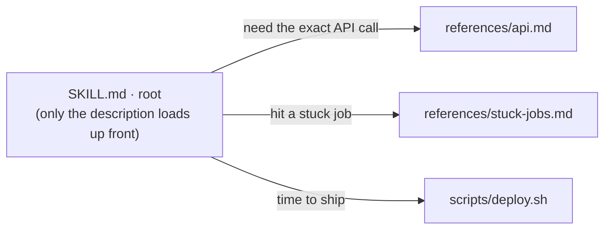
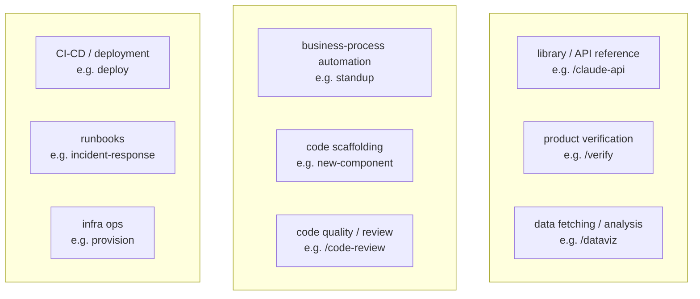
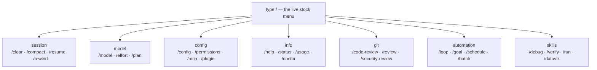

<!-- SPDX-License-Identifier: MIT · Copyright (c) 2026 Neill Prohaska <forest.microclimate@gmail.com> -->
# Skills & Slash Commands — Claude Code Advanced Guide

This is the human twin of the authoritative machine root `02_skills_and_commands.machine.md`; this version and its PDF are derived from that root and rendered with `/folio`. It covers the one merged mechanism — skills *are* slash commands — how to author and stack them to mastery, and the complete catalog of stock built-in commands.

## 02.1 · Skills & Slash Commands (one merged mechanism)

This is how you package a reusable instruction or capability that you trigger by name, or that Claude auto-invokes when the moment fits. The handle to hold: it is **one mechanism with two file shapes**. A *command* is the thin form — a single markdown file — and a *skill* is the folder form; both mint the *same* `/x`.

**Both file shapes create `/x`.** A command at `<repo>/.claude/commands/x.md` and a skill at `<repo>/.claude/skills/x/SKILL.md` each produce a `/x` that behaves the same way.

**Two invocation paths.** Claude *auto-invokes* a skill when your task matches it — the `description:` line is always in context, so Claude is always watching for the trigger — or you *force* it by typing `/name`.

**Arguments.** Trailing text after the name becomes `$ARGUMENTS` — `/fix-issue 123` sets `$ARGUMENTS` to `123` — and you can also read the pieces positionally as `$1`, `$2`, … or `$ARGUMENTS[N]`.

**Stack them.** Chain commands so they compose in a single turn: `/code-review /fix-issue 123` runs both.

**Two orthogonal frontmatter switches** control auto-invocation and visibility as two independent toggles:

- `disable-model-invocation: true` — Claude *stops* auto-invoking it; you can *still* run it with `/name`.
- `user-invocable: false` — *hidden* from the `/` menu, but Claude *can* still invoke it.

Because the two switches are independent, they yield four states: *on* (auto-invocation plus `/name`), *name-only* (`disable-model-invocation` set), *user-invocable-only* (Claude-only, hidden from the menu), and *off* (both set).

**Conflict.** On a name clash, the skill beats the command.

**Authoring.** Write `~/.claude/skills/<name>/SKILL.md` with frontmatter — `name`, `description`, `argument-hint`, `allowed-tools`, `model`, and so on. Because a skill is a *folder*, it can carry `references/` and `scripts/` beside its `SKILL.md`.

**Progressive disclosure.** Only the `description` loads up front; the body loads *on demand* when the skill is invoked — which makes it cheap to keep many skills installed.

The invariant to hold onto: **the `description:` is load-bearing.** It is the matcher for auto-invocation, so write it as a specific, positive, trigger-phrased sentence naming *when* it fires, not a vague summary.

This feeds the rest of the guide. Skills *are* slash commands — this is the merged mechanism the basics simply call "skills." Agents (`03_agents`) are the delegated cousin, and the toolkit's own `/baton`, `/folio`, `/machine-md`, and `/solo` are skills authored in exactly this way (`10_authoring`).

## 02.2 · Skills, Mastered

This is the deepest extension point: turning a general Claude into a *specialist* at *your* task, cheaply, via a folder it loads only when relevant. The handle is a hiring metaphor — "building a skill for an agent is like putting together an onboarding guide for a new hire," the doc a competent generalist needs to do *this* job *this* team's way ([Equipping agents with Agent Skills](https://www.anthropic.com/engineering/equipping-agents-for-the-real-world-with-agent-skills)).

**A skill is a folder, not a file.** The common misconception is that skills are "'just markdown files.' They're actually folders that can include scripts, assets, data, etc. that the agent can discover, explore and manipulate" ([How we use Skills](https://claude.com/blog/lessons-from-building-claude-code-how-we-use-skills)) — "organized folders of instructions, scripts, and resources that agents can discover and load dynamically" ([Equipping agents with Agent Skills](https://www.anthropic.com/engineering/equipping-agents-for-the-real-world-with-agent-skills)).

**Progressive disclosure = the filesystem as context engineering.** There are three load levels: (1) the `description` metadata loads at startup into the system prompt; (2) the `SKILL.md` body loads only when Claude judges the skill relevant; (3) linked `references/*` files Claude "can choose to navigate and discover only as needed." Because Claude reads files on demand, "the amount of context that can be bundled into a skill is effectively unbounded" — you organize knowledge *across* files and pay context *only* for the branch a task actually touches ([Equipping agents with Agent Skills](https://www.anthropic.com/engineering/equipping-agents-for-the-real-world-with-agent-skills)). This is the budget principle — the harness mindset (`00_overview`, §00.2) — made mechanical.

**Figure — progressive disclosure: `SKILL.md` at the root loads on demand, fanning out to `references/api.md`, `references/stuck-jobs.md`, and `scripts/deploy.sh`, each edge labeled with the situation that triggers the load.**

**The nine categories.** A good skill fits exactly *one* of these cleanly ([How we use Skills](https://claude.com/blog/lessons-from-building-claude-code-how-we-use-skills)):

- **library / API reference** — how to call a specific SDK or service correctly.
- **product verification** — confirm a feature actually works end-to-end.
- **data fetching / analysis** — pull and crunch a dataset on demand.
- **business-process automation** — a team's recurring procedure (standup, triage, reporting).
- **code scaffolding** — templates for new components or modules.
- **code quality / review** — your lint and review conventions.
- **CI-CD / deployment** — the ship / release sequence.
- **runbooks** — step-by-step incident / on-call response.
- **infra ops** — provisioning and infrastructure actions.

**Figure — the nine skill categories as a 3×3 taxonomy grid; a good skill fits exactly one, and each cell names the category with one example skill.**

**High-leverage authoring tips** ([How we use Skills](https://claude.com/blog/lessons-from-building-claude-code-how-we-use-skills)):

- **Lead with the Gotchas — the highest-signal section.** "The highest-signal content in any skill is the Gotchas section"; build it "from common failure points" you actually hit — encode the traps, not the happy path Claude can already do.
- **Write the `description` for the model (a trigger spec, not a summary).** It is the activation criterion, the only part loaded until the skill fires, so include the words a user will actually say ("babysit", "deploy") so Claude recognizes the moment to invoke it.
- **Ship scripts; don't make Claude rebuild boilerplate.** Bundle helper code so Claude "composes existing logic rather than reconstructing boilerplate"; deterministic ops (sorting, parsing) belong in a script — cheaper and exact, not re-derived each turn ([Equipping agents with Agent Skills](https://www.anthropic.com/engineering/equipping-agents-for-the-real-world-with-agent-skills)) — so you spend turns on composition, not reconstruction.
- **Help Claude remember (persist, then report only the *delta*).** Write logs, JSON, or SQLite to a stable path (e.g. `${CLAUDE_PLUGIN_DATA}`) so the next run "reads its own history" — a standup skill keeps a `standups.log` of every post — and reports only what changed since last time.
- **Gate with on-demand hooks (active *only* while the skill runs).** Ship a hook inside the skill — for example, a `/careful` PreToolUse guard that blocks `rm -rf` or `DROP TABLE` during a production task, and stops constraining you the rest of the time — so enforcement is scoped to the risky window.
- **Give latitude, not rails (avoid railroading).** Provide the information *and* the freedom to adapt to context, not a rigid step list Claude cannot deviate from when the situation differs.
- **Skip the obvious.** Claude already codes, so don't spend context restating generic practice; spend it on what pushes Claude *out* of its defaults — your conventions, your gotchas, your non-obvious constraints.
- **Design the setup deliberately.** Use a `config.json` plus the `AskUserQuestion` tool to gather what the skill needs up front, rather than discovering it mid-task.

**Compose skills by name.** Reference another installed skill inside your instructions and Claude "will invoke them as needed without explicit dependency management" ([How we use Skills](https://claude.com/blog/lessons-from-building-claude-code-how-we-use-skills)) — so build small, single-purpose skills and let them chain.

**Distribute by scale.** For a small team or a few repos, check skills into `.claude/skills`. Scaling up, "publish plugins to internal or public marketplaces, letting users install selectively" ([How we use Skills](https://claude.com/blog/lessons-from-building-claude-code-how-we-use-skills)).

**Measure with a usage log.** A PreToolUse hook that logs every skill invocation company-wide reveals which skills are popular and which "under-trigger" and need a better `description` or better discovery ([How we use Skills](https://claude.com/blog/lessons-from-building-claude-code-how-we-use-skills)).

The invariant here mirrors §02.1: **the `description` is the only part loaded until a trigger fires**, so it alone decides whether the skill *ever* activates — a precise, trigger-worded description outweighs a perfect body Claude never reaches.

This feeds the rest of the set. Skills *are* the §02.1 slash-command mechanism; their on-demand hooks, the `/careful` guard, and the usage log are hooks (§01.4); plugin distribution rides §02.3's `/plugin` plus a marketplace; and the authoring loop is `10_authoring` (§10.1): `/machine-md` → `machine-doc-reviewer` → `/folio`.

## 02.3 · The Stock Slash Commands (built-in catalog)

This is the *complete* set of Anthropic-shipped `/commands` you can type in a 2.1.201 session — the built-in verbs of the tool, as distinct from the skills and agents you author yourself (§02.1, `03_agents`). Think of it as a control panel: one row per built-in action. Type `/` to filter the live menu; what follows is its annotated map.

**How to read an entry.** Each reads as `/name <args>` — what it does — then, where a concrete call teaches beyond the syntax line, an `EX:` example. `<arg>` marks a required argument; `[arg]` an optional one. A `[Skill]` or `[Workflow]` tag marks an Anthropic-*bundled* skill or workflow (a prompt Claude can also auto-invoke) — still stock, just not a hard-coded command.

**On the examples.** An `EX:` appears *only* where a concrete call teaches beyond the syntax line — a real argument, a non-obvious form, the phrasing you would actually type. Arg-less or self-evident commands carry none by design: the absence is intentional, not an omission.

**Provenance.** This catalog is sourced from the 2.1.201 binary's command registry (`type:"local"|"local-jsx"|"prompt",name:…`), cross-checked against the published `/commands` reference; only enabled, user-facing entries appear.

### Session & Context

- **`/clear [name]`** — start a fresh conversation with empty context (the prior one stays in `/resume`); aliases `/reset`, `/new`.
- **`/compact [instructions]`** — summarize the conversation so far to free context, with an optional focus. EX: `/compact keep the AR1 model contract + the file paths we're editing`.
- **`/context [all]`** — visualize what is filling the context window as a colored grid.
- **`/rewind`** — roll code and/or conversation back to a checkpoint, or summarize from a message; aliases `/checkpoint`, `/undo`.
- **`/resume [session]`** — reopen a past conversation by id/name or via the picker; alias `/continue`.
- **`/branch [name]`** — fork the conversation at this point into a copy you switch into (the original is preserved). EX: `/branch try-brms`.
- **`/fork <directive>`** — spawn a background subagent that inherits the full conversation and works the directive while you continue. EX: `/fork draft unit tests for the gap-fill splice`.
- **`/export [filename]`** — export the conversation as plain text (to a file, or the clipboard). EX: `/export session.txt`.
- **`/copy [N]`** — copy the last (or Nth-latest) assistant response to the clipboard. EX: `/copy 2`.
- **`/rename [name]`** — rename the session; with no arg it auto-generates one from history. EX: `/rename model-refit`.
- **`/btw <question>`** — ask an ephemeral side question (full context, no tools) that never enters history. EX: `/btw which tz did we standardize on?`.
- **`/recap`** — generate a one-line summary of the session on demand.
- **`/memory`** — edit `CLAUDE.md` files and view/toggle auto-memory.
- **`/add-dir <path>`** — grant file access to another working directory for this session. EX: `/add-dir ../shared-data`.
- **`/cd <path>`** — move the session to a new working directory (the cache is kept; the new `CLAUDE.md` is appended). EX: `/cd projects/omega`.
- **`/diff`** — open an interactive viewer of uncommitted changes plus per-turn diffs.
- **`/focus`** — toggle the focus view (last prompt, a one-line tool summary, and the final response); fullscreen only.
- **`/tasks`** — view/manage everything running in the background this session; alias `/bashes`.
- **`/background [prompt]`** — detach the whole session to run as a background agent, freeing the terminal; alias `/bg`.
- **`/stop`** — stop the current background session (transcript and worktree are kept).

### Model, Reasoning & Planning

- **`/model [model]`** — switch model and save it as the default for new sessions (`s` = this session only). EX: `/model opus`.
- **`/effort [level|auto]`** — set reasoning effort (`low`…`max`, `ultracode`); with no arg it opens a slider. EX: `/effort high`.
- **`/fast [on|off]`** — toggle fast mode: Opus with *faster* output (*not* a smaller or weaker model) — the same model, quicker responses. EX: `/fast on`.
- **`/advisor [model|off]`** — enable/disable a second model that advises at key moments during a task. EX: `/advisor sonnet`.
- **`/plan [description]`** — enter plan mode, optionally seeded with a task. EX: `/plan refactor the bam AR1 wrapper`.

### Config, Appearance & Input

- **`/config [key=value …]`** — open the Settings UI, or set keys inline; alias `/settings`. EX: `/config theme=dark`.
- **`/theme`** — change the color theme (auto/light/dark/daltonized/ANSI/custom).
- **`/statusline`** — configure the status line (describe it, or auto-detect from your shell prompt). EX: `/statusline show git branch + model`.
- **`/keybindings`** — open your keyboard-shortcuts file.
- **`/terminal-setup`** — install Shift+Enter and other keybindings for terminals that need it (VS Code, Zed, …).
- **`/color [color|default]`** — set the prompt-bar color for this session. EX: `/color cyan`.
- **`/tui [default|fullscreen]`** — set the renderer and relaunch (fullscreen = a flicker-free alt-screen). EX: `/tui fullscreen`.
- **`/scroll-speed`** — adjust the mouse-wheel scroll speed (fullscreen only).
- **`/voice [hold|tap|off]`** — toggle voice dictation or set its mode (needs a claude.ai account). EX: `/voice tap`.
- **`/ide`** — manage IDE integrations and show status.
- **`/chrome`** — open Claude-in-Chrome settings.

### Extensions, Permissions & Integrations

- **`/permissions`** — manage allow/ask/deny tool rules plus working dirs; alias `/allowed-tools`.
- **`/hooks`** — view hook configurations for tool events.
- **`/mcp [reconnect|enable|disable …]`** — manage MCP server connections and OAuth.
- **`/plugin [subcommand]`** — manage plugins (`list`/`install`/`enable`/`disable`). EX: `/plugin list`.
- **`/reload-plugins [--force]`** — reload active plugins without restarting.
- **`/reload-skills`** — re-scan skill/command dirs so on-disk changes load without a restart.
- **`/skills`** — list available skills (filter by name; `t` sorts by tokens; `Space` toggles visibility).
- **`/agents`** — print a reminder to ask Claude to create/manage subagents (or edit `.claude/agents/`).
- **`/sandbox`** — toggle sandbox mode (supported platforms only).
- **`/init`** — generate a starter `CLAUDE.md` for the repo.
- **`/install-github-app`** — install the Claude GitHub App (plus optional Actions setup).
- **`/install-slack-app`** — install the Claude Slack app via OAuth.
- **`/setup-bedrock`** — configure Amazon Bedrock auth/region/model pins (shows when `CLAUDE_CODE_USE_BEDROCK=1`).
- **`/setup-vertex`** — configure Google Vertex auth/project/region (shows when `CLAUDE_CODE_USE_VERTEX=1`).
- **`/web-setup`** — connect your GitHub account to Claude Code on the web via local `gh`.
- **`/design-login`** — authorize design-system access for `/design-sync`.
- **`/design-sync [hint]`** `[Skill]` — convert your repo's React design system and upload it to Claude Design. EX: `/design-sync Acme DS`.

### Info, Account & Diagnostics

- **`/help`** — show help plus available commands.
- **`/status`** — open Settings on the Status tab (version, model, account, connectivity); works mid-response.
- **`/usage`** — show session cost, plan limits, and activity stats; aliases `/cost`, `/stats`.
- **`/usage-credits`** — configure usage credits to keep working past a limit (was `/extra-usage`).
- **`/release-notes`** — view the changelog in an interactive version picker.
- **`/doctor`** — diagnose and verify the install/settings (`f` = have Claude fix the issues).
- **`/heapdump`** — write a JS heap snapshot plus memory breakdown to `~/Desktop` for high-memory diagnosis.
- **`/insights`** — a report analyzing your sessions (project areas, interaction patterns, friction points). *Read it to act:* turn a recurring friction into a rule or skill, a fact you keep re-explaining into a `CLAUDE.md` line, a slow manual step into a hook. The value is the follow-up, not the report.
- **`/team-onboarding`** — generate a team onboarding guide from your last 30 days of usage; it captures the tools, workflows, and conventions your team *actually* uses, so a newcomer ramps on the real setup, not the docs' ideal.
- **`/login`** — sign in to your Anthropic account.
- **`/logout`** — sign out of your Anthropic account.
- **`/upgrade`** — open the plan-upgrade page (Pro/Max only).
- **`/privacy-settings`** — view/update privacy settings (Pro/Max only).
- **`/feedback [report]`** — submit feedback, report a bug, or share the conversation; aliases `/bug`, `/share`. EX: `/feedback the diff viewer flickers on branch switch`.
- **`/desktop`** — continue the session in the Claude Code desktop app (macOS/Windows plus a subscription); alias `/app`.
- **`/mobile`** — show a QR code to download the mobile app; aliases `/ios`, `/android`.
- **`/powerup`** — learn features through quick interactive lessons with animated demos.
- **`/passes`** — share a free week of Claude Code with friends (if eligible).
- **`/stickers`** — order Claude Code stickers.
- **`/radio`** — open Claude FM lo-fi radio in the browser.
- **`/exit`** — exit the CLI (detaches if attached to a background session); alias `/quit`.

### Git & Code Review

- **`/code-review [low|…|max|ultra] [--fix] [--comment] [target]`** `[Skill]` — review the working diff for correctness bugs plus cleanups; `--fix` applies them, `--comment` posts PR comments, and `ultra` runs in the cloud. EX: `/code-review high --fix`.
- **`/simplify [target]`** `[Skill]` — a cleanup-only review (reuse / simplify / efficiency / altitude) that applies fixes; no bug-hunt. EX: `/simplify R/gapfill.R`.
- **`/review [PR]`** — run the `/code-review` engine on a GitHub PR (no arg lists open PRs). EX: `/review 123`.
- **`/security-review`** — scan the branch's pending changes for security vulnerabilities (injection / auth / exposure).
- **`/ultrareview [PR]`** — a deep multi-agent cloud review; the preferred form is now `/code-review ultra`. EX: `/code-review ultra`.
- **`/autofix-pr [prompt]`** — spawn a cloud session that watches the branch's PR and pushes fixes on CI/review failures. EX: `/autofix-pr only fix lint + type errors`.

### Automation & Orchestration

- **`/loop [interval] [prompt]`** `[Skill]` — re-run a prompt on an interval (omit the interval and it self-paces); alias `/proactive`. EX: `/loop 5m check if the bam fit finished`.
- **`/goal [condition|clear]`** — keep working across turns until a verifiable condition is met. EX: `/goal every gam.check k-index > 0.95`.
- **`/schedule [description]`** — create/list/run cloud routines on a cron; alias `/routines`. EX: `/schedule nightly QC report at 6am`.
- **`/batch <instruction>`** `[Skill]` — decompose a large codebase change into 5–30 units, one background subagent per git worktree. EX: `/batch add roxygen docs to every R/ function`.
- **`/workflows`** — open the workflow progress view (watch / pause / resume / save).
- **`/deep-research <question>`** `[Workflow]` — fan out web searches, cross-check sources, and synthesize a cited report. EX: `/deep-research recent evidence on stomatal-optimization models`.
- **`/ultraplan <prompt>`** — draft a plan in a cloud session, review it in-browser, then execute remotely or send it back. EX: `/ultraplan design the next analysis phase`.
- **`/remote-control`** — make this local session controllable from claude.ai; alias `/rc`.
- **`/remote-env`** — choose the default environment for cloud agents.
- **`/teleport`** — pull a Claude-Code-on-the-web session into this terminal; alias `/tp`.

### Bundled Dev & Data Skills

Here a `[Skill]` tag marks an Anthropic-shipped skill — auto-invocable, like your own.

- **`/debug [description]`** `[Skill]` — enable session debug logging and troubleshoot by reading the debug log. EX: `/debug chains split at iteration 3500`.
- **`/verify`** `[Skill]` — confirm a change works by building and running the app and observing, not just tests.
- **`/run`** `[Skill]` — launch and drive your project's app to see a change working.
- **`/run-skill-generator`** `[Skill]` — author a per-project skill teaching `/run` and `/verify` how to build/launch/drive the app.
- **`/dataviz [request]`** `[Skill]` — chart/dashboard design guidance (form, colorblind-safe palette, marks, accessibility). EX: `/dataviz seasonal flux by sensor height`.
- **`/claude-api [migrate|managed-agents-onboard]`** `[Skill]` — load the Claude API reference for your language; `migrate` upgrades model IDs.
- **`/fewer-permission-prompts`** `[Skill]` — scan transcripts for common read-only calls and add a project allowlist.

**Not in this catalog.** Some names live in the 2.1.201 binary yet are not user-facing. *Removed:* `/pr-comments` (gone since 2.1.91 — ask Claude to view PR comments) and `/vim` (gone since 2.1.92 — use `/config` → Editor mode). *Disabled / flag-gated* (`isEnabled` returns false): `/wellbeing`, `/brief`, `/version`, `/loops`, `/update`. *Internal actions the harness fires* (never typed): `autocompact`, `daemon`, `session`, `pause-memory`, `skill-doctor`, `pro-trial-expired`, `rate-limit-options`, `design-consent`/`design-revoke`, and `extra-usage` (the legacy alias of `/usage-credits`).

The invariant for the whole catalog: **availability is conditional.** An entry shows only when its `isEnabled()` passes for your platform, plan, and environment — `/setup-bedrock` needs `CLAUDE_CODE_USE_BEDROCK=1`, `/upgrade` is Pro/Max — so the live `/` menu is ground truth for *your* session, and this catalog is the 2.1.201 superset.

**Figure — the stock `/` menu grouped by category (session, model, config, info, git, automation, skills), with a few representative commands under each.**

These built-ins feed the rest of the set. They compose with your authored skills and commands (§02.1 — a skill beats a built-in on a name clash) and with agents (`03_agents`); the automation verbs (`/loop`, `/goal`, `/schedule`, `/workflows`, `/batch`) are the `06_loops` and `07_dynamic_workflows` layer; and `/config`, `/permissions`, `/hooks`, and `/mcp` are the front doors to §01.3 and §01.4.

## Sources

The in-text hyperlinks cite the paraphrased sources (the *Skills, Mastered* section); the full consolidated reference list lives in `00_overview` (§00.4).
