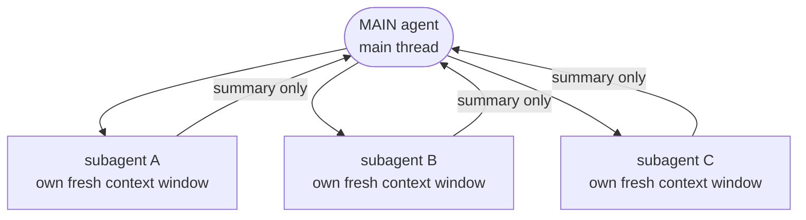

<!-- SPDX-License-Identifier: MIT · Copyright (c) 2026 Neill Prohaska <forest.microclimate@gmail.com> -->
# Agents & Subagents — Claude Code Advanced Guide

This is the human twin of the authoritative machine root `03_agents.machine.md`; this version and its PDF are derived from that root and rendered with `/folio`. It covers a single move: handing a bounded job to a separate context window so the main thread stays clean.

## 03 · Agents & Subagents (the same thing)

**Delegation keeps the main thread clean.** The whole point of an agent is to hand off a *bounded* job to a *separate* context window, so your main thread stays clean while the work gets done elsewhere. That same delegated agent is also the unit that dynamic workflows (`07_dynamic_workflows`) orchestrate at scale — the building block those harnesses coordinate many of. Like every document in the advanced set, this one's map and consolidated references live in `00_overview`.

**Agent and subagent are the same thing.** A *subagent* is nothing more than an agent that the main agent calls; the word names a *relationship*, not a different kind of thing. There is no second species to learn. When the main agent invokes an agent, that agent runs in its *own* fresh context window, and only its *summary* comes back to the main thread. Same object — "subagent" just tells you who called it.

**An agent is a Markdown file.** You define one in `.claude/agents/*.md`. Its frontmatter must supply two fields, `name` and `description`, and may optionally set `tools`, `model`, `effort`, and `isolation`.

**Three ways to invoke one.** An agent can be reached in three ways:

1. **Automatic delegation** — the main agent hands off on its own when an agent's `description` matches the task.
2. **`@agent-<name>`** — naming an agent explicitly *forces* that particular one.
3. **The Agent tool** — invoked programmatically. (It was renamed from `Task`; the old `Task()` still *aliases* it, so prior calls keep working.)

**Three agents ship built in.** Out of the box you have `Explore` (read-only search), `Plan` (design a plan), and `general-purpose` (the catch-all).

**`fork` starts full, not fresh.** A normal subagent starts *fresh* — an empty context window. A `fork` is the deliberate exception: it *inherits* the full parent conversation, so it starts *with* the main thread's context already in hand. In other words, a fork begins already knowing what the main thread knows, where an ordinary subagent begins knowing nothing.

**Isolation is the reason to delegate.** Here is the one load-bearing invariant. Because a subagent spends a *separate* context window, its intermediate work — the exploration and verification it does along the way — does *not* accrue to the main thread; only the distilled summary returns. That isolation is not an incidental side effect. It *is* the reason to delegate: you spend a whole extra context window precisely so the messy middle stays out of yours.

**One agent is the atom that bigger machinery is built from.** Dynamic workflows (`07_dynamic_workflows`) orchestrate *many* subagents into a harness. The toolkit's own five agents — research-facing (`code-review-debugger`, `machine-doc-reviewer`, `version-control-docs`) plus two toolkit-builder agents (`agent-tooling-engineer`, `research-data-manager`) — are each authored in exactly this way (`10_authoring`). And underneath all of it sits the same reason from the top: delegating is what keeps context clean (`01_extension_architecture`).

**Figure — the main agent delegates to isolated subagent contexts, each returning only a summary.**

## Sources

Architecture facts; the consolidated reference list (official docs and blogs) lives in `00_overview`, §00.4.
