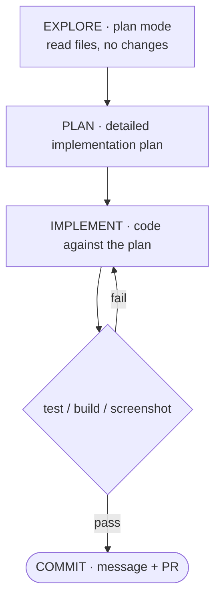

<!-- SPDX-License-Identifier: MIT · Copyright (c) 2026 Neill Prohaska <forest.microclimate@gmail.com> -->
# Agentic Workflows — Claude Code Advanced Guide

This is the human twin of the authoritative machine root `04_agentic_workflows.machine.md`; this version and its PDF are derived from that root and rendered with `/folio`. It collects the repeatable loops Anthropic's internal teams use to get production work out of Claude Code — you pick one by the *shape* of the task, and every one of them reduces to the same move: give Claude a check it can run for itself.

## 04 · Core Agentic Workflows

These are the repeatable loops Anthropic's internal teams reach for when they want production work out of Claude Code, and the choice among them is settled by the *shape* of the task rather than by preference.

The handle is to picture Claude Code as an autonomous coworker — one who "reads your files, runs commands, makes changes, and works through problems while you watch, redirect, or step away entirely." Read that way, the workflows below are simply how you *brief* that coworker and how you *verify* what it produces ([Best practices](https://code.claude.com/docs/en/best-practices)).

**Give Claude a check it can run.** This is the spine every workflow shares. "Claude stops when the work looks done" — so if there is no verifiable check, *you* become the verification loop, and "every mistake waits for you to notice it." Hand Claude a pass/fail signal instead — a test suite, a build exit code, a linter, a script that diffs output against a fixture, a browser screenshot — and "the loop closes on its own" ([Best practices](https://code.claude.com/docs/en/best-practices)). The strength of that gate scales with how far you mean to step away: at its weakest it lives inside a single prompt; stronger, it becomes a `/goal` condition re-checked every turn; stronger still, a `Stop` hook that blocks the turn until the check passes; and at the top, a second-opinion subagent that grades the work. Every workflow that follows is a way to *manufacture* such a check.

**Explore → plan → code → commit.** The point of separating research from execution is to keep Claude from "solving the wrong problem." Work it in four stages. First, *explore* in plan mode: let Claude read the files and answer your questions while making no changes at all. Second, *plan*: ask it to "create a detailed implementation plan" — pressing `Ctrl+G` opens that plan in your editor so you can edit it before Claude proceeds. Third, *implement*: leave plan mode, code against the plan, and run the tests. Fourth, *commit*: a descriptive message and a PR. Reach for this loop when the approach is uncertain, when the change spans multiple files, or when the code is unfamiliar — and skip the plan step entirely when "you could describe the diff in one sentence" ([Best practices](https://code.claude.com/docs/en/best-practices)).

**Figure — the explore → plan → code → commit loop as a cycle: a VERIFY gate (test, build, or screenshot) passes forward to COMMIT or fails back to IMPLEMENT, so a failed check re-enters the loop.**

**Test-first (TDD).** Write the tests, confirm they *fail*, write code until they pass, then commit. This loop suits agents precisely because its target is machine-verifiable: it hands Claude exactly the pass/fail check the spine demands, so Claude can iterate unattended until the suite is green. It also composes with the multi-Claude pattern below — "have one Claude write tests, then another write code to pass them" ([Best practices](https://code.claude.com/docs/en/best-practices)).

**Iterate against an image (visual).** Give Claude a mock or a screenshot and let it converge on the picture. The prompt is literally: "[paste screenshot] implement this design. take a screenshot of the result and compare it to the original. list differences and fix them" ([Best practices](https://code.claude.com/docs/en/best-practices)). This is the loop for UI work: the *image* is the verifiable check, and the browser screenshot Claude takes of its own result is the read-back.

**Split writer from reviewer (multi-Claude).** Have a second, fresh instance review the first one's output, because "a fresh context improves code review since Claude won't be biased toward code it just wrote" ([Best practices](https://code.claude.com/docs/en/best-practices)). In the writer/reviewer pattern, Session A implements, Session B critiques the `@file` for edge cases and race conditions, and Session A addresses the findings. The adversarial-review variant sharpens this by running the reviewer as a subagent that "sees only the diff and the criteria you give it, not the reasoning that produced the change," so that "the agent doing the work isn't the one grading it." One caution: tell that reviewer to flag *only* correctness and requirement gaps, because a reviewer sent hunting for gaps will otherwise drive over-engineering.

**Parallelize on worktrees.** Run several CLI sessions at once, each in its own isolated git checkout "so edits don't collide" ([Best practices](https://code.claude.com/docs/en/best-practices)). The payoff is that N independent workstreams advance simultaneously without stepping on each other's files. This composes naturally with subagents (`03_agents`) and with harnesses (`07_dynamic_workflows`), and the desktop app will manage each session in its own worktree visually.

**Go headless for CI and fan-out (`claude -p`).** Running `claude -p "prompt"` executes non-interactively, which makes it the entry point for CI pipelines, pre-commit hooks, and scripts; add `--output-format json` (or `stream-json`) with `--verbose` when you need to parse the output programmatically. The fan-out pattern batches this: have Claude list the N target files, then loop over them with `claude -p "migrate $file … return OK or FAIL" --allowedTools "Edit,Bash(git commit *)"`. Pilot on two or three files first, refine the prompt on whatever breaks, and only *then* run at scale — and note that `--allowedTools` is what scopes down exactly what an unattended run is permitted to do ([Best practices](https://code.claude.com/docs/en/best-practices)).

The invariant to hold onto: **each workflow's power is the verifiable check it creates** — a failing test, a target screenshot, a fresh-context reviewer, a batch OK/FAIL verdict. It follows that if a task offers no check Claude can read, you must *manufacture* one before you automate it; otherwise "looks done" is the only signal available, and you never get to walk away.

These workflows feed the rest of the guide. The gates that make them autonomous — plan mode, `/goal`, and `Stop` hooks — are documented in the stock-command catalog (`02_skills_and_commands`), the hooks treatment (`01_extension_architecture`), and the loop types (`06_loops`). The multi-Claude, worktree, and fan-out patterns scale up into subagents (`03_agents`) and dynamic-workflow harnesses (`07_dynamic_workflows`). And headless `claude -p` is the primitive that underpins loops and schedules (`06_loops`).

## Sources

The in-text hyperlinks above cite each paraphrased source directly. The full consolidated reference list for the advanced set lives in `00_overview`, §00.4.
