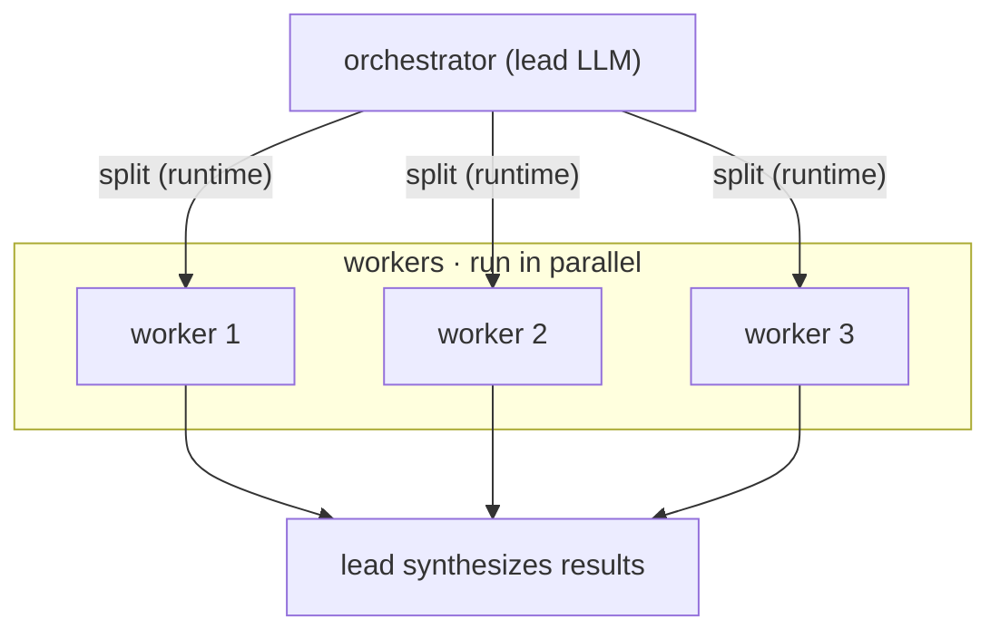

<!-- SPDX-License-Identifier: MIT · Copyright (c) 2026 Neill Prohaska <forest.microclimate@gmail.com> -->
# The Pattern Vocabulary — Claude Code Advanced Guide

This is the human twin of the authoritative machine root `05_pattern_vocabulary.machine.md`; this version and its PDF are derived from that root and rendered with `/folio`. It is the shared **vocabulary** for the advanced guide: the one distinction between *workflows* and *agents*, the five building-block patterns you combine to compose an LLM with its tools, and the simplicity thesis — reach for the fewest blocks that solve the task, and add machinery only when it demonstrably pays.

## 05 · The Pattern Vocabulary (workflows vs agents)

This document exists to give you the shared *names* for the ways an LLM and its tools compose. Learn them here — before scaling into loops (`06_loops`) and dynamic workflows (`07_dynamic_workflows`) — so that those larger constructions read as *instances* of five reusable blocks rather than one-off magic. Hold the vocabulary as a **parts bin, not a blueprint**: five building blocks you combine, and the discipline is always to reach for the *fewest* that solve the task.

That discipline is the governing thesis, so take it first: **find the simplest thing that works, and add agentic complexity only when it demonstrably improves outcomes.** Success is not the most sophisticated system — it is the *right* system for the need. Frameworks speed the start; drop the abstraction layers as you move to production.

### The one distinction — workflows vs agents

Everything else hangs off a single distinction between [workflows and agents](https://www.anthropic.com/engineering/building-effective-agents):

- A **workflow** is LLMs and tools orchestrated through *predefined code paths* — *you* wrote the control flow.
- An **agent** is a system where the model *dynamically directs its own process and tool use*, keeping control of *how* it accomplishes the task — the control flow is decided at *runtime*, by the model.

The split is one of control-flow *ownership*: fixed-by-you is a workflow; decided-by-the-model is an agent. Most production value lives in workflows; reach for a full agent only when the path cannot be drawn in advance.

### The foundation — the augmented LLM

The atom beneath every pattern is a single LLM *augmented* with retrieval, tools, and memory. It generates its own search queries, selects its own tools, and decides what to retain. Build all five patterns on *this* atom.

### The five building blocks

Each block has a name, a one-line shape, and the situation it fits.

- **Prompt-chaining** — decompose the task into *fixed* sequential steps, where each call consumes the previous call's output (with an optional programmatic gate between steps). *When:* the task cleanly splits into fixed subtasks; it trades latency for accuracy.
- **Routing** — *classify* the input, then dispatch it to a *specialist* handler. *When:* distinct categories are better handled separately.
- **Parallelization** — run LLM calls *concurrently* and aggregate the results. It takes two forms — *sectioning* (independent subtasks run at once) and *voting* (the same task run N times, aggregated for confidence). *When:* subtasks parallelize for speed, or multiple perspectives/attempts raise confidence.
- **Orchestrator-workers** — a *lead* LLM *dynamically* splits the task, delegates to workers, then *synthesizes* their results. *When:* you cannot predict the subtasks up front — they are determined at runtime by the orchestrator. This is the workflow that shades into an agent.
- **Evaluator-optimizer** — one LLM *generates*, a second *critiques* it against criteria, and the two *loop* until the output passes. *When:* you have clear evaluation criteria and iterative refinement measurably helps.

### Runnable — read the code, not just the names

All five ship as minimal, executable implementations in the [agents cookbook](https://github.com/anthropics/claude-cookbooks/tree/main/patterns/agents): `basic_workflows.ipynb` (chaining, routing, and parallelization), `orchestrator_workers.ipynb`, `evaluator_optimizer.ipynb`, and `async_multi_agent_orchestration.ipynb`. Read the *code*, not just the names.

### The invariant, and what it feeds

The load-bearing invariant is that **agents are not exotic**: an agent is "typically just an LLM using tools based on environmental feedback in a loop." It follows that the loops (`06_loops`) and harnesses (`07_dynamic_workflows`) ahead are *not* new primitives — they are these same five blocks *named, scaled, and automated*.

Concretely, the vocabulary carries straight into both:

- **Loops** (`06_loops`) are the *evaluator-optimizer* block plus a stop condition, run over time.
- **Harnesses** (`07_dynamic_workflows`) are *orchestrator-workers* plus *parallelization* plus an *adversarial evaluator-optimizer*, auto-assembled per task.

Carry this vocabulary into both.

**Figure — the orchestrator-workers pattern: a lead LLM splits a task into runtime-determined worker calls, the workers run in parallel, and the lead then synthesizes their results.**

## Sources

In-text hyperlinks cite each paraphrased source; the full consolidated reference list lives in `00_overview` (§00.4).
