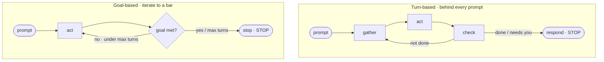
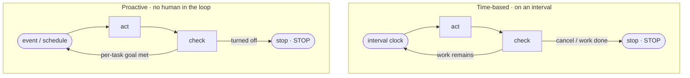

<!-- SPDX-License-Identifier: MIT · Copyright (c) 2026 Neill Prohaska <forest.microclimate@gmail.com> -->
# Loops — Claude Code Advanced Guide

This is the human twin of the authoritative machine root `06_loops.machine.md`; this version and its PDF are derived from that root and rendered with `/folio`. It covers the four loop types — turn-based, goal-based, time-based, and proactive — the quality and token trade-offs each one carries, and when each one fits.

## 06 · Loops

A loop runs the agentic cycle **repeatedly and unattended until a defined stop** — so recurring or long-horizon work advances without you babysitting each turn. The handle is a **thermostat**: it keeps cycling (sense → act → check) until the target condition is reached, then rests.

Formally, a [loop is an agent repeating cycles of work until a stop condition is met](https://claude.com/blog/getting-started-with-loops). You can categorize *any* loop by four axes:

- **Trigger** — what *starts* a cycle: a prompt, a manual real-time ask, a time interval, or an event/schedule.
- **Stop** — what *ends* it: Claude judges the work done, the goal is achieved, you cancel, or the task completes.
- **Primitive** — the Claude Code verb: `/goal`, `/loop`, `/schedule`, or dynamic workflows.
- **Task-type** — what it fits: exploration, verifiable goals, recurring work, or autonomous streams.

One caution up front: **start with the simplest solution and use these patterns selectively** — don't wrap a one-shot task in a loop.

### The four loop types

Each type has a characteristic trigger, stop, best-for, and way to manage cost.

**Turn-based** — the default cycle behind *every* prompt.

- **Trigger:** a user prompt. **Stop:** Claude judges the task done, or that it needs your context. **Best for:** short, one-off, non-routine tasks. **Manage cost:** write specific prompts; harden verification with a skill.

To harden it, encode your manual check as a **verification skill** so Claude self-verifies end-to-end. For example, a `verify-frontend-change` `SKILL.md` might: (1) start the dev server and open the edited page; (2) interact with the change directly and screenshot before and after; (3) check the browser console for zero new errors or warnings; (4) run a Chrome-DevTools performance trace and audit Core Web Vitals; and (5) if any step fails, fix and rerun *from step 1* — never handing back partially-verified work. The principle: **the more quantitative the checks, the easier it is for Claude to self-verify.**

**Goal-based** (`/goal`) — iterate to a verifiable bar.

- **Trigger:** a manual real-time prompt. **Stop:** the goal is met, *or* max turns is reached. **Best for:** tasks with a verifiable exit criterion. **Manage cost:** set specific criteria plus an explicit turn cap.

The mechanism: an **evaluator model** re-checks your condition each time Claude tries to stop, and sends it back until the condition is met. So deterministic criteria — tests passed, a score threshold — work best; the evaluator stops Claude from ending early out of "is this good enough?" uncertainty. For example: `/goal get the homepage Lighthouse score to 90 or above, stop after 5 tries.` Running `/goal` with no arguments shows the turns and tokens spent so far.

**Time-based** (`/loop`, `/schedule`) — run on an interval.

- **Trigger:** a time interval. **Stop:** you cancel, or the work completes (the PR merges, the queue empties). **Best for:** recurring work and interfacing with external systems. **Manage cost:** lengthen the interval, or react to events instead of time.

`/loop <interval> <prompt>` runs **locally** on your machine — for example, `/loop 5m check my PR, address review comments, and fix failing CI`. `/schedule` moves the same loop to the **cloud** as a "routine," so it runs even when your machine is off; reach for it when inputs change but the task is constant (a daily Slack summary), or when monitoring an external system (PR reviews, CI failures).

**Proactive** — long-running, with no human in the loop.

- **Trigger:** an event or schedule, with no human present in real-time. **Stop:** each task exits on its *own* goal, and the routine runs until you turn it off. **Best for:** recurring, well-defined streams (bug reports, triage, migrations, dependency upgrades). **Manage cost:** route routines to smaller, faster models, and reserve the most capable model for judgment calls.

Proactive **composes** the other primitives — `/schedule` plus `/goal` plus skills plus dynamic workflows plus auto mode — into a standing system, plus dynamic workflows built on the fly. The flagship example: `/schedule every hour: check #project-feedback for bug reports. /goal: don't stop until every report found this run is triaged, actioned, and responded to. When fixing a bug, use a workflow to explore three solutions in parallel worktrees and have a judge adversarially review them.` — triage, fix, and review, with no pause for permission.

**Figure — the four loop types, each a small sense → act → check ring with its own distinct stop: turn-based runs behind every prompt, goal-based loops through an evaluator's decision diamond until the goal is met, time-based is gated by an interval clock, and proactive is event- or schedule-driven with no human in the ring.**

### Quality — make the loop's output trustworthy

An unattended loop is only as good as the work it produces, so make that output trustworthy:

- **Keep the codebase clean.** Claude follows the patterns already in the repo, so a clean repo compounds with each iteration.
- **Give Claude a way to verify.** Encode "what good looks like" in skills — especially quantitative checks.
- **Make docs reachable.** Keep framework and library docs current and in reach.
- **Review with a second agent.** A reviewer with fresh context is less biased and not swayed by the main agent's reasoning; use the built-in `/code-review`.
- **Fix the system, not the instance.** When a result misses the standard, encode the fix so every *future* iteration clears it — don't just patch the one case.

### Tokens — spend where it pays

A loop can quietly burn tokens, so spend them where they pay:

- **Pick the right primitive and model.** A small task needs no loop or multi-agent setup, and some work fits a cheaper, faster model.
- **Set clear success and stop criteria** so Claude reaches "done" sooner — "but not too soon."
- **Pilot before large runs.** Dynamic workflows can spawn *hundreds* of agents; gauge usage on a small slice first.
- **Use scripts for deterministic work.** Running a script costs less than reasoning through the steps — for example, a PDF form-fill.
- **Don't run routines more often than the monitored thing actually changes.**
- **Inspect usage:** `/usage` breaks it down by skill, subagent, and MCP; `/goal` with no arguments shows turns and tokens so far; `/workflows` shows each agent's token usage and lets you stop any agent anytime.

### Summary

| Loop | You hand off | Use it when | Reach for |
|------|--------------|-------------|-----------|
| Turn-based | the check | you're exploring or deciding | custom verification skills |
| Goal-based | the stop condition | you know what done looks like | `/goal` |
| Time-based | the trigger | work happens outside your project on a schedule | `/loop`, `/schedule` |
| Proactive | the prompt | work is recurring and well-defined | all the above, plus dynamic workflows |

**Starter move.** Find one task where *you* are the bottleneck, and ask which piece you can hand off: can you write the verification check? Is the goal clear enough? Does the work arrive on a schedule? Launch it, watch where it stalls or over-reaches, then iterate without fear.

**The invariant** to hold onto: a loop is only as good as its stop condition — a vague stop over-runs tokens *or* quits early, while a quantitative, machine-checkable stop is what makes hands-off iteration safe.

**How this feeds the rest.** `/goal` is the evaluator-optimizer pattern (`05_pattern_vocabulary`) given a stop, and the proactive flagship already reaches into `07_dynamic_workflows` (a workflow of parallel worktrees plus an adversarial judge). Loops *schedule* the work; harnesses *structure* it.

## Sources

In-text hyperlinks cite each paraphrased source; the full consolidated reference list lives in `00_overview` (§00.4).
