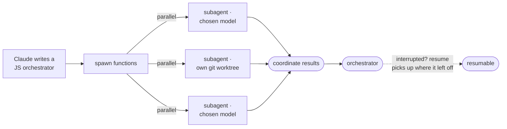
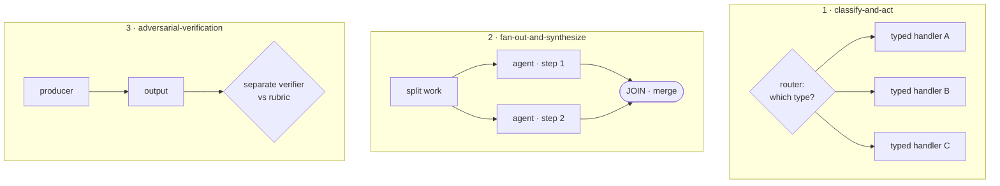
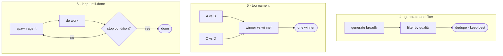

<!-- SPDX-License-Identifier: MIT · Copyright (c) 2026 Neill Prohaska <forest.microclimate@gmail.com> -->
# Dynamic Workflows — Claude Code Advanced Guide

This is the human twin of the authoritative machine root `07_dynamic_workflows.machine.md`; this version and its PDF are derived from that root and rendered with `/folio`. It covers **auto-generated harnesses** — the multi-agent assembly lines Claude builds on the fly, per task — the **three failure modes** of single-context work they exist to defeat, and the **six orchestration patterns** every harness is composed from.

## 07 · Dynamic Workflows & Harnesses

This document is *for* the moment a task outgrows a single context window: a complex, high-value job where doing everything in one window starts to fail. The move is to have Claude **assemble a multi-agent harness tailored to this task**, rather than grind the whole thing through one context.

The handle: Claude writes its *own* [harness on the fly, custom-built for the task at hand](https://claude.com/blog/a-harness-for-every-task-dynamic-workflows-in-claude-code) — you don't pick a template off a menu; Claude *fabricates* the assembly line. You reach for it by asking for a **workflow**, or by saying the keyword `ultracode`.

Mechanically, the harness *is* a JavaScript file. It runs **special functions to spawn and coordinate subagents**, alongside the standard `JSON` / `Math` / `Array` you would use for ordinary data wrangling. For each subagent, Claude **picks the model** and can optionally **isolate it in its own git worktree**. And the whole run is **resumable** — interrupt it (a deliberate user action, or simply quitting the terminal) and resuming the session picks up where it left off.

**Figure — how a harness runs: Claude writes a JavaScript orchestrator whose spawn functions launch subagents in parallel — each with a chosen model, some isolated in their own git worktree — whose results coordinate back to the orchestrator, and the whole run is resumable if it is interrupted.**

**Why bother.** A harness exists to defeat three named failure modes of single-context work:

- **Agentic laziness** — Claude stops before finishing a complex, multi-part task (it addresses, say, 35 of 50 security-review items and calls it done).
- **Self-preferential bias** — Claude prefers its own results and findings, especially when you ask it to *verify* them.
- **Goal drift** — fidelity to the original objective decays across many turns, and lossy *compaction* makes it worse: each summarization step drops detail, so edge-case requirements quietly slip.

The fix in one line: give each job a **separate agent with a clean context**, so no single window has to carry the laziness, the bias, or the drift.

**Static vs. dynamic.** A *static* harness is one you pre-build — with the Claude Agent SDK, or headless `claude -p` — and it is necessarily *generic*, because it has to cover every edge case in advance. A *dynamic* harness is the opposite: Opus 4.8 writes a **tailor-made** harness for your specific use case, at request time.

### The six patterns

Every harness is one of six shapes, or a composition of them. Named by purpose:

- **Classify-and-act** — route each item by *type* to the right agent or behavior.
- **Fan-out-and-synthesize** — *split* the work into parallel steps, one agent per step, then *merge* the results.
- **Adversarial-verification** — a *separate* verifier agent checks each output against a **rubric**.
- **Generate-and-filter** — ideate broadly, then *filter* by quality and *dedupe*, keeping only the best.
- **Tournament** — N agents *compete* on the same task, and judges pick a winner **pairwise** (comparative judgment is more reliable than absolute scoring).
- **Loop-until-done** — keep *spawning* agents until a **stop condition** is met; the pattern for work of *unknown* size.

**Figure — the six orchestration patterns, each a tiny harness shape: classify-and-act routes each item by type to a matching handler, fan-out-and-synthesize splits the work across per-step agents and merges at a join, adversarial-verification sends a producer's output to a separate verifier checked against a rubric, generate-and-filter ideates broadly then filters and dedupes to the best, tournament narrows competitors pairwise to a single winner, and loop-until-done keeps spawning until a stop condition fires.**

### Use cases — which pattern bites

Each kind of task pulls a particular pattern to the front:

- **Migrations and refactors** — a subagent *per fix*, each in its own worktree, then adversarial review, then merge. (Bun's Zig→Rust rewrite used workflows; tell the agents to avoid resource-intensive commands so they parallelize cleanly.)
- **Deep research** — the `/deep-research` skill fans out web searches, fetches sources, adversarially *verifies* their claims, and synthesizes a **cited** report.
- **Deep verification** — one agent extracts the factual *claims*, then a checker per claim, then a "check-the-checker" pass on source quality.
- **Sorting** — rank a big list by **tournament** (pairwise) or by parallel bucket-rank; comparative judgment beats absolute scoring.
- **Memory and rule-adherence** — *forward*: one verifier per rule plus a **skeptic** persona (which kills false positives). *Reverse*: mine your recent sessions and code-review comments for the corrections you keep making, cluster them with parallel agents, and distill the survivors into `CLAUDE.md`.
- **Root-cause analysis** — spawn hypotheses from *disjoint* evidence (logs, files, data); each hypothesis then faces a **panel** of verifiers and refuters.
- **Triage at scale** — classify, then dedupe, then act — with the **security-quarantine** pattern: agents that read *untrusted* public content are barred from privileged actions, and *separate* agents do the acting.
- **Model routing** — a classifier agent researches the task's complexity, then routes to Sonnet or Opus accordingly.

### Scaling lessons from the multi-agent research system

When these harnesses scale up, the lessons from the multi-agent research system apply:

- **Orchestrator-workers at scale** — a lead agent plans and spawns [subagents that operate in parallel, each with its own context window](https://www.anthropic.com/engineering/multi-agent-research-system), exploring different aspects and returning distilled findings for the lead to compile.
- **It costs.** Agents use roughly **4× the tokens** of chat, and multi-agent systems about **15×** — justified *only* when the task's value pays for the added performance.
- **Why it works.** Token usage *alone* explains about **80% of performance variance**; multi-agent systems win mainly by *spending enough tokens* on a problem that exceeds one context window.
- **Delegate explicitly.** Each subagent needs an **objective**, an output format, tool and source guidance, and **clear boundaries** — vague briefs make agents duplicate work and leave gaps.
- **Scale effort to complexity.** A simple fact-find is 1 agent and 3–10 tool calls; a comparison is 2–4 subagents; hard research is 10+ subagents with divided responsibilities.
- **Minimize the "game of telephone."** Have subagents *write* their outputs to the filesystem and pass lightweight **references** back, rather than routing everything through the coordinator's context.

### When not to use a harness

Most traditional coding tasks do *not* need a panel of five reviewers. Before reaching for a harness, ask the honest question: **does this really need more compute?** Workflows burn far more tokens, so reserve them for **complex, high-value** tasks.

### Tips

- **Prompt in detail.** Name the pattern you want; for a small ask, request a "quick workflow."
- **Pair with the loop primitives.** Use `/goal` for a hard completion bar and `/loop` for regular intervals (`06_loops`).
- **Budget tokens** by prompting "use 10k tokens."
- **Save and ship.** Press `s` in the workflow menu to store a workflow in `~/.claude/workflows`. Or ship it inside a skill: put the JavaScript in the skill folder and reference it in `SKILL.md` — and prompt Claude to treat the workflow as a **template**, not a verbatim script, so it adapts to the case (`10_authoring`).

**The invariant** to hold onto: the leverage is **isolated contexts**. A fresh verifier cannot inherit the producer's bias, and a per-fix worker cannot inherit the orchestrator's drift or bloat — that separation is precisely what defeats laziness, self-preference, and goal drift. A harness, at bottom, is the orchestrator-workers pattern (`05_pattern_vocabulary`), *auto-written* per task.

**How this feeds the rest.** Harnesses are the *structure* that a proactive loop (`06_loops`) schedules and a `/goal` bounds; the six patterns are the five building-block patterns (`05_pattern_vocabulary`) specialized and composed; and you author your own by shipping a workflow template inside a skill (`10_authoring`).

## Sources

In-text hyperlinks cite each paraphrased source; the full consolidated reference list lives in `00_overview` (§00.4).
