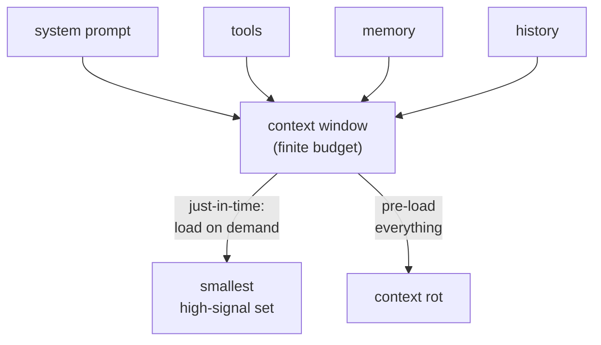

<!-- SPDX-License-Identifier: MIT · Copyright (c) 2026 Neill Prohaska <forest.microclimate@gmail.com> -->
# Context Engineering — Claude Code Advanced Guide

This is the human twin of the authoritative machine root `08_context_engineering.machine.md`; this version and its PDF are derived from that root and rendered with `/folio`. It names the discipline beneath every context tactic in this guide: the finite context window is the master resource, and context engineering is the practice of curating the smallest set of high-signal tokens that fills it.

## 08 · Context Engineering

Context engineering is the discipline beneath every context tactic in this guide: curating the smallest set of high-signal tokens that steers Claude to the right outcome. It is the *successor* to prompt engineering. Prompt engineering wrote the words of a single turn; context engineering curates the *whole* token set the model sees on each turn ([Effective context engineering for AI agents](https://www.anthropic.com/engineering/effective-context-engineering-for-ai-agents)).

The handle: the context window is a finite, *depleting* working memory — a *budget*, not a bucket. You are its curator, and every token you admit dilutes the attention paid to all the rest.

**The successor to prompt engineering, not a rename.** Context engineering is the broader discipline that contains prompt engineering rather than replacing it. Instead of tuning one clever instruction in isolation, it governs the system prompt, the tool set, the retrieved data, the message history, and memory *together*, across a multi-turn agent loop.

**Why small wins.** Attention is itself a finite budget, and it degrades as the window grows — the effect known as *context rot*. More tokens therefore mean lower signal per token and diminishing marginal returns. Optimize for the smallest high-signal set, never for the largest possible context.

**Altitude — the Goldilocks system prompt.** Tune the system prompt to the Goldilocks zone. Too *low*, and it becomes brittle hardcoded if-else logic that overfits and snaps the moment reality differs; too *high*, and it becomes vague guidance that gives no real steer. Aim for the middle: concrete enough to direct, general enough to transfer.

**Just-in-time context.** Keep lightweight *identifiers* in the window — file paths, queries, links — and load the underlying data at runtime, the moment a step needs it, rather than pre-loading everything up front. This mirrors how a person works from a filesystem: hold the path, and open the file on demand.

**Compaction for long-horizon tasks.** As the history nears the window limit, summarize it and reinitialize a fresh window seeded with that summary. Preserve the load-bearing atoms — architectural decisions, unresolved bugs, the contract — and drop the redundant — stale tool output, resolved detours.

**Structured note-taking.** Persist durable notes *outside* the window, in memory or files, and pull them back only when they are relevant. This gives you long-horizon state without paying its token cost on every turn.

**Fewer, sharper tools.** A bloated or ambiguous tool set spends tokens and invites wrong calls. Curate tools the way you curate context: self-contained, minimally overlapping, and token-efficient.

**The invariant.** Treat context as a finite, depleting resource with diminishing marginal returns. The objective is always the smallest set of high-signal tokens that maximizes the odds of the desired behavior — admit a token only when it earns its slot.

**What this feeds.** This is the *theory* that the tactical levers throughout the guide implement: `/clear` drops stale history; `/compact` runs compaction on demand; subagents each get a *separate* window, so a fan-out keeps intermediate exploration off the main thread; skills use progressive disclosure — just-in-time loading in which only the `description` loads until you invoke the skill; and memory plus `.claude/rules` are structured notes that live outside the window. There is one discipline, and those are its instruments. To extend Claude Code further, see `09_going_further`.

**Figure — the context window as a finite budget fed by four sources (system prompt, tools, memory, and history), contrasting just-in-time load-on-demand with pre-loading everything, which invites context rot.**

## Sources

In-text hyperlinks cite each paraphrased source; the full consolidated reference list lives in `00_overview` (§00.4).
