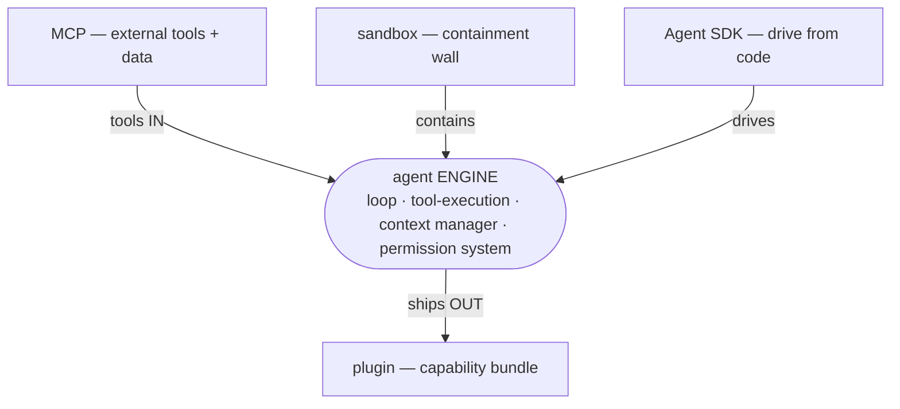
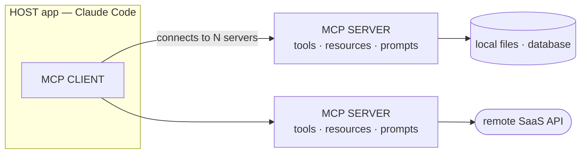
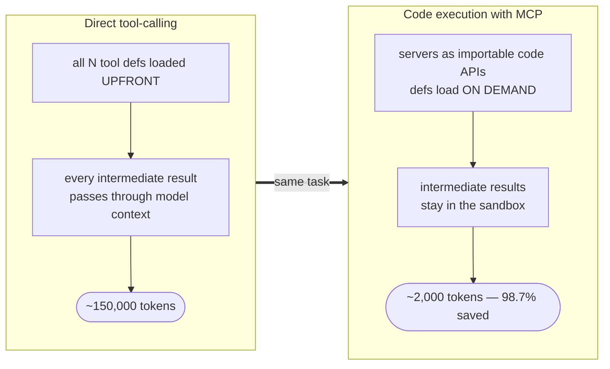
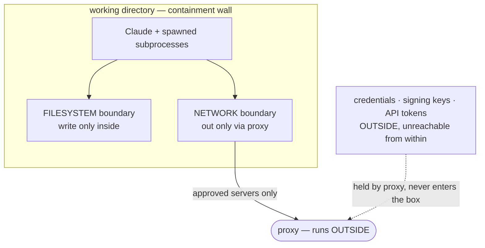
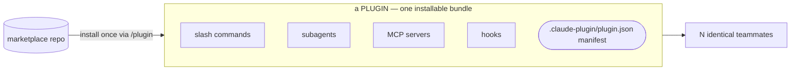
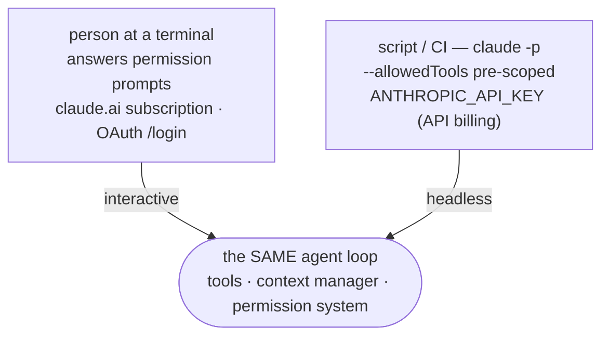

<!-- SPDX-License-Identifier: MIT · Copyright (c) 2026 Neill Prohaska <forest.microclimate@gmail.com> -->
# Going Further — Build on Claude Code — Claude Code Advanced Guide

This is the human twin of the authoritative machine root `09_going_further.machine.md`; this version and its PDF are derived from that root and rendered with `/folio`. Where the earlier documents customized Claude Code from the *inside* — the files under `.claude/` — this one turns the engine *outward*: connect it to external tools and data with **MCP**, contain it behind a **sandbox** so it runs with fewer prompts, package a whole capability set into a **plugin** for a team, and drive it from your own code with the **Agent SDK** and headless CLI.

> **What this is.** Going further — building *on* Claude Code: the four *outward* extension points, beyond the inward `.claude/` files. It is for the researcher whose inward setup already works — `CLAUDE.md`, rules, skills, commands, hooks, and subagents — and who now wants to extend the engine outward: connect it to external tools and data (MCP), run it more autonomously and safely (sandbox), ship a whole capability set to a team (plugin), and drive it from code or CI (the Agent SDK / headless).

## 09.1 · Framing — Claude Code Is a Platform, Not Just a CLI

The interactive terminal is only *one* surface of an agent *engine*. The earlier, inward parts of this guide customize that engine from the inside: the `.claude/` files shape one session on your machine. This document covers the four *outward* surfaces that extend the engine beyond a single local session — and it helps to name each by the thing you are extending:

- **The tools it calls ⇒ MCP.** Connect Claude to external tools and data — issue trackers, databases, design files, your own scripts.
- **The sandbox it runs in ⇒ sandboxing.** A containment wall, which buys more autonomy with fewer prompts.
- **The bundle you ship ⇒ plugins.** Package commands, subagents, MCP servers, and hooks into one installable unit for a team.
- **The library you build on ⇒ the Agent SDK / headless.** The same agent loop as a CLI, plus Python and TypeScript libraries — Claude Code in scripts, CI, and scheduled jobs.

The load-bearing idea is that there is only *one engine* under all four. The same agent loop, tool execution, context manager, and permission system sit beneath every surface — the Agent SDK "gives you the same tools, agent loop, and context management that power Claude Code" ([Agent SDK overview](https://code.claude.com/docs/en/agent-sdk/overview)). So what you learn on one surface — a tool's permission rule, a subagent, a hook — transfers to the others. They are *different doors into one room*, not four separate products. Read this document as "four ways to move the same engine," not four unrelated features.

**Figure — the shared agent engine at the center (loop, tool execution, context manager, permission system), ringed by its four outward surfaces: MCP feeds tools in, the sandbox contains it, a plugin ships it out as a bundle, and the SDK drives it from code.**

## 09.2 · MCP & Custom Tools

The **Model Context Protocol** gives Claude a uniform way to reach the tools and data that live *outside* the chat — an issue tracker, a database, a monitoring dashboard, a design file, your own analysis scripts — so it reads and acts on those systems directly instead of you copy-pasting into the prompt. A good trigger to reach for a server: the moment you notice yourself pasting data from another tool into chat ([Claude Code MCP](https://code.claude.com/docs/en/mcp)). The handle is Anthropic's own — MCP is "a USB-C port for AI applications": one standardized plug, so any compliant tool connects to any compliant app ([MCP intro](https://modelcontextprotocol.io/docs/getting-started/intro)).

### What MCP Is

The **Model Context Protocol** is an *open*, open-source standard for connecting AI applications to external systems — data sources, tools, and workflows ([MCP intro](https://modelcontextprotocol.io/docs/getting-started/intro)). One protocol replaces N bespoke integrations, so you "build once and integrate everywhere."

Its architecture is a **client ⇄ server** split:

- A *host* application — Claude Code, Claude Desktop, or an IDE — embeds an **MCP client**.
- That client connects to one or more **MCP servers**, and each server fronts some external system: local files, a database, a remote SaaS API.
- Claude Code *is* an MCP client, so it *consumes* servers — you never implement the protocol yourself to use one.

A server exposes exactly **three** primitives:

- **Tools** are *actions* the model can call — search, create, query, update. Every call is gated by the permission system before it runs.
- **Resources** are *data and context* the model can read — a file, an issue, a schema — and are `@`-mentionable like a file.
- **Prompts** are reusable workflow *templates*, surfaced as slash commands.

Why the protocol exists: before MCP, every application×tool pair needed a custom integration — an N×M explosion. MCP collapses that to N+M. A tool author writes *one* server, an app author writes *one* client, and they interoperate across a broad ecosystem — Claude, ChatGPT, VS Code, Cursor, and more ([MCP intro](https://modelcontextprotocol.io/docs/getting-started/intro)).

**Figure — the MCP host/client/server model: the host app (Claude Code) contains an MCP client that connects out to N servers; each server wraps a backing system (files, a database, a SaaS API) and exposes the three primitives — tools, resources, and prompts.**

### How to Use It in Claude Code

You *add* a server with `claude mcp add`, in one of three transport forms ([Claude Code MCP](https://code.claude.com/docs/en/mcp)):

- **Remote HTTP** (recommended for cloud services): `claude mcp add --transport http <name> <url>` — for example `claude mcp add --transport http notion https://mcp.notion.com/mcp` — and attach a token with `--header "Authorization: Bearer <token>"`. In JSON config, `type` accepts `streamable-http` as an alias for `http`.
- **Remote SSE** (deprecated — prefer HTTP): `claude mcp add --transport sse <name> <url>`.
- **Local stdio** — a subprocess on your own machine, for direct system access and custom scripts: `claude mcp add [options] <name> -- <command> [args...]`. Everything after the `--` is passed to the server untouched, which is how you separate the server's own flags from Claude's.
- There is also `claude mcp add-json <name> '<json>'` for a raw config, and you can register a WebSocket server via `add-json` with `type:"ws"` for servers that push events unprompted.

You *manage* servers with `claude mcp list` (all of them), `claude mcp get <name>` (one server's detail), and `claude mcp remove <name>`; inside a session, `/mcp` handles status, connect, and authenticate, and its panel shows each connected server's tool count.

**Scopes** decide *where* the config lives and *who* sees it, via `--scope` ([Claude Code MCP](https://code.claude.com/docs/en/mcp)):

- `local` (the default) — this project, you only, stored in `~/.claude.json`. Use it for personal or experimental servers, or ones holding private credentials.
- `project` — this project, *shared* with the team through a `.mcp.json` file committed to the repo root, so everyone gets the same servers. Claude Code prompts for approval before using project servers from `.mcp.json` — a trust gate, since a cloned repo can't auto-approve its own servers.
- `user` — *all* your projects, you only.
- Precedence, highest wins and the whole entry is taken (fields are *not* merged): local > project > user > plugin-provided > claude.ai connectors.

*Authenticating* remote servers is OAuth 2.0. A server that answers `401`/`403` is flagged in `/mcp`; run `/mcp` (or, from the shell, `claude mcp login <name>`) and complete the browser flow ([Claude Code MCP](https://code.claude.com/docs/en/mcp)). Tokens are stored securely and auto-refreshed. In non-interactive mode there is no `/mcp` panel, so authorize from an interactive session first.

To reuse servers you already configured, *import* them from Claude Desktop with `claude mcp add-from-claude-desktop` (macOS and WSL). And to share one config while keeping machine-specific paths and secrets out of version control, `.mcp.json` supports *environment-variable expansion* — `${VAR}` and `${VAR:-default}` inside `command`, `args`, `env`, `url`, and `headers`. Put the key in `${API_KEY}`, not the committed file.

Once connected, you *use* what a server exposes:

- **Tools** — Claude calls them like any built-in tool, gated by the permission system, so your allow/deny rules apply. The full callable form is `mcp__<server>__<tool>`; a plugin-bundled server's tool is `mcp__plugin_<plugin>_<server>__<tool>`.
- **Resources** — `@`-mention them as `@server:protocol://resource/path`, for example `@github:issue://123` or `@docs:file://api/authentication`. They are fuzzy-searchable in the `@` autocomplete and fetched and attached automatically.
- **Prompts** — appear as slash commands `/mcp__<server>__<prompt>`, with arguments passed space-separated, for example `/mcp__github__pr_review 456`.

The *context cost* of all this is managed by default **tool search**: only tool *names* plus server instructions load at session start, and full tool *definitions* are deferred until Claude searches for them, so adding servers barely touches your context window ([Claude Code MCP](https://code.claude.com/docs/en/mcp)). Tune it with the `ENABLE_TOOL_SEARCH` environment variable, or force a small always-needed set to stay visible with `alwaysLoad:true`. Large tool outputs warn at 10,000 tokens and are capped at 25,000 by default (raise the cap with `MAX_MCP_OUTPUT_TOKENS`).

### How to Optimize — Design and Scale Tools for Agents

Design for the *agent*, not the API ([writing tools for agents](https://www.anthropic.com/engineering/writing-tools-for-agents)):

- Favor a **few high-value workflow tools** over many thin endpoint wrappers — "More tools don't always lead to better outcomes." Consolidate: a `schedule_event` that finds availability *and* books, rather than `list_users` + `list_events` + `create_event`; a `search_logs` that returns the relevant lines with context, rather than a raw `read_logs`; a single `get_customer_context` rather than three separate getters.
- **Namespace by service and resource** — `asana_search` and `jira_search` (by service), `asana_projects_search` and `asana_users_search` (by resource) — so the agent picks the right tool when dozens exist.
- **Return natural identifiers** — human-readable names over opaque alphanumeric UUIDs — for measurably better retrieval precision.
- **Let the agent control its own token spend** — pagination, filtering, range selection, truncation with sane defaults, and a response-format enum (`concise` versus `detailed`). Claude Code restricts tool responses to roughly 25,000 tokens by default.
- **Write tool descriptions like onboarding a new teammate** — make implicit domain knowledge explicit, name parameters unambiguously (`user_id`, not `user`), and make error messages *guide* toward a fix rather than return an opaque code.

Refine the tools in an **eval-driven loop**: prototype the tools, generate realistic agent-run eval tasks, run programmatic evals, analyze the results *with Claude itself*, refine the definitions and descriptions, and repeat ([writing tools for agents](https://www.anthropic.com/engineering/writing-tools-for-agents)).

At scale, the sharpest optimization is **code execution with MCP** ([code execution with MCP](https://www.anthropic.com/engineering/code-execution-with-mcp)):

- *The problem.* Loading many tool definitions upfront burns context — connect thousands of tools and you spend hundreds of thousands of tokens before the first request. And every intermediate result flows *through* the model context: a two-hour meeting transcript passed between two tools adds roughly 50,000 tokens.
- *The pattern.* Present each MCP server as a *code API* — files and modules in a filesystem, e.g. `./servers/google-drive/getDocument.ts` — that the agent imports on demand and orchestrates by writing code that runs in a sandbox. Tool definitions then load only when the code imports them, and intermediate results stay in the execution environment, never entering model context.
- *The payoff.* A reported case dropped from 150,000 to 2,000 tokens — **98.7%** saved.
- *Other gains.* Privacy (keep or tokenize PII inside the sandbox, out of the model), control flow (loops, conditionals, and error-handling in familiar code rather than chained tool calls), and state (write intermediate results to files, resume, and save reusable skill functions).
- It *requires* a secure sandbox, with resource limits and monitoring — see **Sandboxing** (§09.3); this is the direct coupling between the two sections.

**Figure — code execution with MCP and the token savings it buys: direct tool-calling loads every tool definition upfront and passes each intermediate result through the model context (~150,000 tokens), while presenting servers as importable code APIs loads definitions on demand and keeps intermediates in the sandbox (~2,000 tokens — 98.7% saved).**

Two disciplines round out the section. *Curate what's enabled*: connect only the servers you use, disable the rest, and at organization scale restrict them with managed `allowedMcpServers` / `deniedMcpServers` — which bounds both context cost *and* attack surface. And mind *security*: untrusted MCP content is a **prompt-injection** risk, so verify you trust each server before connecting it — "Servers that fetch external content can expose you to prompt injection" ([Claude Code MCP](https://code.claude.com/docs/en/mcp)). The **quarantine** pattern is the defense: an agent that *reads* untrusted external content is barred from privileged actions — a reader-of-untrusted is not an actor-with-credentials. Enforce it by composing sandboxing (credentials live *outside* the sandbox, so injected code cannot exfiltrate them) with a permissions deny-list (forbid the privileged action outright).

The invariant to hold onto: a server exposes exactly three primitives — tools (call), resources (read), and prompts (template) — and Claude Code is a *client* that consumes them, with every tool call still passing the permission system. Adding tools is *cheap in context* (tool search defers them) but *not free in trust* (each server is attack surface), so curate and quarantine.

This section *feeds* the rest. MCP tools become the vocabulary for the pattern and dynamic-workflow orchestration layer (`05_pattern_vocabulary` and `07_dynamic_workflows`) — a subagent fleet or a code-execution loop composes MCP tools into pipelines. Tool calls are gated by the same allow/deny rules as built-ins (`01_extension_architecture`). And servers bundle *into* plugins (§09.4) and are drivable from the SDK (§09.5).

## 09.3 · Sandboxing

Sandboxing lets you run Claude *autonomously* with *fewer* permission prompts by making a **containment wall** — not a per-command human gate — the safety boundary ([Claude Code sandboxing](https://www.anthropic.com/engineering/claude-code-sandboxing)). The handle is a blast-shield around the agent: it works freely *inside* the wall, and the wall — not a person clicking "allow" each time — is what stops it reaching *out*.

Two boundaries are isolated:

- **Filesystem** — Claude can read and write the current working directory, but modification of anything outside it is blocked, so a prompt-injected process can't alter system files.
- **Network** — it can reach only *approved* servers, through a unix-domain socket to a proxy running *outside* the sandbox, which blocks data exfiltration and malware download.

The wall is enforced by OS-level primitives — `bubblewrap` on Linux, Seatbelt on macOS — and covers not just Claude's own calls but *any* script or subprocess it spawns ([Claude Code sandboxing](https://www.anthropic.com/engineering/claude-code-sandboxing)). Turn it on with the `/sandbox` command inside Claude Code.

The payoff is autonomy without the click-fatigue: Anthropic reports internal usage where "sandboxing safely reduces permission prompts by 84%" — Claude operates freely within the boundary instead of stopping to ask on every action.

The load-bearing security property is **credential safety**. Secrets — git credentials, signing keys, API tokens — live *outside* the sandbox, and a proxy handles authentication externally, so a compromised *or* prompt-injected process *inside* cannot read or exfiltrate them ([Claude Code sandboxing](https://www.anthropic.com/engineering/claude-code-sandboxing)). This is precisely what makes "let it run" safe rather than reckless.

Frame it as **two knobs, and use both**: the sandbox is the *up* knob for autonomy (raise the wall to safely grant more freedom, with fewer prompts), and the permissions deny-list is the *down* knob (forbid specific dangerous actions even inside the wall). Reach for it on long autonomous runs, for code-execution-with-MCP (it *is* the "secure sandbox" that pattern requires), for anything reading untrusted external content, and for batch or headless jobs you won't babysit.

The invariant: the sandbox is the safety boundary that *replaces* per-command approval; because credentials live outside it, code inside can be wrong or hijacked without leaking secrets or escaping the working directory. Fewer prompts is the *symptom*; containment is the *cause* — don't chase the symptom by loosening permissions without the wall.

Sandboxing *feeds* the rest as the up-knob twin of the permissions deny-list down-knob (`01_extension_architecture`); it is the "secure execution environment" that code execution with MCP (§09.2) depends on; and it is what makes unattended SDK / headless runs (§09.5) safe to leave alone.

**Figure — sandboxing as two-boundary containment: Claude and the subprocesses it spawns run inside the working-directory wall, which permits filesystem writes only inside and network access only out through a proxy to approved servers, while credentials and signing keys sit outside the box, unreachable from within.**

## 09.4 · Plugins

A **plugin** packages "any combination of slash commands, subagents, MCP servers, and hooks" into one installable, versioned, shareable unit — so a teammate installs *once* and has your whole setup on day one, with no per-file copying ([Claude Code plugins](https://claude.com/blog/claude-code-plugins)). The handle: it is an *app-bundle* for Claude Code — you install an app instead of hand-copying its files into place.

A plugin bundles these components, each sitting at the plugin *root* ([create plugins](https://code.claude.com/docs/en/plugins)):

- `skills/<name>/SKILL.md` — skills. (Legacy flat commands live in `commands/`; prefer `skills/` for new plugins.)
- `agents/` — custom subagents.
- `hooks/hooks.json` — event hooks.
- `.mcp.json`, at the plugin root — bundled MCP servers, which start *automatically* when the plugin is enabled; reference bundled files with `${CLAUDE_PLUGIN_ROOT}`.
- And also `.lsp.json` language servers, `monitors/` background watchers, `bin/` executables added to `PATH`, and `settings.json` defaults.

The **manifest**, `.claude-plugin/plugin.json` at the plugin root, defines identity: `name` (which is also the skill *namespace*), `description`, an optional `version`, and an optional `author`. The gotcha worth memorizing: *only* `plugin.json` goes inside `.claude-plugin/`; all component directories sit at the plugin *root* — a common mistake is nesting `commands/`, `agents/`, `skills/`, or `hooks/` inside `.claude-plugin/`.

**Namespacing** is automatic: plugin skills are always namespaced `/plugin-name:skill`, so there are no collisions when multiple plugins ship a same-named skill. For **bundled assets**, three variables locate things: `${CLAUDE_PLUGIN_ROOT}` for files shipped inside the plugin (e.g. an MCP server's `command`), `${CLAUDE_PLUGIN_DATA}` for state that survives updates, and `${CLAUDE_PROJECT_DIR}` for the project root.

You *install and manage* plugins with the `/plugin` command (install, enable, disable). They are "designed to toggle on and off as needed" — enable a capability set when you need it, disable it when you don't ([Claude Code plugins](https://claude.com/blog/claude-code-plugins)). Plugins are distributed through **marketplaces**: a marketplace is a git/GitHub repo (or URL) carrying a `.claude-plugin/marketplace.json` catalog of plugins. Add one with `/plugin marketplace add <owner/repo>` and install from it — and host a *private* marketplace repo to keep a team's plugins internal.

To *author and test* one, create a directory and manifest, test locally with `claude --plugin-dir ./my-plugin` (which loads it without installing), and run `/reload-plugins` to pick up edits live.

The *why* is team distribution: plugins let teams "standardize Claude Code environments around a set of shared best practices" and "ensure consistency across their team" — install once and everyone has identical capability, versioned and updatable ([Claude Code plugins](https://claude.com/blog/claude-code-plugins)). Contrast a standalone `.claude/`: personal, single-project, and must be manually copied to share.

The invariant: a plugin is the *distribution unit* for the inward customizations — the same skills, subagents, hooks, and MCP servers you build one-by-one under `.claude/`, packaged so that install-once equals everyone-identical. It adds no new *kind* of capability; it makes the existing kinds shippable and versioned.

Plugins *feed* the rest by bundling the skills and commands (`02_skills_and_commands`), the hooks (`01_extension_architecture`), and the MCP servers (§09.2) into one unit — the outward packaging of everything inward. The Agent SDK can load plugins programmatically through a `plugins` option, and a `claude -p` run can load one with `--plugin-dir`.

**Figure — a plugin as one installable box wrapping four component tiles (slash commands, subagents, MCP servers, hooks) plus its `.claude-plugin/plugin.json` manifest, installed once via `/plugin` from a marketplace repo so that N teammates end up identical.**

## 09.5 · Agent SDK / Headless

The **Agent SDK** drives the *same* agent — its loop, tools, context manager, and permission system — from *outside* the interactive terminal: a CLI for scripts and CI, plus Python and TypeScript libraries for full programmatic control. It is Claude Code as a *library* you build on ([Agent SDK overview](https://code.claude.com/docs/en/agent-sdk/overview)). The handle: Claude Code as a function call — `claude -p "..."` (or `query(...)` in code) instead of a person typing at a prompt.

What you get is "the same tools, agent loop, and context management that power Claude Code," exposed as ([Agent SDK overview](https://code.claude.com/docs/en/agent-sdk/overview)):

- A **CLI** — `claude -p "<prompt>"` (`-p` / `--print`, non-interactive), which accepts any CLI option.
- **Libraries** — `pip install claude-agent-sdk` (Python 3.10+) and `npm install @anthropic-ai/claude-agent-sdk` (the TypeScript package bundles a Claude Code binary). The core call is `query(prompt, options)`, and the options carry `allowed_tools`, `permission_mode`, `mcp_servers`, `agents` (subagents), `hooks`, and `resume` — the whole feature set, made programmable. It also loads the same `.claude/` config (skills, commands, `CLAUDE.md`, plugins) by default.

The **headless CLI mechanics** ([run programmatically](https://code.claude.com/docs/en/headless)):

- **Output format** — `--output-format text|json|stream-json`. `text` (the default) is plain text. `json` gives a structured result plus a session ID and metadata including `total_cost_usd`, which you parse with `jq -r '.result'`. `stream-json` with `--verbose` (and optionally `--include-partial-messages`) emits newline-delimited JSON events for real-time streaming. Schema-constrained output is available via `--output-format json --json-schema '<schema>'`, which puts the result in a `structured_output` field.
- **Scope tools** — `--allowedTools "Bash,Read,Edit"` pre-approves tools so an unattended run doesn't block on a prompt; it uses permission-rule syntax, e.g. `--allowedTools "Bash(git diff *)"` (a prefix match — mind the space before `*`). For a whole-session baseline instead, use `--permission-mode acceptEdits` (auto-approve edits and common filesystem commands) or `dontAsk` (locked-down CI: it denies anything not in your allow rules or the read-only set).
- **System prompt** — `--append-system-prompt "<...>"` *adds* to the Claude Code defaults and keeps them; `--system-prompt` *replaces* the default entirely.
- **Continue** — `--continue` resumes the most recent conversation; `--resume <session_id>` resumes a specific one (capture the id from `--output-format json`).
- **Pipe stdin** — `cat build-error.txt | claude -p 'explain the root cause' > out.txt`, or `git diff main | claude -p "you are a typo linter ..."` (piping the diff means no Bash permission is needed to read it).
- **Reproducible CI** — `--bare` skips auto-discovery of hooks, skills, plugins, MCP servers, auto memory, and `CLAUDE.md`, so you get the same result on every machine; only the flags you pass explicitly take effect ([run programmatically](https://code.claude.com/docs/en/headless)).

**Authentication** for headless and programmatic use is the `ANTHROPIC_API_KEY` environment variable (that is, *API billing*), *not* the interactive claude.ai OAuth login — Anthropic states that third-party SDK agents must use API-key auth rather than claude.ai login or rate-limits ([Agent SDK overview](https://code.claude.com/docs/en/agent-sdk/overview)). Bedrock, Vertex / Google Cloud, and Foundry are supported via `CLAUDE_CODE_USE_*` environment variables.

The **billing gotcha** follows from that. Interactive Claude Code on a *subscription* plan (claude.ai OAuth `/login`) and headless runs on `ANTHROPIC_API_KEY` are *distinct*, precedence-ordered authentication methods — a session using `ANTHROPIC_API_KEY` does *not* draw on your claude.ai subscription (claude.ai connectors "aren't loaded when `ANTHROPIC_API_KEY` ... is active, even if you previously ran `/login`", [Claude Code MCP](https://code.claude.com/docs/en/mcp)). So a headless run *bills to API credits* — its `total_cost_usd` is real API spend — and you should budget for it separately from your interactive subscription seat.

**When** to use each: CI/CD pipelines; pre-commit hooks and build-script linters or reviewers (`git diff main | claude -p "..."`); fan-out batch jobs (many `claude -p` in parallel); scheduled automation; and building custom agents. The rule of thumb ([Agent SDK overview](https://code.claude.com/docs/en/agent-sdk/overview)): interactive development and one-off tasks call for the CLI, while CI/CD, production automation, and custom apps call for the SDK — and many teams use *both* (the CLI for daily work, the SDK for production).

The invariant: headless is the *same engine minus the human keyboard*. Everything interactive — subagents, hooks, MCP, permissions, skills — is available programmatically; and everything you would decide interactively (a tool approval) you must *pre-decide* via flags (`--allowedTools`, `--permission-mode`) or the run blocks or aborts. When unattended, scope tools, sandbox, and budget API spend *up front*.

The SDK *feeds* the loops and schedules layer (`06_loops`) — a recurring or cloud run is just this SDK loop off your terminal. Unattended runs lean on sandboxing (safe autonomy) and pre-scoped permissions (`01_extension_architecture`), and they load the same `.claude/` files and plugins the interactive engine does.

**Figure — interactive versus headless as one engine with two front-ends: on the left a person at a terminal answers permission prompts under a claude.ai subscription (OAuth), on the right a script or CI job calls `claude -p` with pre-scoped `--allowedTools` and `ANTHROPIC_API_KEY` (API billing), and both drive the identical agent loop.**

## Sources

Every source cited inline above — the MCP protocol and its use in Claude Code, the tool-design and code-execution engineering notes, sandboxing, plugins, and the Agent SDK / headless docs — is collected, grouped by theme, in the consolidated reference list in `00_overview` (§00.4). This document points there rather than repeating it.
