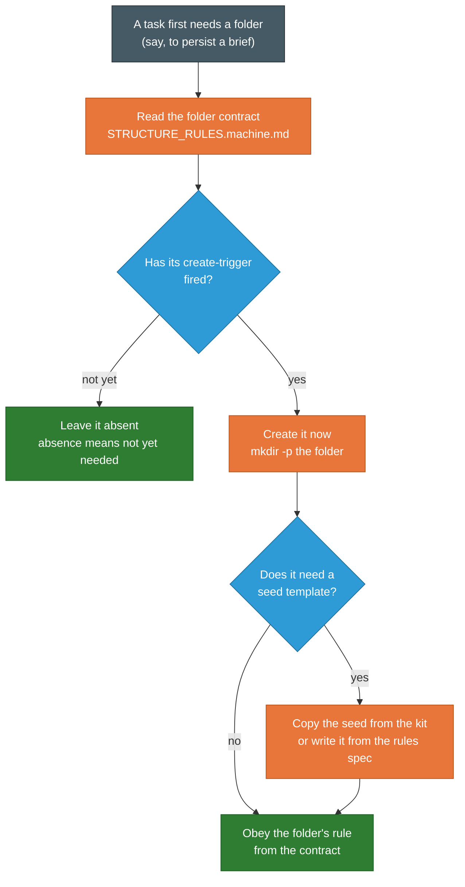

<!-- SPDX-License-Identifier: MIT · Copyright (c) 2026 Neill Prohaska <forest.microclimate@gmail.com> -->
# Why the Kit Is Built This Way

### The design decisions behind a project root that teaches its own agent

You have a way of working that suits you, and you would like to use it again. A planner
coordinates the job, isolated subagents do the reading and writing and building, code carries
the parts that must be exact and repeatable, and everything passes between them through
durable files in a shared tree. The companion guide, `WORKFLOW_GUIDE.md`, explains that loop
and how you steer it. This guide answers the next question: once you have a way of working you
trust, how do you carry it into a new project, and the project after that, without rebuilding
it by hand each time and without it drifting a little further from itself with every move?

That question is the problem the **planner-kit** solves. A workflow that lives only in one
project's files, or only in your head, does not travel. A fresh agent dropped into a new
project has no memory of how you like to work; it inherits nothing. The kit packages the
workflow as a set of generic standing rules that install into any project root and teach that
fresh agent how to operate there. The project root becomes self-teaching: the rules a
coordinating agent needs are sitting in two files at the top of the tree, waiting to be read.

The kit travels inside the Claude Code toolkit, at `CCRT/planner-kit/`, yet it installs
separately from it, because the two do different jobs. The toolkit equips the agent globally,
once, in `~/.claude`; the kit teaches one project root at a time, through its own installer,
run in each project that adopts the workflow. That separation is deliberate, and the two are
designed to be used together.

What follows is the reasoning behind the kit's design, one decision at a time, each paired
with the friction it resolves, so you can weigh each choice and adapt it. This guide is a
sibling of the other two: `WORKFLOW_GUIDE.md` explains the loop itself, and `KIT_ADOPTION.md`
shows a person installing the kit and putting it to work. Because the workflow's own reasoning
belongs to `WORKFLOW_GUIDE.md`, this guide stays on the packaging, the installation, the
structure, and the portability instead.

## Install only what the project uses

The first decision you meet is how much the installer actually creates, and the answer, by
default, is almost nothing. A default install writes two files at the project root, the rules
(`CLAUDE.md`) and a folder contract (`STRUCTURE_RULES.machine.md`), plus a two-line pointer
stub and the two advisory hooks described later. It does not build the folder tree. Instead,
the folders a project might use are created later,
one at a time, the moment a task first needs one. The kit calls this on-demand creation
**lazy materialization**, and it treats a folder's absence as an ordinary fact about the work
so far, never an error: absence means "not yet needed."

The reason for this was stated plainly when the design was set. Pre-creating a stack of
folders that a given project never touches is, in your own words, "a lot of unnecessary
clutter." A project with no figures has no use for a folder to hold them; a project that never
retires anything has no use for a retirement folder. So rather than guess the project's
eventual shape and lay down every folder in advance, the kit lets the shape emerge from the
work, materializing each folder at the moment of first need and leaving unneeded ones absent.

This choice fits a particular kind of project: a long-lived, multi-purpose workspace whose
eventual shape you cannot predict at the outset. It would be the wrong choice for a one-shot
generator that stamps out a finished project in a single pass, where building the whole
structure up front is exactly right. The kit is built for the first kind, and it says so
rather than pretending to suit both. For anyone who does want the full layout immediately, one
flag restores it: running the installer with `--full` pre-builds the classic tree and seeds
every template up front. That full layout is deliberately held identical to the previous
version of the kit, which has a useful side effect: it lets the authors prove the lazy
redesign did not break the classic path, by checking the full install against the older one
and confirming they match.

## The tree is a set of instructions, not a pre-built shell

If the installer no longer lays down the tree, something has to tell the agent how to build
it, and that something is the **folder contract**, `STRUCTURE_RULES.machine.md`. Its primary
reader is the coordinating agent rather than you. It carries the canonical tree, and for each
folder it gives four things: what the folder is for, the trigger that calls it into being, the
rule that governs it once it exists, and the mechanical steps to create it. The lazy default,
in other words, replaces a pre-built tree with a specification the agent executes.

For that to work, the specification has to be self-sufficient, and its triggers have to be
decidable, so that an agent can act on one without stopping to ask. The trigger for the
exchange folder is a good example of the concreteness this demands: the agent creates `dev/`
the first time it needs to persist a brief, a ledger, an instrument script, a benchmark, or a
report. That trigger is a condition an agent can recognize on its own and act on at once. And
the tree is written down only once. The folder contract takes its canonical tree verbatim from
the same map in the rules file, so there are never two copies of it to drift apart and
disagree.

<!--FIG: On-demand materialization: when a task first needs a folder, the agent reads the folder contract, creates the folder at that moment, copies any seed template it needs, and then obeys the folder's rule. | 78% -->

## The installer never rewrites what is yours

The rules install into your project's `CLAUDE.md`, and that is a file you may already own and
have written in. So the installer holds itself to a strict covenant: it touches only the bytes
it owns. If the file is absent, it creates it, with the kit's rules wrapped between a pair of
comment markers. If the file already exists, it appends that **marked block** and leaves every
other byte exactly as it was. When the marked block is already present, it does nothing at
all. Everything outside the block is yours, and the installer never modifies it. The rules go
to the project root, rather than into the `.claude` folder where an earlier version kept them,
because external code-review and continuous-integration runners look at a repository's root; a
one-line pointer stub at `.claude/CLAUDE.md` sends a reader back to the root file.

The covenant has a second, quieter hazard to handle. Suppose a marked block from an older
version of the kit is already in your file. A naive installer that only asked "is a
planner-kit block present?" would see it, conclude the work was done, and stop, which would
leave a freshly seeded folder contract sitting at your root unreferenced by the older rules
beside it. So the installer checks the version, and when the block it finds does not match the
version it is, it prints a loud warning that names both and states the remedy. What it does
not do, even then, is edit your file. The merge still does nothing, and upgrading remains your
explicit choice: delete the old block, and re-run. In every case the covenant holds. The
installer writes only inside its own marked block, and never rewrites your content.

## A preview you can trust, and a re-run that is safe

Two properties make the installer safe to run more than once. The first is idempotency: run it
a second time and it changes nothing the first run did. It deletes nothing and overwrites
nothing, and it writes a template only if that template is absent, so a folder contract you
have since edited by hand survives a re-install untouched. The second is an honest preview.
Before you run the installer for real, you can run it with `--dry-run`, which writes nothing
and prints exactly what it would do.

The word "exactly" is load-bearing there, and it was earned by a bug worth telling. An early
version's dry run under-counted: in full mode it predicted none of the empty-folder markers it
would create, and then the real run created thirteen of them. A preview that lies is worse
than no preview, because you act on it as if it were true. The fix was not to correct the
count but to remove the second opinion. Instead, the dry run and the real run were made to
decide what to write from one shared function reading the same inputs, so the preview cannot
drift from the real run, because one piece of code now decides both.

## The guard a real incident bought

There is a mistake the installer now refuses to let you make, and it refuses because the
mistake was once made. Running the installer from inside the kit's own `payload` folder
pointed the source file and the destination file at the same file on disk, so appending the
rules wrote that file onto itself; in about two minutes it had grown to 213 gigabytes and was
filling the disk. The first version of the installer did have a guard, but it caught only some
of the ways the target could turn out to be the kit rather than a real project, and being run
from inside `payload` was not one of them.

Two independent levels of defense do the work now, on purpose, because either level alone can
be slipped past. The first level refuses, before the installer does anything, if the target is
the kit's own directory or anywhere inside its tree. The second sits immediately before each
write and asks a narrower question: are the source and the destination in fact the same file?
If they are, it stops. So even if the first guard were somehow evaded, the write that filled
the disk still cannot run. And the incident became a test: the exact scenario that produced
the 213 gigabytes is reproduced, and the guard is confirmed to stop it, so the protection
cannot quietly erode in some later change. The lesson the kit takes from this is to fix a
fault at its root and add an independent backstop, rather than to suppress the symptom and
hope.

## The records the project keeps about itself

A project that runs this way accumulates state that has to outlive the isolated agents who
come and go and the sessions that open and close. Three parts of the kit exist to keep that
state trustworthy.

The first is the **plans** system. The harness gives a session a single mutable plan slot, and
reusing that slot for a new task overwrites the plan that was in it. So before the slot is
repurposed, the current plan is snapshotted, word for word, into a plans folder whose
subfolders record status by name: an active copy, a parked-and-resumable copy, and a finished
copy. But naming a folder "finished" does not by itself make anything true, and the design is
careful about this. A folder carries status only where a mechanism honors it, so every move
between those folders is paired with a row in a plan ledger and with the snapshot itself. The
location is a convenience for orientation; the content is the record.

The second is the **ledgers**. Three of them ship as templates the project copies in when it
first needs them. One is an efficacy ledger whose single governing rule is that nothing may be
called working without a cited measurement; a fix that merely exists is only "attempted,
untested" until a number says otherwise. A second is an append-only change log, where you add
rows and never edit old ones, standing in for version history where a project keeps none. The
third is a code inventory that every agent consults before it writes new code, so that it uses
or extends what already exists instead of building a rival copy. That last rule carries its own
plain reason: a second implementation of the same thing produces a second answer, and two
answers that disagree cost more to reconcile than either cost to build.

And the kit holds itself to that efficacy rule as strictly as it asks you to. The principles
gathered here were measured in the single project they came from, and until your project
measures them again, they are, by the kit's own standard, attempted and untested in your hands.

The third is **Stale_Trash**, the retirement folder, and it is the subtlest of the three,
because the obvious way to retire a document is wrong. An agent finds what it knows by
searching the contents of files, so moving a stale file into a folder called trash does not
hide it: the search still reads it and still trusts it as current. Currency has to live where
the search will look, which is inside the file. So retiring a file means first writing a
tombstone into the file itself, marking its status as superseded and prefixing its headline
claim with a note that points to whatever replaced it, on the exact line a search would reach.
Only after that is the file moved into `Stale_Trash`, which is tidiness and a kept trail, not
the act that neutralizes the stale claim. Nothing is deleted; deletion is a separate, later,
explicit decision. The move is defense in depth laid on top of the tombstone, never a
substitute for it.

## What the kit writes, and what makes it fire

Two later decisions tightened what the kit puts into your project, and what stands behind it
once it is there. The first governs the text itself. A file the kit installs is read again by
every agent that later works in your project, so a line that changes nothing is a cost paid
at every read, and a line never written can never go stale. Each line now faces one question:
does an agent reading this file do something differently because this line exists? Rules,
triggers, contracts, operative context, and marker machinery pass. Provenance narration,
self-description, justification prose, and version numbers in prose do not, and were cut,
taking a default install from 26,968 bytes to 22,497 and a full one from 46,661 to 41,442.

The kit's own provenance survives that cut, because provenance belongs to the record rather
than to the instruction: status headers, markers, and the memory seeds' stated reasons are
kept by name, and the change ledger holds the history. A version number shows why: the
marker and the installer already carry it, so a version in prose adds nothing and ages
badly, as two stale references to an older version had already shown.

The second decision is about how a rule survives contact with the work. A rule an agent must
remember is weaker than a form it must fill in, weaker again than a check that fires on its
own, so the kit ships all three: the brief contract as prose, the same contract as a fill-in
form whose unfilled slot is visible without anyone looking for it, and two hooks installed by
default, one naming an unfilled brief slot at launch, the other asking once for the collect
outcome when a turn that gathered results names none.

Both advise and neither refuses, because here a false refusal costs more than a missed
reminder, though where the guarded action is expensive and irreversible a refusing check
would be the right setting. Both fail open, one variable turns them off, and by the kit's own
efficacy rule they are fixture-measured, not proven in an adopting project. The form carries
one more shipped option: a chunk that would need a plan of its own can go whole to a subagent
running the planner role, sealed in a narrowed scope with its own brief area, as a block you
delete when it does not apply. Nesting is measured one level deep, no further.

## It anchors itself, so it travels

The kit carries no absolute path to your project anywhere in what it installs. It defines the
project root as the directory that holds the rules file, and it works out its own location and
the target's location at the moment it runs. One copy of the kit therefore installs into any
project, on any machine, with nothing to edit first. Exactly one machine-specific path appears
in anything it writes: a note recording where the kit's own seed templates live, so an
on-demand folder can copy a template when it is first needed. That single path is labeled as
precisely what it is, a local convenience carrying no authority, and it comes with a fallback.
If the kit has since moved, or you are on a different machine and the path no longer resolves,
the agent writes the template from its specification in the rules file instead, which is the
portable source of truth. The convenience is allowed to fail without blocking the work.

## The principle under all of it

One idea sits under all of these decisions, and it is worth stating on its own. A thing's
location shapes its reach and its authority, but a folder name carries status only where some
mechanism actually honors that status, so the real record always lives in a file's content,
never in the folder name alone. It underlies the lazy tree, the folder contract, the plans
folders, and `Stale_Trash`. It buys a coordinating agent two things at once: orientation,
because each kind of thing has a known home, and a single owner for each home. And in the same
breath it refuses to let a bare folder name promise something no mechanism enforces. The
load-bearing half of the principle is that refusal, and it is deliberately self-limiting: the
standard tells you where things belong while warning you, at the same time, not to trust a
location any further than a mechanism backs it.

## What generalizes, and what is specific to this kit

You may want to carry these ideas to a toolkit of your own someday, so it is worth separating
the transferable pattern from this kit's particulars. Most of what this guide has described
transfers to any portable toolkit built for agents: installing the rules and materializing
artifacts on demand, for a long-lived workspace rather than a one-shot generator; shipping an
executable, single-sourced specification instead of a pre-built shell; merging non-destructively
into a file the user owns; making the preview identical to the real run by having one function
decide both; guarding a self-run installer against targeting itself; snapshotting a single-slot
resource before reuse; neutralizing a superseded claim where a reader will reach it;
anchoring to your own location so you carry no absolute paths; writing only lines that fire
at a decision; and backing a rule that must fire at a particular moment with a check at that
moment.

Three of these hold only within stated limits, and the kit marks them: materializing on demand
suits long-lived workspaces and not one-shot generators, holding a full layout identical is a
safety net only when there is a previous version to match, and guarding against self-targeting
matters only for a tool you run from its own source. What is specific to this kit is a short
list: the exact version string and marker text, the 213-gigabyte figure and the particulars of
the portability target, and the specific folder and template names. Drawing that line
deliberately is itself part of what makes the pattern portable. None of these decisions is
exotic. Each is the plain response to a friction the work actually produced, which is why you
can adopt them one at a time, keep the ones that fit your project, and know exactly what each
one is protecting you from.

<!-- machine root (authoritative from 2026-07-30): ../machine_md/KIT_RATIONALE.machine.md — updates land there first, this file is the derived human rendering -->
