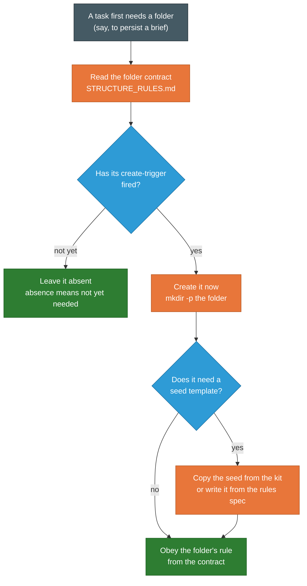

# KIT_RATIONALE.machine.md — Why the Kit Is Built This Way (the design decisions behind a project root that teaches its own agent)
# STATUS: CURRENT (2026-08-05; was 2026-08-04). Machine root of the KIT_RATIONALE guide; human twin in ../human_md/. 2026-08-05 (kit v1.5, K12): the folder contract is named `STRUCTURE_RULES.md` throughout, diagram node included (renamed from `STRUCTURE_RULES.machine.md`; content unchanged) — the ../PDF/ render is now STALE on this token and owes a re-render. K11-B: PREMISE gains PAIRING.ships-inside-ccrt (kit inside the CCRT at `CCRT/planner-kit/`; two deliberately-separate installers).
<!-- SPDX-License-Identifier: MIT · Copyright (c) 2026 Neill Prohaska <forest.microclimate@gmail.com> -->
# FORM: machine-md · durable reference · primary reader = LLM · atom-preserving translation of the human twin (INVARIANT.convert: every rule/fact/step kept; only packaging changes). SIBLINGS: WORKFLOW_GUIDE.md (the loop itself + how you steer it), KIT_ADOPTION.md (a person installing the kit + putting it to work). This guide stays on the packaging · installation · structure · portability, because the workflow's own reasoning belongs to WORKFLOW_GUIDE.md.

# ─── PREMISE (the problem the kit solves) ──────────────────────────────────
PREMISE.workflow: you have a way of working that suits you + want to use it again — a planner coordinates the job, isolated subagents do the reading + writing + building, code carries the parts that must be exact + repeatable, + everything passes between them through durable files in a shared tree.
PREMISE.question: once you have a workflow you trust, how do you carry it into a new project — + the project after that — WITHOUT rebuilding it by hand each time AND without it drifting a little further from itself with every move? ⇒ that question is the problem the **planner-kit** solves.
WHY.does-not-travel: a workflow living only in one project's files, or only in your head, does not travel. A fresh agent dropped into a new project has no memory of how you like to work; it inherits nothing.
DECISION.self-teaching: the kit packages the workflow as a set of GENERIC standing rules that install into any project root + teach that fresh agent how to operate there ⇒ the project root becomes self-teaching: the rules a coordinating agent needs sit in TWO files at the top of the tree, waiting to be read.
PAIRING.ships-inside-ccrt: the kit travels INSIDE the Claude Code toolkit at `CCRT/planner-kit/` yet installs SEPARATELY from it, because the two do different jobs — the CCRT equips the agent GLOBALLY (once, into `~/.claude`); the kit teaches ONE project root at a time (its own `install.sh`, run in each adopting project). The separation is DELIBERATE + the two are designed to be used together.
SCOPE.this-guide: the reasoning behind the kit's design, one decision at a time, each paired with the friction it resolves, so you can weigh each choice + adapt it.

# ─── §1 INSTALL ONLY WHAT THE PROJECT USES ─────────────────────────────────
DECISION.minimal-default: the first decision — how much the installer actually creates ⇒ by default, almost nothing. A default install writes TWO files at the project root — the rules (`CLAUDE.md`) + a folder contract (`STRUCTURE_RULES.md`) — plus a two-line pointer stub + the two advisory hooks (§7). It does NOT build the folder tree.
MECH.lazy-materialization: instead, the folders a project might use are created later, one at a time, the moment a task first needs one ("lazy materialization"). A folder's absence is treated as an ordinary fact about the work so far, NEVER an error: absence means "not yet needed."
WHY.clutter: reason stated plainly when the design was set — pre-creating a stack of folders a given project never touches is "a lot of unnecessary clutter" (your own words). EX: a project with no figures has no use for a folder to hold them; a project that never retires anything has no use for a retirement folder. ⇒ rather than guess the project's eventual shape + lay down every folder in advance, the kit lets the shape emerge from the work — materializing each folder at the moment of first need + leaving unneeded ones absent.
FIT.long-lived: this choice fits a long-lived, multi-purpose workspace whose eventual shape you cannot predict at the outset. WRONG choice for a one-shot generator that stamps out a finished project in a single pass, where building the whole structure up front is exactly right. The kit is built for the first kind + says so rather than pretending to suit both.
EX.full-flag: for anyone who wants the full layout immediately, one flag restores it — running the installer with `--full` pre-builds the classic tree + seeds every template up front.
WHY.full-identical: that full layout is deliberately held IDENTICAL to the previous version of the kit ⇒ useful side effect: it lets the authors prove the lazy redesign did not break the classic path, by checking the full install against the older one + confirming they match.

# ─── §2 THE TREE IS A SET OF INSTRUCTIONS, NOT A PRE-BUILT SHELL ────────────
DEF.folder-contract: if the installer no longer lays down the tree, something must tell the agent how to build it ⇒ the folder contract, `STRUCTURE_RULES.md`. Its primary reader is the coordinating agent rather than you. It carries the canonical tree, + for each folder gives FOUR things: (1) what the folder is for, (2) the trigger that calls it into being, (3) the rule that governs it once it exists, (4) the mechanical steps to create it. ⇒ the lazy default replaces a pre-built tree with a specification the agent executes.
RULE.decidable-triggers: for that to work the specification must be self-sufficient + its triggers must be DECIDABLE, so an agent can act on one without stopping to ask. EX (the concreteness this demands): the agent creates `dev/` the first time it needs to persist a brief, a ledger, an instrument script, a benchmark, or a report — a condition an agent can recognize on its own + act on at once.
RULE.write-tree-once: the tree is written down only ONCE. The folder contract takes its canonical tree VERBATIM from the same map in the rules file ⇒ there are never two copies of it to drift apart + disagree.

<!--FIG: On-demand materialization: when a task first needs a folder, the agent reads the folder contract, creates the folder at that moment, copies any seed template it needs, and then obeys the folder's rule. | 78% -->

# ─── §3 THE INSTALLER NEVER REWRITES WHAT IS YOURS ─────────────────────────
RULE.covenant: the rules install into your project's `CLAUDE.md` — a file you may already own + have written in ⇒ the installer holds itself to a strict covenant: it touches only the bytes it owns. ABSENT ⇒ it creates the file, with the kit's rules wrapped between a pair of comment markers. EXISTS ⇒ it appends that **marked block** + leaves every other byte exactly as it was. MARKED BLOCK ALREADY PRESENT ⇒ it does nothing at all. Everything outside the block is yours; the installer never modifies it.
WHY.root-not-dotclaude: the rules go to the project ROOT, rather than into the `.claude` folder where an earlier version kept them, because external code-review + continuous-integration runners look at a repository's root; a one-line pointer stub at `.claude/CLAUDE.md` sends a reader back to the root file.
HAZARD.stale-block: the covenant has a second, quieter hazard — a marked block from an OLDER version of the kit already in your file. A naive installer asking only "is a planner-kit block present?" would see it, conclude the work was done, + stop ⇒ leaving a freshly seeded folder contract at your root unreferenced by the older rules beside it.
MECH.version-check: so the installer checks the version; when the block it finds does not match the version it is, it prints a LOUD warning naming BOTH + stating the remedy. Even then it does NOT edit your file — the merge still does nothing, + upgrading remains your explicit choice: delete the old block + re-run. In every case the covenant holds: the installer writes only inside its own marked block + never rewrites your content.

# ─── §4 A PREVIEW YOU CAN TRUST, AND A RE-RUN THAT IS SAFE ─────────────────
PROP.idempotency: two properties make the installer safe to run more than once. (1) IDEMPOTENCY: run it a second time + it changes nothing the first run did — deletes nothing, overwrites nothing, + writes a template only if that template is absent ⇒ a folder contract you have since edited by hand survives a re-install untouched.
PROP.honest-preview: (2) an HONEST preview: before you run the installer for real, run it with `--dry-run` ⇒ it writes nothing + prints exactly what it would do.
LESSON.exactly: "exactly" is load-bearing, + was earned by a bug worth telling. An early version's dry run UNDER-counted: in full mode it predicted none of the empty-folder markers it would create, + then the real run created THIRTEEN of them. A preview that lies is worse than no preview, because you act on it as if it were true.
FIX.one-decider: the fix was NOT to correct the count but to remove the second opinion ⇒ the dry run + the real run were made to decide what to write from ONE shared function reading the same inputs, so the preview cannot drift from the real run — one piece of code now decides both.

# ─── §5 THE GUARD A REAL INCIDENT BOUGHT ───────────────────────────────────
INCIDENT.213gb: there is a mistake the installer now refuses to let you make, + it refuses because the mistake was once made. Running the installer from inside the kit's own `payload` folder pointed the source file + the destination file at the SAME file on disk ⇒ appending the rules wrote that file onto itself; in about two minutes it had grown to 213 GIGABYTES + was filling the disk. The first version of the installer DID have a guard, but it caught only some of the ways the target could turn out to be the kit rather than a real project — being run from inside `payload` was not one of them.
MECH.two-guards: two INDEPENDENT levels of defense do the work now, on purpose, because either level alone can be slipped past. LEVEL 1 refuses, before the installer does anything, if the target is the kit's own directory or anywhere inside its tree. LEVEL 2 sits immediately before each write + asks a narrower question — are the source + the destination in fact the same file? if they are, it stops. ⇒ even if the first guard were somehow evaded, the write that filled the disk still cannot run.
MECH.incident-as-test: the incident became a TEST — the exact scenario that produced the 213 GB is reproduced, + the guard is confirmed to stop it, so the protection cannot quietly erode in some later change.
LESSON.root-plus-backstop: the lesson the kit takes from this is to fix a fault at its root + add an independent backstop, rather than to suppress the symptom + hope.

# ─── §6 THE RECORDS THE PROJECT KEEPS ABOUT ITSELF ─────────────────────────
PREMISE.state-outlives: a project that runs this way accumulates state that must outlive the isolated agents who come + go + the sessions that open + close ⇒ THREE parts of the kit exist to keep that state trustworthy.
RECORD.plans: the **plans** system. The harness gives a session a SINGLE mutable plan slot, + reusing that slot for a new task overwrites the plan that was in it. So before the slot is repurposed, the current plan is snapshotted, word for word, into a plans folder whose subfolders record status by name: an active copy, a parked-and-resumable copy, + a finished copy. But naming a folder "finished" does not by itself make anything true ⇒ a folder carries status only where a mechanism honors it, so every move between those folders is paired with a row in a plan ledger + with the snapshot itself. The location is a convenience for orientation; the content is the record.
RECORD.ledgers: the **ledgers** — three ship as templates the project copies in when it first needs them. (1) an EFFICACY ledger whose single governing rule is that nothing may be called working without a cited measurement; a fix that merely exists is only "attempted, untested" until a number says otherwise. (2) an APPEND-ONLY change log, where you add rows + never edit old ones, standing in for version history where a project keeps none. (3) a CODE INVENTORY that every agent consults before it writes new code, so it uses or extends what already exists instead of building a rival copy. WHY.rival: a second implementation of the same thing produces a second answer, + two answers that disagree cost more to reconcile than either cost to build.
SELF-BIND.efficacy: the kit holds itself to that efficacy rule as strictly as it asks you to — the principles gathered here were measured in the SINGLE project they came from, + until your project measures them again they are, by the kit's own standard, attempted + untested in your hands.
RECORD.stale-trash: **Stale_Trash**, the retirement folder, is the subtlest of the three, because the obvious way to retire a document is WRONG. An agent finds what it knows by searching the CONTENTS of files ⇒ moving a stale file into a folder called trash does not hide it: the search still reads it + still trusts it as current. Currency must live where the search will look, which is INSIDE the file. ⇒ retiring a file means FIRST writing a tombstone into the file itself — marking its status as superseded + prefixing its headline claim with a note that points to whatever replaced it, on the exact line a search would reach. ONLY AFTER that is the file moved into `Stale_Trash`, which is tidiness + a kept trail, NOT the act that neutralizes the stale claim. Nothing is deleted; deletion is a separate, later, explicit decision. The move is defense in depth laid ON TOP of the tombstone, never a substitute for it.

# ─── §7 WHAT THE KIT WRITES, AND WHAT MAKES IT FIRE ────────────────────────
DECISION.two-later: two later decisions tightened what the kit puts into your project + what stands behind it once it is there.
DECISION.slop-cut: the FIRST governs the TEXT itself — a file the kit installs is read again by every agent that later works in your project ⇒ a line that changes nothing is a cost paid at EVERY read, + a line never written can never go stale.
TEST.fires-at-a-decision: each line now faces ONE question — does an agent reading this file do something DIFFERENTLY because this line exists? PASS ⇒ rules, triggers, contracts, operative context, marker machinery. FAIL ⇒ provenance narration, self-description, justification prose, version numbers in prose — these were CUT.
MEASURED.byte-cut: the cut took a DEFAULT install from 26,968 bytes to 22,497, + a FULL one from 46,661 to 41,442.
KEEP.provenance: the kit's own provenance SURVIVES that cut, because provenance belongs to the RECORD rather than to the INSTRUCTION ⇒ status headers, markers, + the memory seeds' stated reasons are kept BY NAME, + the change ledger holds the history.
EX.version-number: a version number shows why — the marker + the installer already carry it, so a version in prose adds nothing + ages badly, as two stale references to an older version had already shown.
LADDER.remember-form-check: the SECOND decision is how a rule survives contact with the work. A rule an agent must REMEMBER is weaker than a FORM it must fill in, weaker again than a CHECK that fires on its own ⇒ the kit ships ALL THREE: the brief contract as prose; the same contract as a fill-in form whose unfilled slot is visible without anyone looking for it; + two hooks installed BY DEFAULT — one naming an unfilled brief slot at launch, the other asking once for the collect outcome when a turn that gathered results names none.
RULE.advise-not-refuse: both ADVISE + neither REFUSES, because HERE a false refusal costs more than a missed reminder — though where the guarded action is expensive + irreversible, a REFUSING check would be the right setting. Both FAIL OPEN, + one variable turns them off.
CAVEAT.fixture-measured: by the kit's own efficacy rule the hooks are FIXTURE-MEASURED, NOT proven in an adopting project.
OPTION.sub-planner: the form carries one more shipped option — a chunk that would need a plan of its own can go WHOLE to a subagent running the planner role, sealed in a narrowed scope with its own brief area, as a block you DELETE when it does not apply. Nesting is measured ONE level deep, no further.

# ─── §8 IT ANCHORS ITSELF, SO IT TRAVELS ───────────────────────────────────
RULE.no-absolute-path: the kit carries NO absolute path to your project anywhere in what it installs. It defines the project root as the directory that holds the rules file, + it works out its own location + the target's location at the moment it runs ⇒ one copy of the kit installs into any project, on any machine, with nothing to edit first.
EXCEPTION.one-path: exactly ONE machine-specific path appears in anything it writes — a note recording where the kit's own seed templates live, so an on-demand folder can copy a template when it is first needed. That single path is labeled as precisely what it is — a local convenience carrying NO authority — + it comes with a fallback: if the kit has since moved, or you are on a different machine + the path no longer resolves, the agent writes the template from its specification in the rules file instead (the portable source of truth). The convenience is allowed to fail without blocking the work.

# ─── §9 THE PRINCIPLE UNDER ALL OF IT ──────────────────────────────────────
PRINCIPLE.location-vs-mechanism: one idea sits under all of these decisions + is worth stating on its own — a thing's LOCATION shapes its reach + its authority, but a folder name carries status ONLY where some mechanism actually honors that status, so the real record always lives in a file's CONTENT, never in the folder name alone. It underlies the lazy tree, the folder contract, the plans folders, + `Stale_Trash`.
WHY.buys-two: it buys a coordinating agent two things at once — orientation, because each kind of thing has a known home, + a single owner for each home — + in the same breath it refuses to let a bare folder name promise something no mechanism enforces. The LOAD-BEARING half of the principle is that refusal, + it is deliberately self-limiting: the standard tells you where things belong while warning you, at the same time, not to trust a location any further than a mechanism backs it.

# ─── §10 WHAT GENERALIZES, AND WHAT IS SPECIFIC TO THIS KIT ─────────────────
GENERALIZES.pattern: you may want to carry these ideas to a toolkit of your own, so it is worth separating the transferable pattern from this kit's particulars. Most of what this guide describes transfers to ANY portable toolkit built for agents: installing the rules + materializing artifacts on demand, for a long-lived workspace rather than a one-shot generator; shipping an executable, single-sourced specification instead of a pre-built shell; merging non-destructively into a file the user owns; making the preview identical to the real run by having one function decide both; guarding a self-run installer against targeting itself; snapshotting a single-slot resource before reuse; neutralizing a superseded claim where a reader will reach it; anchoring to your own location so you carry no absolute paths; writing only lines that fire at a decision; + backing a rule that must fire at a particular moment with a check at that moment.
SCOPED.three-limits: three of these hold only within stated limits, + the kit marks them — materializing on demand suits long-lived workspaces + not one-shot generators; holding a full layout identical is a safety net only when there is a previous version to match; + guarding against self-targeting matters only for a tool you run from its own source.
SPECIFIC.this-kit: what is specific to this kit is a short list — the exact version string + marker text, the 213-gigabyte figure + the particulars of the portability target, + the specific folder + template names. Drawing that line deliberately is itself part of what makes the pattern portable.
CLOSE.not-exotic: none of these decisions is exotic — each is the plain response to a friction the work actually produced, which is why you can adopt them one at a time, keep the ones that fit your project, + know exactly what each one is protecting you from.
