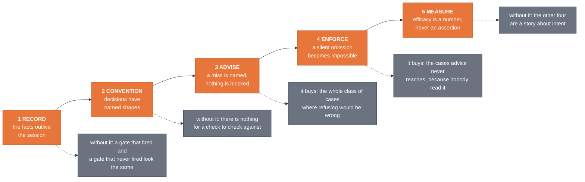
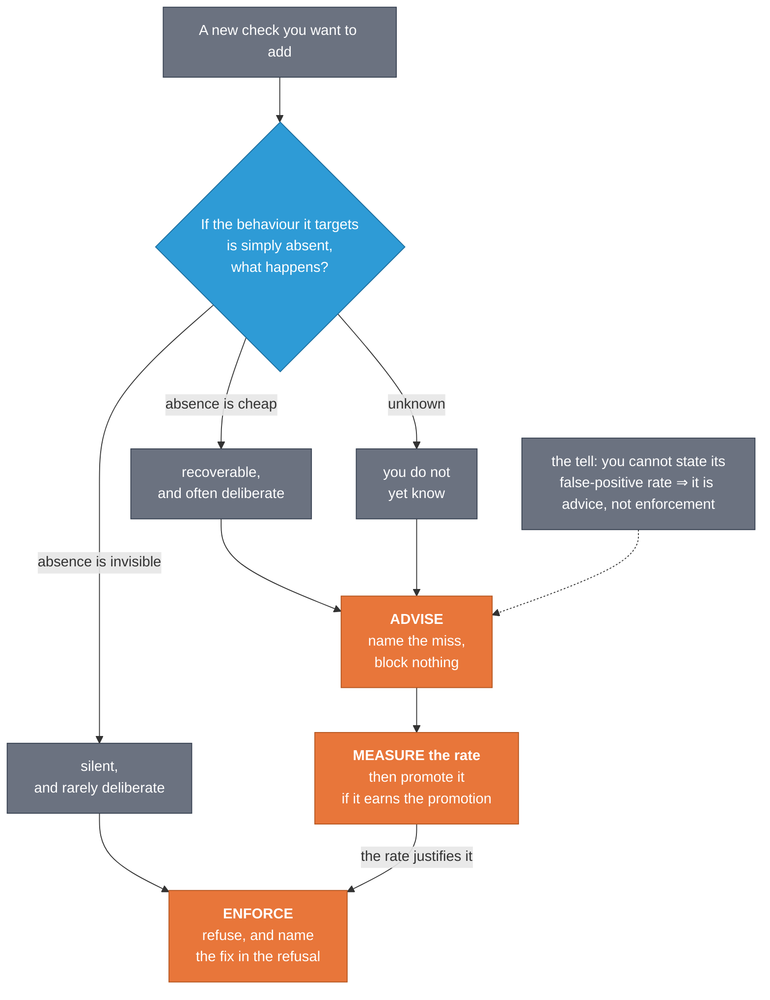

<!-- SPDX-License-Identifier: MIT · Copyright (c) 2026 Neill Prohaska <forest.microclimate@gmail.com> -->
# The Five-Level Assurance Ladder

### Record, convention, advise, enforce, measure — how the toolkit keeps itself honest

## 1. What this answers

You ask for a piece of work to be handed off, and instead of starting, it stops. A short message
comes back naming something your instructions left out, telling you how to add it, and pointing at
a template. Nothing crashed and nothing was lost. The work simply did not begin, and the thing that
stopped it is not something you remember installing.

Something just refused you: what was it, and why does it exist? That is the question this document
answers first, and the answer is that the refusal came from one of five kinds of safeguard this
toolkit ships. Knowing which one acted tells you what to do next.

Here is the setting the whole document assumes. A person directs an AI assistant, and that
assistant hands pieces of the work to other, separate assistants — **subagents**, which the
entries below also call *children*. Each is launched with one written assignment, holds no memory
of your conversation, returns one report, and is then gone. Two platforms carry this toolkit: Claude Code runs as a program on your own computer, with
real files and a real shell, while Claude Science runs in a sandbox you reach through a browser,
and every difference between the two versions of the toolkit descends from that one fact. The
safeguards below are small programs running on your own machine, which is what lets them stop an
action before it happens rather than comment on it afterwards. This document explains the five
kinds, so you can tell which one just acted and where a check of your own belongs. If you want the
working loop instead — how a coordinator writes an assignment, collects the report, and decides
what happens next — read *Inside the Loop* first; for why this toolkit exists in two versions at
all, read *One Methodology, Two Carriers*.

Three questions bring people to this page, and each is answered in a different place below. A gate
just refused something you did: what refused it, and why does it exist? You are adding a check of
your own: which level does it belong at, and what does that level owe you? Someone asks whether the
toolkit's assurances actually work: what is measured, and what is merely built?

The toolkit's assurances are not one mechanism. They are five levels, and each does a job the
neighbouring levels cannot do. **Record** keeps facts alive past the session that produced them.
**Convention** gives decisions named shapes. **Advise** names a miss without blocking anything.
**Enforce** makes a silent omission impossible. **Measure** turns efficacy into a number instead of
an assertion.

### The four words the rest of this document rests on

Four terms carry almost everything below, and they are worth fixing before the argument starts.

The **harness** is the software that runs your session: it launches the assistant, carries out the
tool calls the assistant asks for, and ends its turns. At fixed points in that sequence the harness
fires named **events**: before a tool call, after one, when a subagent finishes, when a turn ends,
and when a session starts. A **hook** is a small program you register against one of those events,
which the harness then runs automatically, handing it a description of what is about to happen. A
hook can put a note in front of the model, or refuse the action outright, and that difference is
the distinction this whole document turns on: a **gate** is a check sitting at a decision moment,
an **advisory** gate names what is missing and lets the action proceed, and an **enforcing** gate
refuses the action and says how to fix it. Last, an **exit code** is the number a program hands
back when it finishes, by convention 0 for success. The measuring instruments here use 0, 1 and 2
to carry a verdict, while every hook here returns 0 no matter what it decides, for a reason
section 6 gives.

With those in hand, the rest follows in order: section 2 is the law the whole ladder rests on,
section 3 the five levels themselves, section 4 what each level buys that its neighbours cannot,
section 5 the honest limit, section 6 one compact entry per shipped mechanism, section 7 the
control surface, and section 8 how to add a level of your own.

One neighbouring document is cited throughout and never summarised. *When a Model Request Is Not
the Model Run* owns a single failure — a request for one model that a remote service answered with
a different one — and the verification patch built around it. This document cites that story where
it bears on the ladder; it never retells it. (The file is
`MODEL_SUBSTITUTION_AND_VERIFIED_LAUNCH.machine.md`, with its human twin beside it.)

## 2. The law beneath: structural over disciplinary

When you are choosing among candidate assurances, prefer a mechanism that fires at the decision
moment over an exhortation that has to be remembered. An instruction written into a prompt fires
only if the prompt was loaded and the model then chose to comply. A hook on the tool call fires
regardless of both.

This is a conclusion drawn from recorded defects rather than a matter of taste, and three of the
shipped mechanisms carry their own origin in their header comments. Each of the three is a case
where the advice already existed, in writing, and did not arrive.

The first is a hole in a model ban. The ban held at build time, where a barred identifier cannot
ship in the payload, and at plan time, where a plan cannot declare one. A launch typed in the
moment reached the barred model with no check at all, because neither of those gates sits on the
dispatch path — the path a launch actually travels. The dispatch guard exists to close that hole
and nothing else.

The second is a routing mandate that lived in the prompt of the planner, the coordinating agent
that decomposes the work and hands out the pieces. It produced a plan declaring six delegation
tracks, four of which the lead then ran itself. The plan-approval gate lints the plan's routing
block — the part that names who runs each track — at the tool call, so the plan is corrected
before the user ever sees it.

The third is a set of launch conventions for a verified frontier-tier child, where *frontier tier*
means the most capable and most costly model band, kept for the hardest pieces of work; *Inside the
Loop* owns that vocabulary. Those conventions kept failing to reach sessions that had never loaded
the documents stating them. The dispatch gate enforces the launch shape, so the convention arrives
whether or not the doctrine did.

A corollary follows from the same reasoning. When an action's costs are asymmetric, default toward
the cheap-to-reverse side and require an explicit token for the expensive one. Every gate described
here fails open on its own internal error: it exits zero always, the refusal rides in structured
output rather than in the exit code, and the error is logged. A broken guard must never wedge a
session, and a silent fail-open is itself the bug, which is why the fail-open gets a log line.

The law says to prefer a mechanism. It does not say a mechanism can do everything, and section 5
states what no gate on this ladder can do. Read those two sections as one claim in two halves. A
check that fires beats an instruction someone has to remember, and no check that fires can make the
decision it forces a good one. Taking the first half without the second turns this document into a
promise it does not make.

## 3. The five levels

<!--FIG: The five-level ladder: each level in order, with what it buys that its neighbours cannot. | 88% -->



The one thing to take from the figure: the levels are ordered, and each rests on the one before it.
A check can only check a shape that a convention already defined, and a measurement can only measure
against facts a record already kept. Section 4 argues each of those five claims in turn; this
section says what actually sits at each level.

### Level 1 — Record: facts survive

Nothing above this level means anything if the facts do not outlive the session that produced
them.

Four **append-only ledgers** carry the record, each written so a worker with no prior context can
read it — a *ledger* here being a running file that gets added to and never rewritten. The change
ledger takes one dated row per change and never edits a past row. The efficacy ledger takes one row
per check, carrying its status and the measurement that justifies that status. The code inventory
registers every script, so the next worker uses or adapts one rather than rebuilding it. The plan
ledger records which plan is active, which is parked, and which is finished.

**Receipts discipline** governs how a current fact may be stated: only from a fresh read or
measurement made for that claim. Recollection cannot be audited, and a command's output can.

**Serving stamps** decide the model identity of a run. That identity is read from the API
response's own per-call `model` field in the run's own transcript — the session's line-by-line
record file — and it is the only record downstream of what actually ran. Every other signal, whether
a launch argument, a resolution, a header in the interface, or the run's own testimony about
itself, records intent or belief. *When a Model Request Is Not the Model Run* is where that
distinction is worked out in full.

**Completion telemetry** appends one structured row per subagent completion, clean completions
included, because a rate needs a denominator. Each row carries the hook build that wrote it, so a
later analyst can separate pre-fix from post-fix populations instead of pooling them.

### Level 2 — Convention: decisions have named shapes

A decision with no named shape cannot be checked by anything: not by a hook, not by a reviewer,
not by the person who made it. Everything at levels 3 and 4 is checking conformance to a shape
defined here.

**The project contract** is a project-level `CLAUDE.md` stating the supervisory workflow, the
folder contract, and the standing rules. It is installed into the project root rather than
remembered.

**The seven-element brief** fixes what a subagent gets — the *brief* being the written assignment a
subagent is launched with, and the only thing it knows about the job. Its first six elements are: an
assignment with a checkable done-condition; read-paths the child reads itself rather than receiving
as a summary; a write-path inside the workspace for all products, code included; a report cap
giving a line budget plus the receipts each claim must quote; the stop-when-stuck rule verbatim;
and the scope rule verbatim. The seventh is the role assignment, described in its own entry below. An empty element means the brief is not ready to launch. The fill-in
form ships at `dev/briefs/_TEMPLATE.md`.

**Routing blocks with owners** require a plan's delegation block to name, for each track, the
executor and also an owner that says more than the executor tag — the persona or skill assignment —
or else to carry the explicit "no specialist fits" fallback.

**The role assignment** is the `ROLE:` line in a brief, naming which persona the child runs as,
with the brief pointing at that persona's file. A *persona* is a role definition kept in a file,
which a subagent is told to read and then operate as.

**Persona and skill delivery by read-pointer** means the brief names the persona file or `SKILL.md`
path and the child reads it. Handing the child a summary instead would be the obvious alternative,
and it is the wrong one. Two things follow from making the child fetch the source itself. The child can audit what it was given, rather than trusting a précis that already decided
what mattered. And for a frontier-tier child, those opening reads double as the warmup — the first
few real reads a subagent makes — that lets the serving identity be certified early, before any
work is banked on it.

### Level 3 — Advise: misses get named, never blocked

This is the level for things that are usually an oversight and occasionally a considered choice,
where refusing would be wrong more often than it would be right.

The **brief-slot advisory** names any unfilled brief slot at launch time and never refuses the
launch. The **completion-telemetry nudge** puts one advisory note in front of the model when a
finishing child's own final message scans at severity 2 or worse. The **watchdog scaffold** prints,
after a frontier-tier launch returns, the ready-to-run certification command with the child's
transcript path already substituted, together with the exit-code legend, so the next action
requires zero recall — the *watchdog* being the small program that reads a run's opening serving
stamps and returns one of three verdicts. **Plan-state re-injection** restores the active plan's
name, its snapshot path, and the resume protocol at each session boundary — startup, resume, and
post-compaction — for roughly a hundred tokens per boundary event rather than a per-prompt tax.

### Level 4 — Enforce: a silent omission becomes impossible

This is the level for omissions that are silent by nature, the ones nobody notices at the time,
which is precisely why advice does not reach them.

**The dispatch deny-gate** refuses a frontier-tier launch that names no brief and opens with no
warmup, or names a brief that is absent or unreadable, or names a brief missing its `ROLE:` line,
its persona pointer, or, at the ceiling tier, its warmup slot.

**The plan-approval gate** refuses the plan-approval tool call when the plan's routing block is
missing or malformed, owner-explicitness and multi-stage enumeration included, so the plan is
fixed before the user is asked to approve it.

**The turn-verdict block** stops a turn once when that turn launched a certified-route child and
names no serving certification, printing the ready-to-run certification command.

All of it is **one-shot by construction**: a turn-level block fires at most once per stop
sequence, guarded by the harness's own already-blocked flag. A gate that could fire twice is a
loop, not a gate.

### Level 5 — Measure: efficacy is a number, never an assertion

This is the level that decides whether any of the four below it actually worked.

**Live certification** reads a still-running child's first serving stamps and returns a verdict by
about the fifth call. **The post-hoc audit** catalogs every run's launch argument against its
resolved model against the model that was actually served, with a per-run verdict and a gate-able
exit code. **Completion telemetry**, which Level 1 collects as rows, becomes a rate here: the rows
carry denominators and build tags, so "did the fix work" is answerable by comparing populations
rather than by assertion.

**The adherence scorecard** scores a session's transcripts on six greppable dimensions as n over
N, where n counts compliant cases and N counts the opportunities actually observed. It dates each
opportunity by the transcript record that carries it, so an interrupted time-series across a gate's
ship instant stays interpretable instead of being smeared by sessions that straddle it. Five of the
six dimensions score how well the gated launches were run. The sixth, tier-explicitness, scores
whether the tier was decided at all, so its denominator is every delegate-class launch rather than
only the gated ones. A launch counts as compliant there when it carries a model argument or names a
pinned or probe agent type: a pinned type is itself an explicit tier choice, because the model then
comes from that agent's own frontmatter pin. An omitted argument sits at the bottom of the
harness's four-rank precedence order and simply requests whatever the main model happens to be.
Such a launch is legal, and sometimes it is the right one, so the dimension measures how often the
choice was recorded, never whether it was wise. It measures; it never blocks and never edits. The workflow
kit installs it at `<project>/dev/tools/adherence_scorecard.py`, with its fixture guard beside it,
so the method by which the grades in section 6 were earned is one you re-run on your own sessions
rather than merely a citation. Its lineage classification derives from your project root, so your
sessions score as yours.

**The efficacy-ledger discipline** fixes the vocabulary every grade in section 6 uses, and it has
five values. `attempted-untested` means built but not yet measured, and it is the status of
anything new by default. `fixture-measured` means exercised against labeled fixtures or test cases,
behaving as specified on those cases — a *fixture* being a saved test case with a known right
answer. `measured-working` means measured before and after on real outcomes, stated with the
numbers. `measured-regressed` holds the same evidence standard and the opposite result. `retired`
means no longer in use. No check moves past `attempted-untested` without a cited measurement, and
"I built it" is never a measurement.

**The verdict is ceiling-tier work, and its inputs are not.** The final verdict pass over a
work-product — the go/no-go synthesis, the adversarial adjudication, the release-gate reading — is
not delegable downward. The checking work-pieces that feed it — guard runs, stamp greps, fixture
batteries, line-level review sweeps — tier by their own difficulty and delegate down like any other
work. Record who holds the verdict. The reason is that the moment a wrong call is most expensive is
exactly the moment a cheap tier is most tempting, and a verdict assembled by whoever happened to
hold the pieces inherits their tier by accident rather than by decision. Its grade is
`attempted-untested`: this is doctrine, and its behavioural efficacy accrues through the adherence
time-series above, whose tier-explicitness dimension measures the recorded half of it per session,
never through its having been written down. The routing side of the same doctrine — which work
classes merit the ceiling, and what a non-ceiling main agent delegates — is owned by *When a Model
Request Is Not the Model Run*, section 4, and is not restated here.

## 4. Why five — what each level buys that its neighbours cannot

Without the **record**, every other level is unauditable: a gate that fires and leaves no row
cannot be told from a gate that never fired.

Without a **convention**, there is nothing to check. Levels 3 and 4 do not check goodness. They
check conformance to a shape Level 2 defined, which is why every enforcement below points at a
convention above.

**Advice** covers the large class where refusal would be wrong. An advisory that names a miss
costs a line of context. A refusal that is wrong costs a retry, then a workaround, and eventually
the operator switching the whole layer off, which is the real failure mode of over-enforcement. The
danger of enforcing too much is not the one wrong refusal; it is the switch being thrown afterwards.

**Enforcement** exists because advice reaches only an agent that reads it. The recorded failures
in section 2 are all cases where the advice existed and did not arrive: the ban was written down,
the routing mandate was in the prompt, the launch convention was documented. Enforcement is what
fires when the doctrine did not load.

Without **measurement**, the other four are a story. `attempted-untested` is the default for a
reason: a mechanism's existence is evidence about the author's intent, never about its effect.

That gives a rule for placing a new check, and it turns on one question rather than on a taxonomy:
what happens if the target behaviour is simply absent?

<!--FIG: Placing a new check: one question decides the level, and the false-positive rate decides whether it may enforce. | 74% -->



In words: if the absence of the behaviour is recoverable and often deliberate, advise. If it is
silent and rarely deliberate, enforce. If you do not yet know, advise first, measure the rate, and
promote afterwards. The tell to watch for is the one on the figure's grey node — you are about to
add an enforcement whose false-positive rate you cannot state, which means it should ship as advice
and be measured.

## 5. The honest limit

Every gate on this ladder forces a decision to be **made**, **recorded**, and **well-formed**.
None of them forces it to be **wise**. The owner-completeness and multi-stage checks are the
clearest case: they are minimum-explicitness checks, and a routing block that names the wrong
specialist for every track passes all of them.

The same boundary holds in general. These mechanisms check form and identity, not content-truth.
A well-formed false claim passes. A brief with all six slots filled with nonsense passes. A
certified child can be certified as the right model and still be wrong about the work.

The judgment residual is not left unowned. It belongs to **two-stage detection**. Every round that
outputs a product a standard covers only partly runs two passes in order. First the automated
detectors scan and disposition, with the results recorded. Then the standard's owner — the user by
default, in a project with no style or standard document yet — sweeps the same output for what
stage one missed. Output is never called clean on stage-one evidence alone.

Each stage-two miss then becomes three things: a labeled fixture pairing the flagged text with
the corrected text, a row in the change ledger, and a routing decision, either to the next
detector build or to the judgment checklist when no detector shape fits. Per-round residual counts
accumulate, and the rate-drop trend across rounds is the real efficacy measurement. A single
round's count is a baseline, not a verdict.

The residual has a **tier** as well as an owner, and this is the part that is easy to leave
unmade. Because no gate here makes a decision wise, the wisdom has to come from somewhere, and
"somewhere" is a routing decision: the final verdict pass sits at the ceiling tier and is not
delegable downward, while the checking pieces that feed it delegate down by their own difficulty,
as Level 5 sets out. A ladder that forces every decision to be recorded and well-formed, and then
lets the verdict on those records fall to whichever tier happened to be holding the pieces, has
moved the weak point rather than removed it.

Every mechanism here can also be switched off, as section 7 describes. That is deliberate. An
operator who sets the switch has made the layer inert on purpose, and a gate that ignored the
switch would be a surprise. The consequence is worth stating plainly: these gates are a floor for
a cooperating operator, never a control over a determined one.

Finally, a measurement is a statement about the conditions it was taken under. Where the measured
thing is served remotely, its rates can drift on the scale of hours with no local change at all,
so certification at launch carries the guarantee rather than configuration or a rate measured
yesterday. *When a Model Request Is Not the Model Run* holds that case in full.

## 6. Mechanism entries

Each entry below gives the file path an adopter has after install, where `<project>/` is the
project root you installed the workflow kit into and `~/.claude/` is the global toolkit install;
the harness event and matcher it registers on; what triggers it; what you see when it fires; how
to test it; how to silence it; and its evidence grade, copied from the efficacy ledger. Every
mechanism here was read at authoring time, no grade is upgraded in the writing of it, and nothing
is described that the record does not carry.

A word that first does real work in this section: a **matcher** is the narrowing filter written
beside an event, naming which tools that event should apply to. A hook registered on PreToolUse
with the matcher `Task|Agent` runs before a subagent launch and ignores every other tool call.

**The contract every hook entry shares.** Input is one JSON object on standard input — the
harness's description of what is about to happen, handed to the hook as text. The exit code is
always zero: a refusal rides in the structured output rather than in the exit code, because the
model needs the reason in order to retry, and that retry is the point. Any internal error — no
interpreter, unparseable input, an unexpected shape — is treated as indeterminate, so the hook
fails open and logs. All of them are read-only apart from their own log lines.

**The test every hook entry shares**, and why it is valid. Every hook here is a pure reader of
JSON on standard input, so replaying one crafted payload is the real firing path; nothing about a
live session changes what the script reads. The form is `printf '<payload>' | bash <hook path>`,
after which you read standard output — empty means a silent pass, one JSON object means a
decision — and standard error, which carries advisory text. A worked example, a briefless
frontier-tier launch, which must print a deny object:

```bash
printf '{"tool_name":"Agent","cwd":"/tmp/x","tool_input":{"subagent_type":"fable-executor","prompt":"do a thing"}}' \
  | bash "<project>/.claude/hooks/fable-dispatch-gate.sh"
```

Then invert it: point the prompt at a compliant brief and confirm silence. A gate you have only
seen pass is not a gate you have tested. Show it refusing the thing it exists to refuse, then show
it passing what it must not refuse.

Each hook also names its own per-hook regression battery in its header comment, as
`tests/test_<name>.sh`. Those stay development-side and are not part of the release cut. The
end-to-end battery, however, ships: `<project>/dev/tools/test_enforcement_e2e.sh` replays the whole
violation set against the installed hook copies and against their `.claude/settings.json`
registrations — the delivery layer, which a vendor tool-rename kills silently while every hook file
stays perfectly correct. One command; exit 0 means every arm behaved. Arms that need a surface a
given project may not have, such as the global toolkit install or a live plan under
`plans/current_active/`, print SKIP rather than FAIL, because a false failure is how a check
teaches its adopter to ignore it.

### 6.1 Advise

**Brief-slot advisory** — `<project>/.claude/hooks/brief_gate.sh`, on PreToolUse with matcher
`Task|Agent`. It triggers on a subagent launch: the prompt or description naming a
`dev/briefs/*.md` file is looked up, a substantive launch naming none gets a one-line note, and a
trivial launch (a read-only searcher, a short prompt, no write intent) passes in silence. What you
see is injected context naming the unfilled slots, which are the seven brief elements, the seventh being the `ROLE:` routing line, all advisory. It emits no permission decision at all: it advises, it does not
deny. Silence it with `PLANNER_KIT_HOOKS=off`. Grade: `fixture-measured`.

**Launch scaffold** — `<project>/.claude/hooks/fable-launch-scaffold.sh`, on PostToolUse with
matcher `Task|Agent`. It triggers when a certified-route or probe launch returns and the response
carries an `output_file:` path; no path means it stays fully silent. What you see, on standard
error, is the ready-to-run certification command with the child's transcript path substituted,
plus the legend: FAITHFUL, exit 0, means certified, continue; SWAPPED at call k, exit 1, means
relaunch or proceed knowingly and log it; UNDETERMINED, exit 2, means investigate. Standard output
stays empty, since this hook decides nothing. Silence it with `PLANNER_KIT_HOOKS=off`. Grade:
`fixture-measured`.

**Plan-state injector** — `<project>/.claude/hooks/plan-state-inject.sh`, on SessionStart with
matchers `startup`, `resume`, and `compact`. It triggers at a session boundary when a
`plans/PLAN_LEDGER.machine.md` row under the project directory is marked ACTIVE; with multiple
ACTIVE rows the last is named plus a count of the rest, and no ledger, no ACTIVE row, or any parse
doubt leaves it silent. What you see is about two lines: the active plan's name and snapshot path,
then the one-line resume protocol including the verified-launch reminder. Standard input is
drained and ignored, and it writes nothing at all, not even a log, because a session-boundary hook
is a pure reader. Silence it with `PLANNER_KIT_HOOKS=off`. Grade: `fixture-measured`, with one
live output receipt against a real ledger.

### 6.2 Enforce

**Dispatch deny-gate** — `<project>/.claude/hooks/fable-dispatch-gate.sh`, on PreToolUse with
matcher `Task|Agent`. This is the one deny-capable launch gate. It triggers on two kinds of
launch: one whose subagent type is any of the three certified routes, and one whose model argument
names the ceiling tier. The three certified routes are the two executors, ceiling-tier and
supervised, plus the ceiling-tier sub-planner, which the gate's trigger vocabulary gained the day
that route shipped. Subagent types beginning `probe-` are allowlisted, since probe cells are
legitimately briefless by design, and everything else passes silently.

It runs three checks. The first is launch shape: the prompt or description names a
`dev/briefs/*.md` brief, or the prompt opens with the warmup token, and neither means deny, while
a named brief that is absent or unreadable also means deny, because a dangling brief pointer is a
launch defect rather than a parse error. The second is routing explicitness, applied once a brief
resolves: the brief carries a `ROLE:` line and, anywhere in the file, either a persona-file
reference or the literal fallback phrase, and a missing one means deny. The scope is the whole
brief on purpose, because persona pointers legitimately ride the warmup slot rather than the ROLE
line. The third is verified launch, at the ceiling tier only and once a brief resolves: the brief
carries the warmup token, and a missing one means deny.

Alongside those three checks the gate carries an **advisory arm**, and the split between them is
worth reading closely, because it is this document's own placement rule applied inside a single
hook. The checks judge the brief and can deny. The advisory judges the route and never denies. On
the pass path, when a launch requests the ceiling tier by model argument from a generic agent type
— any type outside the pinned set, with `probe-` already allowlisted — the gate emits one injected
note naming the certified alternatives, the executor for executor work and the sub-planner for
sub-planning, and asking for watchdog certification. The launch proceeds either way. Why advisory
and not a fourth check: that shape is the measured substitution-prone class, and it is at the same
time legal, sometimes necessary, and caused by a defect on the serving side that this gate does not
own. Those three properties together describe section 4's advise level exactly. So the same gate
enforces where the omission is silent and advises where refusal would be wrong.

What you see is a denial of the launch with a reason of at most four lines: the check that failed,
the element that is missing, the fix, and the template path. On the advisory arm you see the
injected note instead, and no decision at all. Silence it with `CRT_MODE=off` or `CRT_MODE=observe`;
it is an intervention hook, so `on`, the default, is the only enforcing value. Grade: the deny
checks are `fixture-measured (live instances)` and the advisory arm is
`fixture-measured (incl. live instances)` — 88 guard cases with a red arm, plus live firing in a
real session, where the gate denied a coordinator's own non-compliant probe launches and admitted
both the corrected ones and a briefed run.

**Plan-approval gate** — `~/.claude/hooks/plan-routing-gate.sh`, on PreToolUse with matcher
`ExitPlanMode`. It triggers when the agent is about to present a plan for approval, and it lints
every routing fence and the markdown table, not just the first, so a compliant first block cannot
shadow a violating second one.

The checks are the frozen routing-schema lint set. A declared delegation track must actually
delegate, so body text saying the lead runs it is caught. Barred model aliases are denied wherever
they appear, because an alias re-resolves silently and is therefore never a sanctioned route. A
raw model field naming a restricted model is denied, while naming that model inside an executor,
owner, task, or tradeoff field is allowed, so a plan that legitimately routes to a supervised
executor can say so without the gate reading its own documentation as a violation. A
supervised-executor track must carry its supervision marker, since the marker is what
distinguishes a watched run from one that was routed and then abandoned. Owner-completeness
requires a delegation track's owner to say more than the executor tag, or to carry the explicit
fallback. Multi-stage completeness requires a track declaring a cascade topology to enumerate at
least two stages, and a plan routing more than one delegation track to carry a waves or ordering
section. Tier-explicitness requires three fields on every delegated track. The first is a
`model_tier` drawn from the tier vocabulary, where the `n/a` sentinel belongs to main-agent and
code tracks and fails on a delegated one. The second is a non-empty `effort`, with the placeholders
`TBD`, `?` and `-` reading as absent. Last comes a `topology` drawn from the topology vocabulary,
which is the fixed set of names for the ways a plan can arrange its subagents. Main-agent and code
tracks are exempt from this check.

One note on tier-explicitness. It is a minimum-explicitness check of the same shape as
owner-completeness and multi-stage completeness: it forces the tier, effort and topology decisions
to be recorded, and judges none of them. The recorded gap it closes is that `model_tier` was
validated only when present, while `effort` and `topology` were never inspected at all, so a track
that never made those decisions passed exactly like one that made them well. A `model_tier` that is
present but unknown or barred remains the tier-ban check's finding and is not re-reported here.

What you see is the approval call denied with the failing check named, so the plan is corrected
before the user is asked to approve it.

One note on extraction. The current harness sends neither the plan text nor its path in the tool
input, so the gate falls back to the newest plan file in the plans directory, accepted only when
its modification time is within the last thirty minutes. Any miss — no directory, no file, too
old, unreadable — is a logged fail-open rather than a lint failure. Silence it with
`CRT_MODE=off` or `observe`. Grade: `fixture-measured (live instances)` for the gate and its
owner-completeness and multi-stage checks; the tier-explicitness check carries its own, newer grade
of `fixture-measured`, from 60 guard cases with both red arms printed plus one live plan passing in
full. A check added to a gate with live instances does not inherit that gate's grade — it earns its
own.

**Alias dispatch guard** — `~/.claude/hooks/opus-dispatch-guard.sh`, on PreToolUse with matcher
`Task|Agent`. It triggers on a launch whose model argument is a bare restricted alias, alone or
context-suffixed; everything else passes silently, whether that is a named tier alias, a full
model identifier, or no model key at all.

Why aliases and only aliases: an alias reads to a human like a tier choice while resolving at
launch to whatever the launcher currently maps it to, and it re-resolves silently whenever that
mapping changes. A full identifier is deliberately not denied here, because the launch parameter
accepts aliases only, so a full identifier is rejected upstream by the harness, and because the
sanctioned supervised route names an agent whose own frontmatter carries the pin rather than
naming a model.

What you see is the launch denied with the structured reason. Silence it with `CRT_MODE=off` or
`observe`. Grade: `fixture-measured`, from matrices with no-guard red baselines; the code
inventory additionally records live firing in the session it shipped.

**Turn-verdict block** — `<project>/.claude/hooks/collect_outcome_gate.sh`, on Stop. It runs two
layered checks over the segment after the last genuine user message. The outcome check fires when
the turn collected subagent results and the reply names none of the six collect outcomes; the
signal that the turn saw subagent results is read from the transcript by three independent tells,
any one of which suffices, and no tell means silence, so the gate never fires on a turn it cannot
read. The verdict check fires when the same segment launched a certified-route child and carries
no certification token, meaning either a verdict word or a serving-stamp receipt line. That token
is searched in decoded content text only, so a transcript record's own model field can never
masquerade as a receipt, and a user prompt, which the segment excludes, can never certify a child
it merely mentions.

What you see is one block carrying the request. A Stop hook has no advisory channel: blocking is
the only way to put text in front of the model, and it costs one extra turn, which is why the
trigger is narrow. On the verdict check the block names the ready-to-run certification command
with the child transcript path substituted from the launch result. The harness's already-blocked
flag covers both checks, so there is at most one block per stop sequence and never two. Silence it
with `PLANNER_KIT_HOOKS=off`. Grade: `fixture-measured` for the outcome check and
`fixture-measured` for the verdict check.

### 6.3 Measure

**Live certification** — `<project>/.claude/skills/model-verification/fable_watchdog.py`, also
installed globally with the toolkit's skills. Run it as
`python3 <path>/fable_watchdog.py <child-transcript> [--expect <model-id>] [--verdict-at 5] [--watch]`.
You trigger it, at or just after a launch, and `--watch` polls a still-growing transcript, so it
can be pointed at a running child. What you see is one verdict line, and the exit code is the
verdict: 0 for FAITHFUL, meaning the first `--verdict-at` stamps all equal `--expect`; 1 for
SWAPPED at call k, where the first divergent stamp is call k, decided the moment a divergence is
seen; and 2 for UNDETERMINED, meaning too few stamps yet, no assistant records, or unparseable
input, and never a crash. It pairs with the warmup convention: the brief's persona and skill
read-pointers are the opening calls, so the transcript reaches a certifiable length through useful
work rather than throwaway calls. Grade: `fixture-measured (live instances)`.

**Post-hoc audit** — `~/.claude/skills/model-verification/model_run_audit.py`. Run it as
`python3 <path>/model_run_audit.py <project-dir | session.jsonl | session-dir> [--json|--tsv|--summary-only]`.
What you see is every run catalogued across its record layers — the raw launch argument, the
harness's resolution, and the API's own served stamp — with a per-run verdict of MATCH, MISMATCH,
or UNKNOWN, plus totals by served model and the mismatch signature. The exit code is 0 for no
mismatch, 1 for at least one mismatch, and 2 for an input or parse error; UNKNOWN never gates,
because a main-loop run carries no intent layer by construction. One caution: a naive grep for
`"model"` over a transcript that launches children also matches each launch's model argument and
config echoes, mixing intent into what reads as a serving tally. The audit script separates the
layers, and the skill documents an accurate one-liner for when the script is unavailable. Grade:
`fixture-measured`, plus one live acceptance run.

**Completion telemetry** — `~/.claude/hooks/subagent_qa_gate.sh`, on SubagentStop. It triggers
when a subagent finishes, writing one structured row per completion, clean completions included,
and putting an advisory nudge in front of the model only when the scan found something at severity
2 or worse.

The scanned text is the finishing child's own final message, taken from the payload the harness
supplies where present and otherwise resolved through a documented ladder of narrowing fallbacks,
with each row recording which resolution was used. This matters because the transcript path
supplied on this event is the parent session's file, so "the last assistant message in the
transcript" is usually the coordinator's text rather than the child's, a measured source of false
flags, each of which cost a turn to refute.

One of its findings is not text-shaped but value-gated: a certified route's serving stamp is
compared against that route's shipped model promise, so a silent substitution becomes loud with
zero operator discipline required. What you see is a row appended to the error-mode log, and a
nudge only above the severity threshold. Grade: the child-scoped scan is `fixture-measured` with a
live signal on real rows, and the substitution flag is `fixture-measured`, since no real
substitution has crossed it live yet.

**Adherence scorecard** — `<project>/dev/tools/adherence_scorecard.py`, with its fixture guard
beside it. It registers on no event: you run it over transcripts after the fact, as
`python3 <project>/dev/tools/adherence_scorecard.py <session.jsonl | dir-of-jsonl> [--json|--tsv] [--append <log>] [--since <date>] [--split <ISO-8601>]`.
What you see is one row per session and phase, each of the six dimensions given as n over N with
`-` where there was no opportunity: plan-routing, counting approval calls that were not denied;
launch-brief, counting gated launches that named a brief or opened with the warmup token;
certification, counting frontier-tier launches that actually ran and were certified afterwards;
collect-outcome, counting turn segments holding a completed subagent result whose reply names one
of the six outcomes; brief-persistence, counting named briefs that exist on disk; and
tier-explicitness, the sixth dimension described in section 3, which takes every delegate-class
launch and scores whether the tier was recorded at all.

Why `--split` exists is worth the paragraph, because it is a measurement defect caught by
measurement. The interrupted time-series was uninterpretable while a session was filed whole under
its start date: one session straddling a gate's ship instant put 469 of its 471 pre-gate
opportunities on the pre side while running for hours past that instant. So the dated unit is the
opportunity, not the session, each dated by the transcript record that carries it, and a session
emits up to two rows. An opportunity whose carrying record has no parseable timestamp is excluded
from the denominator and counted separately, never guessed onto a side.

One deviation is stated rather than hidden. The collect-outcome dimension matches its outcome
tokens case-sensitively where the turn-verdict hook matches them case-insensitively. The hook is a
fail-open nudge that should not annoy; a measurement whose token `continue` fires on ordinary prose
measures nothing.

Grade: `fixture-measured` for the tier-explicitness dimension, from 114 of 116 guard cases with the
two deviations owned and stated, one real log of 368 rows across 13 columns read back clean, and
the five older dimensions reproducing their previous cells identically, so the addition is provably
additive. Its limit is the ladder's limit: it scores form, so a session can score six for six by
recording well-formed decisions that were all wrong.

### 6.4 Delivery

This class is numbered last and sits at Level 2, because it is about how a convention physically
arrives in a project — and stays current there.

**Kit installer content refresh** — the workflow kit's own `install.sh`, run from the project root
as `cd /your/project && bash <kit>/install.sh [--full] [--upgrade-rules] [--dry-run]`. It registers
on no event: it is an operator command rather than a harness hook, and the one mechanism in this
section with no standard-input contract and no exit-code politics.

The failure it closes is a quiet one. The install was file-existence gated, and therefore
version-blind. An adopter re-running it at a newer kit version received the new filenames, while
every pre-existing file kept its old bytes and `.claude/settings.json` went on registering them.
The project read as upgraded and behaved as the old version: a turn-verdict hook with no verdict
check, a brief advisory with no role slot. Stranded content is worse than a missing file, because a
missing file is visible and stale bytes are not.

What it does now is refresh the artifacts the kit owns, if and only if they differ. Those artifacts
are the hooks, the `dev/tools` diagnostics, the model-verification skill files, and every agent the
kit places, the last of these found by a glob over the payload's agents directory, so that an agent
added to the payload later is covered with no edit to the installer. Each is byte-compared against
the payload source, and where they differ the project's copy goes into a dated backup directory
first, one directory per run and its path printed, and only then is replaced. No backup, no
replace. Identical files are skipped
exactly as before, so a same-version re-run is still a no-op that creates no backup directory at
all.

What is never refreshed, under the unchanged seed-if-absent contract: the root `CLAUDE.md` outside
the marker span, the `.claude/CLAUDE.md` pointer stub, the contents of `dev/briefs`, the ledger,
plan and planner-memory templates, `STRUCTURE_RULES.md` unless you opt in with `--upgrade-rules`,
and anything the kit does not ship at all. The refresh iterates payload sources, so a file the kit
never shipped is never visited, let alone written.

Why this belongs on the ladder rather than beside it: every level above rests on its mechanism
being present and current in the project, and that is a property no level can check about itself.
From inside a session, a hook one version behind looks exactly like the current one, fires the old
logic, and agrees with a doc set describing the new. That is the one failure mode the ladder cannot
catch from above, so it is closed from below, at delivery.

Grade: `fixture-measured (incl. shipped-artifact arms)`. The red arm ran 115 passing with 14
stranded-byte failures, and the fixed installer ran 129 passing with 0, independently re-run at
129 and 0. The upgrade arm was exercised against the shipped release tree: a deliberately stale
hook was backed up and refreshed, with the backup comparing byte-identical to the pre-run copy.

## 7. The control surface

There are two switches, split by what a mechanism does rather than by which file it lives in.

`PLANNER_KIT_HOOKS=off` silences the advisory set: the brief advisory, the launch scaffold, the
plan-state injector, and the turn-level Stop hook. These inject context or block a turn, so they
must be silenceable.

`CRT_MODE` gates the intervention set: the dispatch deny-gate, the plan-approval gate, and the
alias guard. The value `on`, which is the default, enforces; `off` and `observe` both silence. It
is set from the environment, or from the mode file the toolkit reads when the variable is unset.

Silencing is an operator act with a whole-layer effect, not a per-case escape. When a gate refuses
something legitimate, fix the shape it is checking — fill the slot, name the owner, add the warmup
— rather than switching the layer off. The refusal names the missing element and the template
precisely so that the fix is cheaper than the bypass.

## 8. Adding to the ladder

Six steps. Name the failure the check exists to catch, and the record that shows it happened; a
check with no recorded failure behind it is a guess. Pick the level by the one question in section
4. Write the check so that it fires at the decision moment, fails open on its own error, and logs
that fail-open. Show it red before green: plant the exact fault it exists to stop and confirm it
fires, because an untested gate is an unverified claim one layer down. Register it at
`attempted-untested` and say so where it ships. Promote it only on a cited measurement, and state
the population that measurement covers.

The shape generalizes past this toolkit. Any system where an instruction can go unread by the
party it binds meets the same split: a durable record, a named shape, a cheap advisory for
recoverable misses, a hard gate for silent ones, and a measurement that decides whether the
previous four earned their keep. What does not transfer is any particular rate, because a rate
belongs to the conditions it was measured under.

The record outlives the session; the convention gives the check something to check; advice covers
what refusal would get wrong; enforcement covers what advice cannot reach; and measurement decides
whether any of it worked. No gate anywhere on the ladder claims to make a decision wise, which is
why the human sweep at stage two is part of the architecture rather than an admission about it.

<!-- machine root (authoritative from 2026-08-07): ../machine_md/ASSURANCE_ARCHITECTURE.machine.md — updates land there first, this file is the derived human rendering -->
