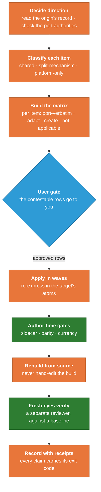

<!-- SPDX-License-Identifier: MIT · Copyright (c) 2026 Neill Prohaska <forest.microclimate@gmail.com> -->
# Porting an Improvement Across the Twin

### The cross-porting workflow, worked through a real example

Suppose you have improved something on one side of the twin. The writing detectors on Claude
Code just got sharper, and you want Claude Science to gain the same sharpening. The move that
suggests itself is to copy the improved file across. Do that and you will most likely break it
in a way that makes no noise, because a Claude Code hook or a Claude Science delegation call
pasted into the wrong platform cannot run where it lands, and the discipline it carried dies
quietly. Porting across the twin is not a copy. It is a short, ordered workflow whose whole
purpose is to move the improvement without dragging a mechanism into a place it cannot
execute.

This guide walks that workflow against a real case. The project ran a pass, tracked under the
name **the J-series**, that carried the Claude Code writing-engine upgrades back into the
Claude Science bundle. Every step below is illustrated by what happened in that pass, including
where the close went wrong and had to be corrected, because that teaches the final rule better
than any tidy version could. The workflow rests on the three tiers laid out in the companion
guide on the twin architecture, and assumes that model rather than re-teaching it.

## The shape of the workflow

The workflow is a fixed sequence with one point where it pauses for your judgment. You decide
the direction of the port, classify each item into a tier, lay the items out in a matrix,
bring the contestable rows to the user, apply the approved rows in waves, run the target's
gates, rebuild from source, verify with fresh eyes, and record the result. The picture below
puts the steps in order, with the user gate marked as the one place the work waits on a human
decision and the two checking steps set apart from the doing steps.

<!--FIG: The cross-porting workflow: from deciding the direction to recording the result, with the single point where the work pauses for your judgment. | 78% -->

The rest of this guide walks that diagram one step at a time, with the J-series showing each
step in practice.

## Decide the direction, and check the registries

Port direction is not fixed. Shared content can originate on either carrier and flow to the
other, so the first thing you settle is which side is the origin, and you settle it by reading
the origin's own record rather than assuming a habitual direction. In the J-series the writing
engine had advanced on Claude Code, where a detector-upgrade pass had split and extended the
checks, while Claude Science had not followed, so Code was the origin and Science the target,
and the port flowed from Code to Science.

Before you act on a direction you check the port-direction authorities. One document owns the
question of whether a given Science feature should cross to Code at all. A second, the record
of Science skills deliberately not ported back, lives in a historical tree outside this mirror
and is not readable from here; where that record comes up, that is exactly what to say about
it rather than guessing at its contents.

## Classify into a tier, the same session

Every item you might port gets a tier before it gets an edit, and it gets that tier in the
same session, while the platform reasoning is fresh. In the J-series matrix the detector
upgrades were shared-tier work, because the detector engine is shared exactly across both
sides and mirroring a change to it is a standing obligation that had simply come due. The
per-profile self-scan clause was split-mechanism work, carried as an always-on rule on Code
and as a per-profile clause on Science. The install-time coupling gate was platform-only, a
Code build mechanism with no Science object to act on, so it was never a candidate to port.
Naming the tier first is what tells you, for each item, whether you are mirroring it, re-
expressing it, or leaving it alone.

## Build the adaptation matrix

With the tiers assigned you lay the items out in an adaptation matrix, one row per item. Each
row carries a disposition, which is one of port-verbatim, adapt, create, or not-applicable;
where the disposition is adapt, the row says how and into which target primitive. Each row
also carries a target path, its sync-tier, and a judgment flag raised wherever the question
"does this even belong on the other side" is genuinely contestable rather than mechanical.

The matrix is authored read-only, from the primary record, before a single edit lands on the
target. That discipline paid off twice in the J-series before anything was changed. Reading
the actual files to build the matrix caught a sync note that had gone stale, a line asserting
the two detector engines were byte-identical when the record showed they had diverged, because
Code had advanced and Science had not. It also surfaced that the Science planner still carried
a rule Code had already retired. Both were found by reading the record rather than trusting a
description of it, which is the entire reason the matrix step comes before the editing steps.

## The user gate

The rows flagged as judgment calls go to you before any of them is applied. This is the one
deliberate pause in the workflow, and it exists to separate the two kinds of decision a port
contains. The mechanical disposition, which primitive a thing maps to and where its target
file sits, an analyst can settle alone. The judgment of whether a change makes sense on the
other side at all is yours, and burying it inside an apply-wave would turn a real decision into
a silent one.

Seven of the eleven J-series rows were judgment calls. The sharpest was whether a
message-steering correction written for Claude Code belonged on Claude Science at all, given
that the asynchronous Science interface never had the limitation the correction was written to
fix. Bringing that to you as an explicit choice, rather than porting it on autopilot, is the
gate doing its job. You trimmed the set: fold some conventions into skills that already
existed, create one new standalone skill, port one portable document, and hold the rest.

## Apply in waves, re-expressing in the target's atoms

The approved rows become apply-waves, each routed to a separate subagent, with the sources kept
disjoint so the waves run in parallel. The J-series ran three at once: the kernel back-port,
the profile edits, and the new skills and folds. Every wave re-expresses its content rather
than copying it. The Code detector engine is driven from a command line, while the Science
kernel, the module that Science loads automatically, has no command line at all, so the port
dropped the command-line entry block and renamed a helper whose leading-underscore name the
Science loader forbids, arriving at the same functions through the platform's own door. The
always-on rule became a per-profile clause. The subagent-tool steering became the Science
delegation call.

The kernel back-port, the crux wave, shows in one stroke why re-expressing beats copying. The
Science skill being updated already carried a self-scan section that the Code original did not
have. A wholesale copy of the Code file over the Science one would have deleted that section
without anyone deciding to delete it. Instead the merge was surgical: the new detectors went
in, the Science-only section stayed, and nothing was amputated. Re-express, and you keep what
the target already got right. Copy, and you overwrite it blind.

## The gate battery, and the honesty rule

Before a wave's output can be trusted it runs the target's gates, and you have to know which
gates can actually run from where you are standing. Some are author-time gates that run against
the source in the repository: the sidecar contract that checks each kernel will load, the
parity checks that confirm the built bundle is a faithful function of its source, the currency
self-test. Others are ship-time gates that cannot run from the repository at all, because they
need a live catalog, a cut release, or a served installation to check against.

The honesty rule governs the difference. You name which gates ran, you
never report a gate green that you were unable to run, and you make every claim of "verified"
or "passed" carry its receipt, the exit code or the diff or the hash, in the same breath as the
claim itself. A gate you could not run is not a gate that passed. It is a gate whose result you
do not have, and saying otherwise manufactures a confidence no one inspected.

## Rebuild from the source, never the build

A Science change is not finished when its source is edited, because the artifact that actually
ships is the built bundle, and the bundle is regenerated from the source. You never hand-edit
the built bundle, since an artifact edited by hand stops being a function of its inputs and
parity can no longer be checked against anything. The rebuild command is fixed. Every path in
this tree contains spaces, so the standing rule is to quote every path in every command; the
rebuild itself is run from the bundle directory, where its arguments are plain local names:

`python3 build_crt_science_bundle.py --src bundle_src --config build_config.json --out crt_science_bundle.json`

followed by the parity check in its build mode. Run the builder bare, without those three
arguments, and it does not build a stale copy or guess at defaults. It stops with a usage
error and builds nothing, a detail that looks pedantic here and matters a great deal at the
final step.

## Verify with fresh eyes

Whoever built a thing is a poor judge of whether it is right, so verification is a separate
pass, by a separate reviewer, against a known baseline. In the J-series that reviewer built
the bundle into a sandbox, leaving the committed target untouched and proving it untouched with
a hash, then re-derived the kernel port independently and read every changed profile, skill,
and fold against both the baseline and the source it came from. The verdict was
ship-with-fixes. The port was faithful and every atom was preserved, with three small currency
defects to clear first, the most serious of which was a bundle that would otherwise have
shipped a note reading "51 skills" over a true count of fifty-three. None of the three touched
the logic; all three were the kind of stale label that goes wrong precisely because no gate
recomputes a sentence.

## Record the result, with receipts

The last step writes down what happened, and it is where the receipts rule earns its keep, so
it is worth telling the J-series close exactly as it went rather than as it should have gone.
The first attempt to close the port wrote into the record that the bundle was "rebuilt at 53,
gates green." The printed output sitting directly above that sentence said otherwise: the
build had exited with an error and the count still read fifty-one. The bare-builder trap from
two steps earlier had sprung. The build command had been run without its arguments, had
stopped at the usage error, and had built nothing, and the closing sentence had been written
from what its author intended, not from what the record in front of them actually said.

It was caught the same turn, precisely because the receipts rule requires the receipt to
travel beside the claim, so the contradiction sat in plain view the moment the claim was
written. A second slip hid in the same block: a line reporting "parity exit: 0"
had actually read the exit code of a `tail` command at the end of a pipeline rather than the
gate's own exit code. Once the build was run correctly, the real receipts went into the record
in full: the build wrote the bundle at fifty-three skills and exited clean, the parity gate
passed, the sidecar check passed, and a corrective entry superseded the false one on the record
rather than quietly erasing it.

The lesson lands harder as an incident than as a maxim. A claim is only ever as trustworthy as
the receipt beside it, and a sentence written from intent will contradict the record about as
often as intent and reality diverge, which is often enough that the discipline has to be
mechanical rather than earnest.

## What generalizes

Strip away the specifics and the workflow ports to any move of shared content across two
platforms. A framework migration, a shared library vendored into two applications, a fix that
has to flow from either copy back into the other: each is better served by a per-item
disposition table with a human review of the contestable rows than by a blind copy that
silently mis-transforms the cases no one looked at. Re-express in each dialect instead of
pasting one across. Verify against a baseline with fresh eyes. Let no claim outrun its receipt.

What is specific to this twin is only the furniture: the exact gate names, the one rebuild
command with its three arguments, the contract a Science kernel has to satisfy to load. That
furniture changes from project to project. The order of the steps, and the discipline of never
letting a copy stand in for a re-expression or a claim stand in for a receipt, is what you
carry with you.

<!-- machine root (authoritative from 2026-07-30): ../machine_md/CROSS_PORTING_GUIDE.machine.md — updates land there first, this file is the derived human rendering -->
