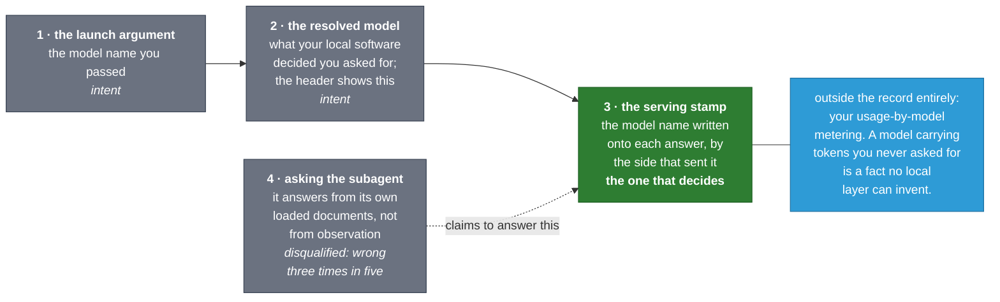
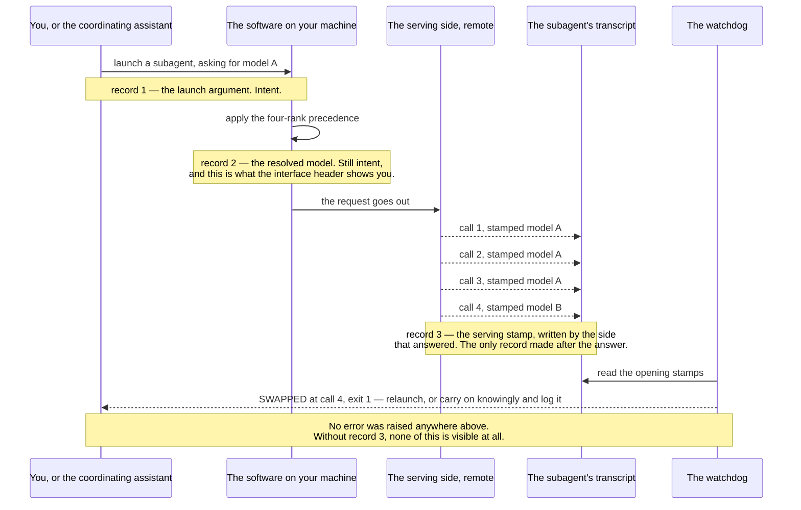
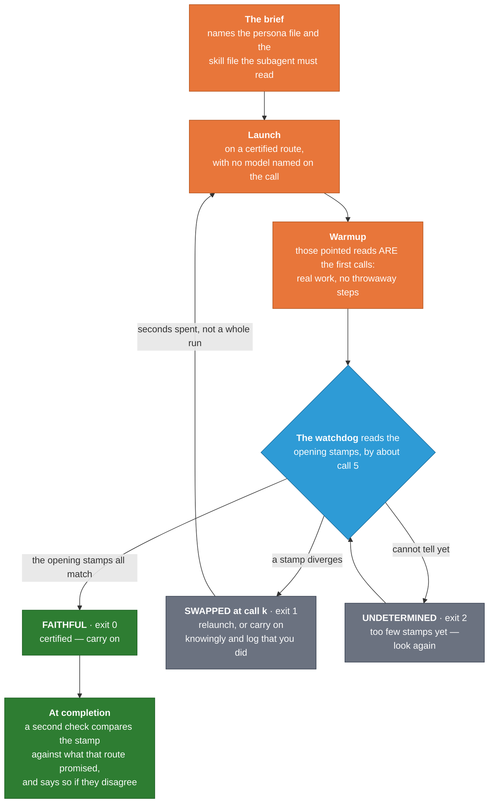

<!-- SPDX-License-Identifier: MIT · Copyright (c) 2026 Neill Prohaska <forest.microclimate@gmail.com> -->
# When a Model Request Is Not the Model Run

### The substitution that shaped this toolkit's verification, and the patch that answers it

You hand a piece of your work to a **subagent** — a fresh, separate instance of the assistant,
launched with one written assignment, holding no memory of your conversation, returning one report
and then gone — and you name the model you want it to run on. The request is correct at every layer
you can inspect from your own machine: the name you passed on the launch, the name the software on
your machine settled on after applying its precedence rules, and the name the interface shows you
when you open the subagent. Then a different model answers, for some or all of that subagent's
turns. In the measured incident, a request for `claude-fable-5` was served by `claude-opus-5`. No
error is raised, no warning is printed, and nothing in the session's own record announces the
difference. One record reveals it, and only one: a field the remote service writes onto each answer
it sends back.

This toolkit is about one working arrangement: a person directs an AI assistant, and that assistant
hands pieces of the work out to other, separate AI assistants that do them and report back. It
ships on two platforms — Claude Code, which runs as a program on your own computer, with real files
and a real shell, and Claude Science, which runs in a sandbox you reach through a browser — and
every difference between the two toolkits descends from that one fact. This document covers a
single failure of that arrangement on Claude Code: a subagent asked for one model and answered on
another, everything measured about it, and the working construction built around it. Read it if you
delegate work to subagents and any part of your judgment depends on which model did that work, and
read it as the reason this toolkit settles model questions by audit rather than by configuration. If
you want the working loop itself, meaning how the coordinating assistant plans, briefs, launches and
collects, `WORKFLOW_GUIDE.md` is the front door; `TWIN_ARCHITECTURE.md` covers how the two platform
toolkits relate.

That substitution is the incident the toolkit's whole verification architecture was built around.
It is why a model claim here is settled by an audit of a **transcript**, the session's own
line-by-line record file that the audit instruments read, and never by a configuration file, an
interface header, or the model's own account of itself. It is also why the toolkit ships instruments
where it could have shipped advice: the failure is invisible to attention and cheap to catch
mechanically, and that combination is what calls for machinery.

## Two boundaries, and the units the numbers arrive in

Two words about those units first, because every number below is quoted against one of them. A
**population** is a set of runs sharing conditions — one session, or one machine across a stretch of
days — and it is what a rate is measured over. The other unit is the **regime**, or era: a stretch
of hours during which the remote serving side behaved one way. It moves without anything on your
machine changing, and that single property ends up mattering more than any individual number in this
document.

Now the boundaries, which keep the problem in proportion. The substitution is confined to subagent
requests that target `claude-fable-5`. Every other model id was served faithfully in every era
measured, 31 out of 31 across days, and 100 percent of non-fable ids in the first population
examined. The main conversation loop was never substituted at all.

The second boundary decides everything that follows. Prevention lives on the serving side and is out
of user reach; nothing you can set on your own machine stops this. What is in reach is
**verification**. Verification turned out to be cheap here, because the substitution, when it
happens at all, happens at a fixed and early moment: a subagent's fate is observable by roughly its
fifth call. Every countermeasure below follows from that one property. The cheapness is a fact about
this particular failure and not a general property of verification, and the section on what
generalizes says where the pattern holds and where it stops.

## Which record answers "what ran?"

Four records describe a subagent's model. They are not four opinions about one thing. Each records
something real, and exactly one of them records what answered.

The first is the **launch argument**: the model name passed on the launch, stored in the subagent's
own metadata file, and absent when the launch named no model at all. It is an input record, and it
says nothing about serving.

The second is the **resolved model**: what the software on your machine decided you asked for,
written onto the launch row of the main transcript. It arrives after that software applies a fixed
order of precedence among the places a model can be named — four ranks of them, the highest-ranking
mention winning. `WORKFLOW_GUIDE.md` lists the four in full, and that is where to go if you want to
know why a launch naming no model gets the model it gets. The resolved model is the only field
carrying the `[1m]` display suffix, and it is evidently the source of what the interface header
shows you. It records intent rather than serving, and the difference is not academic: it diverged
from the serving record in about 94 percent of fable-resolved launches during the measured
incident.

The third is the **serving stamp**: the model field the API response itself carries, written per
call by the serving side onto every assistant turn of the subagent's transcript. The serving stamp
is the one authoritative layer, because it is the only record made downstream of what actually
answered.

The fourth is **asking the subagent what it is running on**, and it is disqualified as an
instrument. It was wrong three times out of five when measured. A subagent assembles that answer
from its own loaded context, so it repeats whatever its documents call the default, which is
precisely the belief under test.

One witness sits outside the transcript record: the account's usage-by-model metering. It
cannot attribute tokens to a particular run, but a model carrying tokens you never requested is a
serving-side fact that no layer on your machine can manufacture.

<!--FIG: The four records of a subagent's model, and the one that decides. Three sit upstream of the answer and carry intent; the fourth is a report from a party who cannot see it. Only the serving stamp is written after the answer, by the side that produced it. | 88% -->



The picture's one point is the direction of the arrows. Records one and two are made before anything
is served, so they can only carry what was asked for; record four is made afterwards by a party with
no access to the answer. Record three is the only one written after the event, by the side that
produced it.

From this comes the rule the toolkit enforces everywhere. **A model claim is verified by the serving
stamp or it is not verified.** Headers, configurations, resolutions and the model's own testimony
are statements of intent or belief. They earn their keep in diagnosing *why* a substitution
happened; none of them is evidence of *what* ran. The moment to remember it is the moment you are
about to attribute some behavior — quality, error rate, speed, cost — to a named model without
having read that run's stamps. Read them first.

The check is one line against a subagent's transcript:

```bash
grep -oh '"model":"claude-[^"]*"' <child-transcript.jsonl> | sort | uniq -c
```

The `claude-` prefix is load-bearing. On a transcript that launches subagents, each launch's model
*argument* sits in the same field shape, so a bare short name appearing in that field is never a
serving stamp. The API stamps full ids only.

## The incident as it happens, in time

The four records are easier to hold once you watch them arrive in order, because this failure is a
sequence rather than a state. What follows is one substituted run as the record shows it.

<!--FIG: One substituted run, in the order the records are made: the request, the local resolution, three faithful answers, the swap on the fourth, and the watchdog's verdict. Nothing raises an error at any point. | 80% -->



Two things in that sequence are worth carrying. Nothing anywhere in it fails: no step returns an
error, and every local record is exactly what it was asked to be. And the swap lands at a fixed
place. Three turns answered as requested, and the fourth did not. That fixed position is what makes
a verdict by call five possible at all, and it is the property the whole patch is built on.

## What the record shows

**The swap has a fixed and early shape.** Substitution arrives in exactly two shapes. In the first,
the substituted model answers from call one; that was the character of the earliest era and of
full-tool subagents generally. In the second, the run swaps mid-course after exactly three faithful
turns and stays substituted; that shape held 7 out of 7 runs across two days, and in every swap of
one controlled evening campaign. You see either one by reading the per-turn stamps in order. What it
forces is the design below: the swap point is fixed and early, which is the only reason early
certification is possible.

**Two subagents launched in the same breath can diverge.** Three identical-shape subagents of one
**pinned** agent — pinned meaning the model name is written into the agent's own definition file, so
that a launch naming no model still gets that one — went out in a single message within the same
second, and came back different: one faithful for 12 turns, one swapped at call 4 after three
faithful turns and substituted for 8 more, one faithful for 19. Every dimension a client controls is
shared inside that trio: the configuration files, the environment, the version of the software, the
agent definition, the launch instant. What it forces: the decision is made per request, on the
serving side. No local state can explain a split inside one message.

**The rate drifts at the scale of hours, on frozen configuration.** Each figure below is a tally of
serving stamps re-derived from the full transcript record.

| The window | Served as requested | What the window shows |
|---|---|---|
| 2–3 August 2026 | 0 of 32 | every subagent substituted from its first call |
| 4 August, 14:53 to about 23:14 | 45 of 69, or 65.2% | with a sub-window at 84.2%, 16 of 19 |
| 5 August | 1 of 9 | the rate falls back without an intervention |
| 6 August, one 100-minute stretch | about 50% rising to about 90% | nothing on the machine changed |
| 6 August 23:07 to 7 August 11:16 | 10 of 10 | about 13 hours faithful |

What it forces rides every number quoted anywhere in this document: a rate is a property of a
configuration *and an hour*, never of a configuration alone.

**One request-side discriminator was isolated by single-variable experiment.** Nine scratch agents
were written with identical minimal bodies, each carrying the same pinned model and launched with no
model argument so that the pin governed; all nine resolved as intended. The variable under test was
the **tool grant**, meaning the list of tools an agent is permitted to use, written into its
definition. Each cell changed one grant against a base of reading and searching, and each agent type
was introduced after a restart so that it entered the roster cleanly.

| The grant | Served as requested |
|---|---|
| `Read, Grep` — the base | 2 of 2 |
| the base plus the shell | 2 of 2 |
| the base plus the web tools | 2 of 2 |
| the base plus the ability to launch subagents | 2 of 2 — the prime suspect, exonerated |
| the base plus the Skill tool | 0 of 3, substituted on every stamp |

Two further cells test size rather than grant. Padding the agent body at a five-tool grant that
measures faithful, across initial requests of roughly 69, 75, 81 and 87 thousand tokens, stayed
faithful four times out of four, which exonerates initial request size up to about 87 thousand for
that shape. And a run whose context grew to about 146 thousand tokens mid-course stayed faithful for
all 11 of its turns, so growth after the start is free.

That result is graded carefully, and the grading is the part to carry away. The Skill grant is
measured **sufficient** to flip a correctly resolved request, at n=3. It is not claimed
**necessary**: one counterexample was substituted at about 94 thousand tokens of initial request
with no Skill grant and with three grants each measured faithful, which leaves a possible size-like
condition somewhere above 90 thousand, and the band between 87 and 94 thousand unprobed. What it
forces is a habit of speech — sufficient and necessary are different claims, and only the first was
earned here.

**And the discriminator is itself conditioned on the regime.** In the faithful window spanning 6 and
7 August, a two-run control on the same `Read, Grep, Skill` shape that had substituted in every
prior era served faithfully. In that window the discriminator did not discriminate at all. What it
forces: treat it as the best request-side bet available, and never as a rule the serving side is
obliged to honor.

**A swap boundary is not always terminal.** One subagent served faithfully for three calls, then
substituted for 167, then returned to the requested model for its final two. Read as one continuous
stamp sequence, that says a verdict taken from the first row alone, or from the last row alone, can
be wrong in either direction. What it forces: audit every turn.

**A separate refusal class closes the obvious workaround.** Headless sessions — sessions run from
the command line with no interactive window — whose main model is `claude-fable-5` were refused at
turn one under a biology-hazard category on a benign kickoff: instructing one subagent to read eight
local project files and report their line counts. The refusal repeated three times, across fresh
sessions, reworded text, and a front-door file six times smaller, with no biological content
anywhere in the prompt or the project context. The same kickoff under a different main model runs
clean. Since the main loop is the one path never substituted, routing this work through headless
main sessions would have been the natural way around the whole problem, and this class closes it.

**That refusal is shaped by the prompt surface, and it clears.** Running
`claude -p "Execute the instructions in the file <path>"` went through cleanly, with the main loop
served as requested for 36 turns and its executor subagent for 13, both faithful, where the
identical instructions written inline in the prompt had been refused three times out of three. The
classifier fires on the inline wording rather than on the meaning, so moving the same text behind a
file reference restores the route.

**The metering corroborates the substitution from outside the record.** In the primary investigation
session, which requested `claude-fable-5` for the main loop and for virtually every subagent, the
session's usage-by-model table showed `claude-opus-5` carrying more output tokens than fable itself,
4.1 million against 2.9 million out. That face is independent of every transcript. What it forces is
a second habit: a substitution window shows up as the substituted model's token line carrying work
you never routed to it, and the crossover when a regime turns faithful is the signature.

**The client-side configuration space was swept, and came back empty.** One evening, one regime
window, two runs per arm: forcing the model through the top-rank environment variable, including in
its `[1m]` form; leaving that variable unset; naming a short model name on the launch; pinning in
the agent file as a full id, as a short name, and in `[1m]` form; inheriting from the session;
remapping the default model alias; and running effort at maximum against high. No arm moved fidelity
beyond regime noise. Two sub-findings are worth carrying. The `[1m]` request form cannot be placed
on a subagent request at all, since it normalizes to the plain id at the environment rank, at the
agent-file rank, and through the remap; only the main-loop picker carries the form, and the main
loop is the one path never substituted. And the resolution rank is exonerated, since ranks two,
three and four all served faithfully on restricted-grant agents in the same window.

**Every local location that could affect resolution was read directly and excluded.** Managed
settings do not exist on the machine. The shell startup files carry no relevant variables. The
project and local settings never carried a model key in any commit or dated snapshot. No allowlist,
override or fallback keys are present. No hook rewrites the launch input, which a direct search over
both hook directories confirmed with zero hits. What the two sweeps force together: the mechanism is
server-side, the settings axis is closed, and there is no local defect to fix.

## The patch: verification, not prevention

Six pieces compose into a working shape. None of them prevents a substitution, because prevention is
not available to a user. Together they make a substituted run either impossible to complete
unnoticed or cheap to discard.

The shape is easiest to see as a loop.

<!--FIG: The verified-launch loop: the brief points at the files the subagent must read, those pointed reads are the opening calls, and the watchdog reads the stamps they produce and returns one of three verdicts before any work is banked. | 76% -->



The loop's one point: the reads that prove which model is answering are the same reads that begin
the work, so certification costs the seconds it takes to read a verdict.

**A pinned, restricted-shape executor agent.** Its definition file carries the full model id, which
sits at the third rank of precedence and was measured to govern — nine probe cells out of nine
resolved from their pins with no launch argument. It is granted reading, editing, writing, two kinds
of searching, and the shell, and it is granted neither the Skill tool nor the ability to launch
subagents. The launch names no model, so the pin decides. One precondition holds
the whole arrangement up: the top-rank environment variable must stay at `inherit` or unset, because
set to a model id it overrides both the launch argument and the pin.

Where that pinned agent *lives* is worth a paragraph of its own, because it changed on 9 August 2026
and because the change is easy to misread as a loosening. The routes used to ship from a separate,
project-only area of the toolkit, and it was tempting to describe the arrangement that way — a pin is
allowed *there*, and nowhere else. It no longer works like that. The three routes now ship in the
toolkit's **general** payload alongside every other agent, and what admits their pins is a **named
allowlist of exactly three files** — the executor, the sub-planner introduced below, and the
supervised Opus 5 executor — which the build gate enforces by name. The permission is attached to
the route, not to the directory the route sits in.

That distinction matters because the *old* rule has not been repealed, only re-scoped, and the
reasoning behind it still governs every other agent the toolkit ships. Those agents carry no model
pin at all, and the same gate fails the whole payload if one appears, for the reason it always
failed: a pin sits at rank three, above nothing but inheritance, yet still above the launcher's own
tier choice — so a shipped pin on an ordinary agent silently overrides that choice in every session
that installs the toolkit. On a route, the pin has the opposite effect: launching the route *is* the
tier decision, which is exactly why these three are launched with no model argument. Same mechanism,
opposite consequence, and the allowlist is how the toolkit tells the two cases apart.

Two further arms of that gate exist because a named exception invites two new failures. The gate
fails if one of the three ever **loses** its pin — a route stripped of its pin still launches
without complaint, and a paramless launch then quietly requests whatever model the session happens
to be running, which is the substitution problem re-entering through the front door. And it fails if
the payload's copy of a route and the project-workflow kit's copy of the same route ever **drift**
apart, since two files claiming to be the same route while differing is a difference nobody would
think to look for. Note that these two arms catch different things: if a pin were stripped from both
copies at once, they would still match each other perfectly, so the parity check would pass — which
is precisely why the lost-pin check has to exist separately.

Why the grant looks like that is worth separating out, because its three parts rest on three
different grades of evidence and the toolkit keeps them apart deliberately. The Skill tool is
excluded on a **measured trigger** — it is the flipper isolated above. The ability to launch
subagents is excluded as a **design choice** rather than on measurement, since it measured faithful
two runs out of two: an executor spawns nothing. And the grant as a whole rests on an **untested
composition** — each tool in it was measured faithful individually, and the five-tool set was
measured faithful as a set four times out of four, but the six-tool composition was never its own
experimental cell, and neither was the size band above 90 thousand tokens. The shape is a measured
bet, and it is stated that way everywhere it appears.

An executor without the Skill tool still reaches skill content, by **read-pointer**: the brief names
the skill file's path and the subagent reads it itself, which also satisfies the standing rule that
a worker reads its own sources rather than someone's summary of them. On grade, the executor is
`fixture-measured` — a five-launch acceptance passed with every assistant turn of all five runs
stamped as requested. The real-world qualifier belongs beside it: the route reduces substitution and
does not eliminate it. The running tally recorded substituted runs on this shape, including one
substituted from its first row. Audit every stamp.

**The sibling route: a sub-planner, and the only certified route that can launch subagents.** It is
the same construction with exactly one more grant, the ability to launch subagents, carried by a
sub-planner that runs a full plan, brief, launch and collect cycle inside one sealed
chunk of work and returns a compressed roll-up. It ships in the general payload and holds its pin
under the same named allowlist described above — the move was the same move, made for the same
reason, and it left the sub-planner's construction otherwise untouched. The extra grant rests on two different things at
once: that ability measured faithful two runs out of two in the grid above, where it had been the
prime suspect and was exonerated, and a sub-planner that cannot launch subagents is not a
sub-planner. The Skill tool stays excluded for exactly the reason it is excluded above. Three
constraints ride with the route. Nesting is one level deep, so the subagents a sub-planner launches
are workers and never a third tier. Its launches name no model, so the rank-three pin governs. And the
shared ledgers remain one-writer, the top coordinator's, so a sealed sub-planner reports what
belongs in them instead of writing the row itself.

Its grade is `fixture-measured`, with the acceptance replicated twice and the grade conditioned on
the regime it ran in: three warmup-shaped probes of seven to eight assistant turns each, all stamped
as requested, plus two independent full cycles of 62 and 57 turns with zero swaps. Each of those
cycles planned its chunk, wrote and persisted its worker briefs, launched three lower-tier workers
through the grant, collected them, spot-checked their receipts against the sources, and rolled up
compressed. The workers' own turns all stamped their requested tier, and the persona and skill files
those workers were pointed at were verifiably named and applied in the workers' artifacts, checked
two independent ways. What that certifies is the routing and the coordination shape, not the quality
of the work, and it certifies them in the regime they ran in — the same bar the executor route
shipped on.

**The relay fallback, for regimes where the launching shape cannot be certified.** The same charter
runs on the pure restricted executor and the launching is relayed, so this path needs no launch
grant at all and therefore survives any regime in which a restricted subagent survives. It runs in
four steps. The restricted subagent plans and writes but does not launch: every worker brief is
persisted, alongside a launch manifest carrying one row per launch — the agent type, a prompt that
points at the brief file rather than restating it, the wave order, and an optional model and
description — and then it stops and reports the manifest ready.

The coordinator relays each row verbatim, exercising no planning judgment, because judgment added at the relay silently re-plans the
chunk the seal existed to isolate. Each returned report is written to the named collect
directory, and the subagent is resumed by message. The resumed subagent runs the same collect
discipline and returns the same roll-up. What the relay moves is the launch keystroke, never the
planning, the collect judgment, or the roll-up. Measured: one full round-trip, 36 turns all stamped
as requested across the planning phase and the post-resume roll-up.

**One precaution corrected into a measurement.** The first launch of a newly added agent type failed
with a type-not-found error, and then the roster refreshed mid-session with no restart and every
launch after that worked. So restarting the session after adding an agent type is a sufficient
precaution rather than a necessary wait, on the version measured.

**Pointed reads that double as the warmup.** A brief for one of these routes opens the task with a
few small pointed reads — the persona file, the skill file — so that the transcript crosses the
deterministic swap boundary on real working context instead of on throwaway calls. The reads that
certify the launch are the same reads that begin the work, so certification costs nothing extra. The
delivery mechanics are `measured-working`: eight subagents out of eight named and applied the
framework from the file they were pointed at, and all eight were served as requested; and in the
composition test, six out of six were faithful and six out of six showed verified uptake across
persona-only, skill-only and combined arms, with four of the six certified live at call five while
still mid-task.

**A watchdog that reads the opening stamps.** It returns a verdict by roughly call five, carried in
the number a program returns when it finishes: FAITHFUL, exit code 0, meaning certified, carry on;
SWAPPED at call *k*, exit code 1, meaning relaunch, or proceed knowingly and log that you did; and
UNDETERMINED, exit code 2, meaning investigate. It runs live against a still-running subagent with
`--watch`, or after the fact against a finished transcript, and an `--expect` argument generalizes
it to any pinned model rather than to one id. Its grade is `fixture-measured (live instances)`:
eight production certifications out of eight issued mid-run by call five at trivial cost, on top of
seven fixture cases out of seven and correct out-of-sample verdicts on live transcripts.

**The economics of relaunching.** Because the verdict lands at about the fifth call, a substituted
launch is discarded seconds in rather than discovered after a long run has been spent on the wrong
model. At the rates measured during the campaign the pattern cost about one to two launches per
certified subagent, and that figure is conditioned on the regime, so it moves as the rate moves.

**A completion flag that asks nothing of you.** A hook — a small program the session's software runs
automatically at a fixed moment — fires when a subagent finishes, compares that subagent's serving
stamp against the shipped model promise of its route (the executor route promises `claude-fable-5`,
the supervised route promises `claude-opus-5`), and raises a served-model substitution finding on
any disagreement. The check is gated on the value rather than on any text shape: only a real serving
stamp may fire it, because a launch argument or an inference from a pin is intent and not serving.
Generic subagents carry no promise and remain audited by the coordinator. On a certified route the
subagent either works on the model it was promised or the swap is announced on the spot, and silence
stops being one of the outcomes. Its grade is `fixture-measured` — 94 guard cases out of 94,
including a red arm proving that the pre-build version stayed silent — with the honest limit that no
real swap has crossed it live yet, because the regime has stayed faithful since it shipped.

**A dispatch gate that makes the shape unavoidable instead of remembered.** When a ceiling-tier
subagent, meaning one requesting `claude-fable-5`, or a supervised-tier one requesting
`claude-opus-5` on its watched route, is about to launch, the gate denies the launch unless three
things hold: the launch names a readable brief file or opens with the warmup token; the resolved
brief carries a role line and either names a persona file or states plainly that no specialist fits;
and a ceiling-tier brief carries the warmup token. The denial comes back as a structured reason
naming the failed check, the missing element and the fix, because a correct relaunch is the point
rather than a blocked one.

A companion advisory hook prints the ready-to-run certification command as
soon as a launch returns, so the next action needs no recall. The gate's trigger vocabulary covers
all three certified routes, the sub-planner included from the day that route shipped. Its grade is
`fixture-measured (live instances)`: a briefless launch was denied in a real fresh session with the
denial text captured, across 66 guard cases out of 66, with the pre-build silent pass printed as the
red arm.

The same gate carries a second arm that never denies anything. On its pass path, when a launch
requests the ceiling tier by model argument from a generic agent type — any type outside the pinned
set — it injects one note naming the certified routes, the executor for executor work and the
sub-planner for sub-planning, and asking for watchdog certification; the launch then proceeds
regardless. That shape is precisely the substitution-prone class measured above, a ceiling request
from a full-tools agent type. It is an advisory rather than a check because the shape is legal,
sometimes necessary, and produced by a server-side defect this gate does not own, so refusing it
would be wrong more often than right, while leaving it unnamed is how the measured class keeps being
launched by a session that never read this document. The advisory arm's grade is
`fixture-measured (incl. live instances)`: 88 guard cases including a red arm, plus live firing in a real
session where the gate denied a coordinator's own non-compliant probe launches and admitted both the
corrected ones and a briefed run.

One caveat travels with every number above. These rates are conditioned on the regime and none of
them is a property of a configuration alone. **Certification at launch, not configuration, carries
the guarantee** — no combination of settings was found that moves subagent fidelity, while the
fidelity itself keeps moving. A correct request is not yet the run you asked for, so audit the
stamps.

## Where this stands, and what it asks of you

The underlying defect is open and sits on the serving side. It has been reported to the vendor with
per-request receipts and a runnable reproduction package; the vendor report and the incident record
are held privately. Everything above is a measured construction *around* the defect rather than a
fix *for* it, and it can stop working without notice if the serving side changes.

Three habits carry it. **Audit the serving stamps** of every model-sensitive subagent when you
collect its work; that is the entire discipline, one search or one run of the shipped audit
instrument per subagent that matters. **Check your usage-by-model face** periodically, since a model
carrying output tokens you never requested is the external tell, and it shows up even when no one
thought to audit a transcript. And **re-run the five-launch acceptance after any Claude Code
upgrade**: this environment's own records show behavior changing within a single version, and the
version correlation broken at both ends, with degradation beginning before a version bump and
opposite outcomes on the same version less than an hour apart. Version stability cannot be assumed.

The instruments arrive with the toolkit installed into `~/.claude` and the kit's own installer run
in your project root. Each path below is relative to that project.

| Where it lives | What it is for |
|---|---|
| `.claude/agents/fable-executor.md` | the ceiling-tier worker route |
| `.claude/agents/fable-subplanner.md` | the ceiling-tier coordinator route — the one route granted the ability to launch subagents, so the only one that can |
| `.claude/agents/opus5-executor.md` | the supervised route |
| `.claude/skills/model-verification/fable_watchdog.py` | live and after-the-fact certification |
| `.claude/skills/model-verification/model_run_audit.py` | the whole-session audit of intent against what was served, with an exit code you can gate on |
| `.claude/hooks/fable-dispatch-gate.sh` | the launch gate |
| `.claude/hooks/fable-launch-scaffold.sh` | the advisory scaffold |
| `~/.claude/hooks/subagent_qa_gate.sh` | the subagent completion hook that the completion flag rides |

Those three agent files are the three certified routes. Each body carries its own grant rationale,
watch conditions and read-pointer mechanics, and each is worth reading before first use. The
`model-verification` skill's own `SKILL.md` sits beside its two instruments.

### Which work reaches the ceiling at all

The instruments answer which model ran. They do not answer which model a piece of work deserved, and
that question comes first.

The normal tier for file and code reading, writing and editing is the supervised tier or lower, with
the supervised model reached only through its certified route above. The ceiling, meaning the most
capable tier available, is both reserved for and preferred for the classes of work where higher-order
reasoning or synthesis is absolutely critical to the piece. Three classes illustrate that test
without bounding it. The hardest coding: novel algorithms, subtle concurrency and correctness
reasoning, architecture under ambiguity, and the most complicated models, simulations, physics and
mathematics. High-stakes scientific writing: proposal and manuscript drafting, and high-order
synthesis prose. And the final quality verdict on a piece of work. Route those to the ceiling
whenever possible and through the certified routes — merited and preferred, not merely permitted —
while chunking even those wherever they separate, and tiering the separable pieces down.

Planning has its own rule, conditional on the model the main session is itself running. When the
main session runs below the ceiling, planning-class work delegates to the sub-planner route wherever
the chunk allows it, and the main agent's own job narrows to the three things only it can do: scope
adjudication, meaning what is in and out and whose boundary that is; context curation, meaning a
sealed brief carrying the file pointers the sub-planner reads for itself, plus whatever context only
this session holds; and receipts-based collect. The sub-planner launch rides verified launch like
any ceiling-tier subagent.

Where it cannot, a fallback chain takes over, and the collect names which
rung carried the work: a certified sub-planner, then a relaunch of it when the watchdog says
SWAPPED, then the relay pattern above for when the planning must stay at the ceiling but the
launching cannot, then supervised planning under the executor contract, and last the main agent
planning for itself. The reason is that the reasoning which decomposes a task is the part that most
rewards the ceiling, and it is exactly the part a lower-tier main agent silently keeps for itself.

That doctrine's grade is `attempted-untested`, and the word is chosen precisely, because it is
doctrine. Its behavioral efficacy accrues through the adherence time-series described in
`ASSURANCE_ARCHITECTURE.md`, never through its having been written down.

For the general model behind the grades used here — what `fixture-measured`, `measured-working` and
`attempted-untested` each license a claim to say — see `ASSURANCE_ARCHITECTURE.md`. This document supplies
one worked instance of that model rather than restating it.

## What generalizes beyond this failure

Three patterns are worth lifting out of the incident. Each comes with the boundary that keeps it
honest, because a pattern shipped without its boundary is the more dangerous half.

**When the fault is on the far side of an interface you do not control, verification beats
prevention.** The instances are all above: prevention lives on the serving side and is out of reach;
a sweep of everything settable on the machine came back empty across every rank, form, remap and
effort level; the swap turned out to be deterministic and early; the watchdog returns a verdict by
about call five; and the whole pattern costs about one to two launches per certified subagent. The
same move appears far from software — a manufacturer who cannot control a supplier's process
inspects incoming lots at the earliest stage where a defect is visible, and certificate transparency
exists because you cannot stop a certificate authority from mis-issuing, so you log and monitor
instead.

**The boundary:** the cheapness is not part of the pattern. This toolkit got a cheap
observation moment. Where a fault shows up late, or leaves no observable trace at all, verification
is expensive or impossible, and the honest version of the claim narrows to *verify at the earliest
observable moment, and pay what that moment costs*.

**Among records of one event, authority runs by position in time.** The only authoritative record is
the one written downstream of the event; every record made upstream carries intent or belief,
however many of them there are and however well they agree. Four layers here, and only the third
qualified; the resolution diverged from serving in about 94 percent of the affected launches; asking
the subagent was disqualified as an instrument because it answers from its own loaded documents; and
the `claude-` prefix in the one-line check is load-bearing precisely because a launch argument sits
in the same field shape as a stamp. One step beyond what the record itself states, and marked here
as an inference rather than a measurement: agreeing upstream records *echo* rather than corroborate,
because they are copies of one intent rather than independent observations of one event. The pattern
transfers cleanly — a build pipeline's configuration says which compiler was requested, and the
binary's own embedded toolchain stamp says which one compiled it.

**A rate is a property of a configuration and an hour.** The series above moves from 0 out of 32 to
10 out of 10 with nothing on the machine changing, including a move from about half to about ninety
percent across a hundred minutes; the discriminator that had held in every prior era did not
discriminate in the faithful window; and three subagents of one launch message diverged from each
other. Where an uncontrolled outside party serves the thing you are measuring, certification at the
moment of use carries the guarantee, and neither a configuration nor a rate measured yesterday does.
**The boundary is what makes this usable:** it holds only where such a party is in the loop. In a
locally deterministic system a measured rate genuinely *is* a property of the configuration, and
this pattern does not apply. Where it does apply, it applies to ordinary things — a cloud provider's
tail latency against last week's measurement, or a flaky test's failure rate across build machines.

What holds all of it together is a single reversal. The serving stamp is the only record of what
ran; the substitution is server-side, conditioned on time, and invisible to every layer you can
inspect from your own machine. So the answer is to certify early rather than to configure carefully
— and a correct request is not yet the run you asked for.

<!-- machine root (authoritative from 2026-08-07): ../machine_md/MODEL_SUBSTITUTION_AND_VERIFIED_LAUNCH.machine.md — updates land there first, this file is the derived human rendering -->
