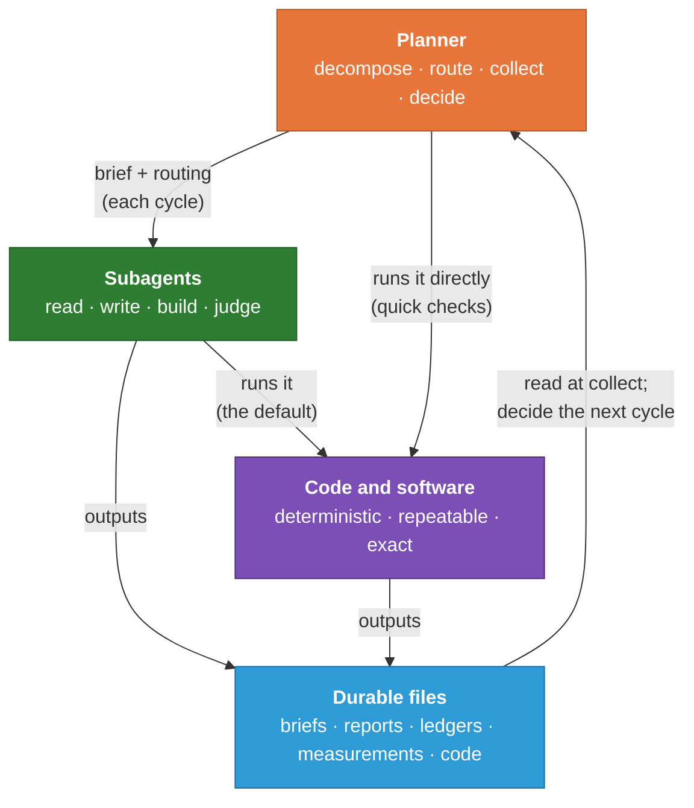
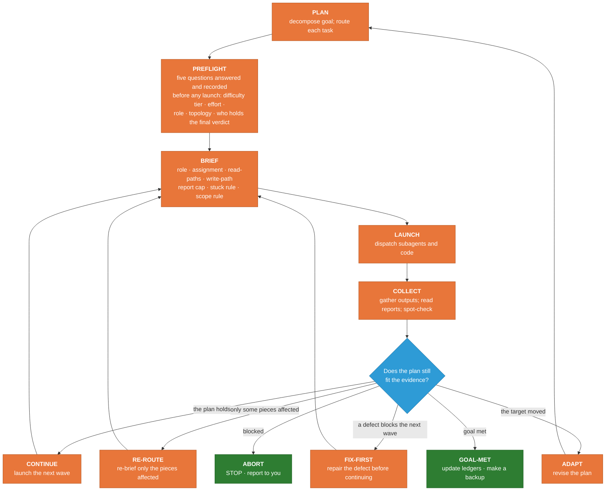
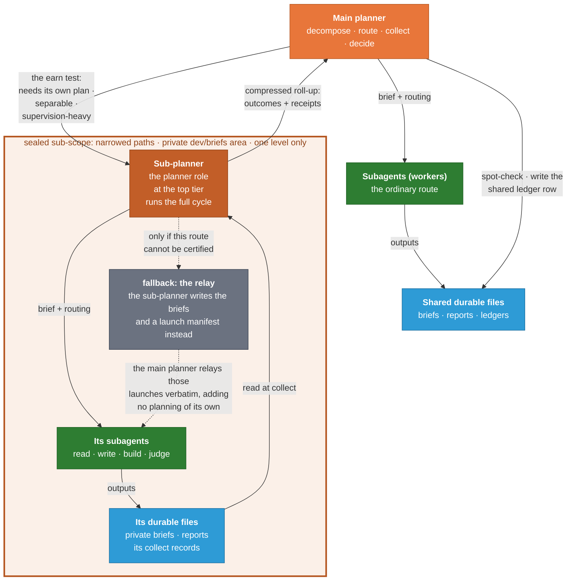
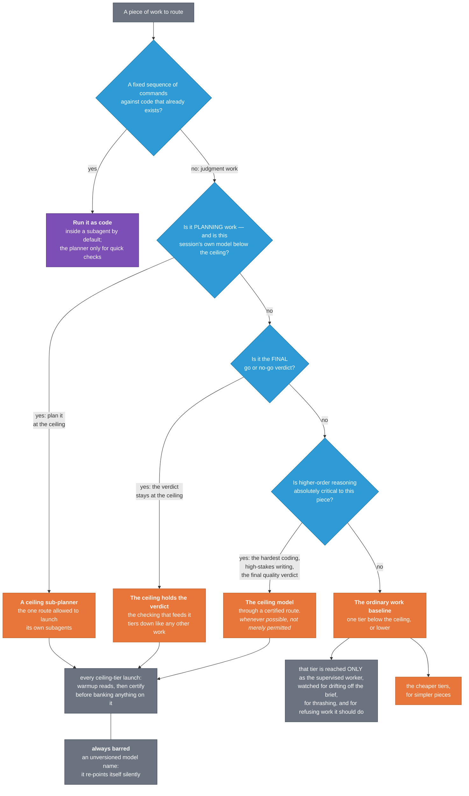

<!-- SPDX-License-Identifier: MIT · Copyright (c) 2026 Neill Prohaska <forest.microclimate@gmail.com> -->
# Inside the Loop

### How the supervised workflow runs, and how you steer it

You ask an AI assistant for help with a piece of research work — improving the writing
across a body of scientific documents, say. Behind that one request, a small
team assembles, does its work, and disbands, several times over. A coordinator breaks the
job into pieces, hands each piece to a specialist, waits for the results, decides what to
do next, and only then assembles the next team. Every member of that team is another
instance of the same assistant, started fresh and given one written assignment. This guide
explains that loop: what it is,
why it is built the way it is, and how to predict what it will do next and steer it when
you want to.

The work runs this way for a concrete reason. A single assistant, working alone, has one
**context window**: one finite pool of working memory that holds everything it is currently
thinking about. The job that produced this guide did not fit in that pool. It spanned a
corpus of sixty curated failure examples pulled from a PDF, a body of detector code that
flags weak prose, a benchmark that measures how well those detectors work, and a rendering
pipeline that turns machine notes into a readable document.

Ask one assistant to hold all of that at once and one of two bad things happens. Either it
loses the thread, re-reading the same files until it starts to contradict itself, or it
fakes competence, claiming a fix works without ever measuring whether it does. The
supervised loop exists to prevent both failures. By the end of this guide you should be
able to look at any moment in the work, say what the loop is doing and why, and step in
where your input changes what happens next.

**What you are looking at, and where to start.** The loop described here is not a one-off
arrangement. It is packaged as a portable kit you can install in a project of your own, and
two separate installers put it there. One installs the research toolkit once on your
machine, equipping every session with a shared library of specialists, methodology
documents, and automatic checks. The other runs inside each project that adopts the
supervised workflow and writes that project's own operating contract. They do different
jobs and are designed to be used together; the close of this guide returns to both.

One detail about that shared library will save you a confusing half-hour the first time it
bites. **The specialists come in two trees, and only one of them is installed for you.** The
installer places the *general* set — 16 specialists and 34 methodology skills, recounted from
the tree on 9 August 2026 — into your home directory, and that set is the cross-domain one:
planning and delegation, code review, document authoring, data management, and the model
routes this guide describes later.

The *domain* specialists — ecosystem and plant-physiology
modeling, micrometeorology, scientific machine learning, phyllosphere microbial ecology,
philosophy of technology and AI safety, and the probes used to measure the toolkit's own model
dispatch — sit beside the installed payload in a folder named `CCRT_specialists/`, 18
specialists and 21 skills, and **you copy the ones you want in yourself with `cp`**. There is
no installer flag for them; the flags that once did this are retired and now exit with an
error that points you at that folder. Its own `README.md` carries the copy commands and one
warning worth heeding — the folder's depth varies, so list a bucket before copying it rather
than assuming it holds `agents/` and `skills/` directly.

The reason for the split is worth thirty seconds, because it explains a constraint you will
meet if you ever edit the toolkit. The installed payload goes to *every* user's machine
unchanged, so it must stay free of any single project's vocabulary — a site code, an
instrument, a particular model codebase — and that is enforced by a gate that fails the
install when such a token survives in it. Domain specialists are useful precisely because they
name those things. Keeping them out of the scanned payload and installing them by hand is what
lets both requirements stand: the shipped payload stays generic, and the specialists keep the
vocabulary that makes them worth having. This
guide is the front door for the working loop, written for the person directing the work
rather than for someone extending the toolkit, and it assumes no prior knowledge of either.
If what you want instead is the architecture — why one methodology is carried on two
platforms, Claude Code being a program that runs on your own computer with real files and a
real shell, and Claude Science a sandbox you reach through a browser, and how to read a
difference between them — start with the companion guide *One Methodology, Two Carriers*.

## What it is

The workflow is a **supervised loop** with four named parts. Three of them do the work.

A single coordinator, the **planner**, decomposes the goal, routes each piece of work,
launches the workers, collects what comes back, and decides the next move; apart from a few
narrow exceptions, it does no domain work itself. A rotating cast of
**subagents** does the reading, writing, building, and measuring. And **custom code and
software** handles the invariant, deterministic tasks: the work the project has to repeat,
and the work that accuracy or completeness makes safer in code than in prose. Code sits at
the same level of importance as the planner and the subagents, because it is one of the
three things that actually does the job.

The fourth part is the **durable files** in a shared folder tree. They are what the other
three produce and pass between one another: briefs, reports, ledgers, measurements, and the
code itself.

A subagent is not the same thing as the assistant you are talking to. A subagent is a
**fresh, separate instance** of the assistant, launched with a single written assignment
and no memory of the wider conversation. It cannot see what you said, what the planner is
thinking, or what its sibling subagents are doing. It sees exactly what its assignment
tells it to read, it does its one job, it writes its output to a named file, and it returns
a short report. Then it is gone. This isolation is deliberate.

The picture below is the loop as one cycle: the planner at the top, the two kinds of worker
below it, and the shared file tree at the bottom. One arrow runs back up: what the workers
write is what the planner reads to decide the next cycle.

<!--FIG: The supervised loop: the planner, its two kinds of worker, and the durable files that carry everything between them. | 70% -->

The planner sends each subagent a **brief**: an assignment, the exact files to read, and
the file to write. It also chooses their arrangement: one worker, several at once, or a
chain. Deterministic work goes to code instead of to a subagent's narration, and that code
runs inside a subagent by default, or directly under the planner when a quick check is all
it needs. Whatever any of them produces lands in the shared tree as a durable output. The
planner reads those outputs, decides whether the plan still fits, and launches the next
cycle.

One caveat about the picture. Its arrows can read as live steering, as if the planner were
leaning over a subagent's shoulder while it works. Mostly it is not. Each arrow is a
**per-cycle** exchange: a launched subagent does its job and returns one report, and the
planner's ordinary way of correcting course is to wait, collect, and launch a fresh
subagent with a corrected brief. One narrower channel does exist. The planner can send a
message to a running subagent, and the message reaches it at its next tool call, so a
correction or a stop request can land while the work is under way. What that channel cannot
do is redesign the job: a subagent works from its brief, and a new design means a new
brief.

### A worked example

To make this concrete, here is a stretch of the supervised loop as it ran in the project
that produced this guide. It ran as two cycles, one after the other.

The goal of one early phase was to sharpen a set of writing detectors, using a curated
collection of bad scientific prose as the yardstick. The planner broke that goal into pieces
and ran the first piece as a single cycle. It briefed one subagent to **extract** the
examples from the project's PDF of failure cases into a structured machine file.
The subagent read the PDF, pulled sixty verbatim example atoms, sorted them into thirty of
your failure classes, built a table mapping each class to the detector that ought to catch
it, and verified its own counts before reporting. Its durable output was one file,
`dev/failure_examples_extract.machine.md`. The planner collected that output, read the
report, and recorded the change in a running log. That is one **iterative cycle**: brief,
launch, durable output, collect, log.

The next cycle built on it. Now that the sixty examples existed as ground truth, the planner
routed a second, different subagent, a software specialist this time, to build the
**yardstick itself**: a small harness, living in `dev/benchmark/`, that runs every one of
the sixty examples through the current detectors and reports which are caught and which
slip through. The harness is code; running it produces a measurement; the measurement tells
the project where its detectors are weak. The first cycle produced a durable file, and the
second cycle read that file and produced a measurement. The output of one cycle became the
input of the next, and the two subagents never communicated at all; their only connection
was a named file in the shared tree.

You are holding another instance of this pattern. This guide was not written by the
planner. The planner routed the job as a two-stage chain: a first subagent, a rationale
analyst, read the project owner's own workflow sketch and notes and distilled the reasoning
behind them into a machine-readable ledger; then a second
subagent, the writing specialist that authored these words, read that ledger and wrote the
guide you are reading. The writing specialist never saw the analyst's conversation. It saw
one file.

## The iterative cycle in more detail

The **iterative cycle** is the workflow's unit of work: everything the loop does
happens inside one cycle or another. A cycle is one full pass, from plan through brief,
launch, collect, and synthesis, and it ends in a decision. Each cycle closes by asking a
single question: given what just came back, does the plan still fit the evidence? That
question is what keeps the work honest. The plan is never executed blindly to the end; it
is re-fitted to fresh evidence at the close of every cycle.

<!--FIG: The iterative cycle: one pass, from plan to the collect-time decision. | 82% -->

Between planning and briefing sits a short step the diagram calls **preflight**: five
questions the planner answers, and writes into the plan, before the first launch of a wave.
The first is difficulty. Each subagent is assigned a capability tier and an effort setting
by how hard its task is to reason about, not by how long it looks — a short, high-stakes
judgment call is the piece most often tiered downward by mistake. The second is role: each
subagent working at the upper tiers is given a named specialist to operate as, or the brief
says outright that no specialist fits. Both are answers; silence is not, which is why a
check on the launch treats an unanswered role as a reason to refuse. The third is topology,
the arrangement of subagents described below, named for every track. The fourth applies when
the session's own assistant is not itself running the top model: the planning of a separable
chunk is then handed to a sub-planner that is, since the reasoning that decomposes a task is
the part that most rewards the strongest model and the part a weaker coordinator quietly
keeps for itself. The fifth is the final verdict — the go or no-go reading on a finished
work product — which is held at the top tier, while the checking that feeds it is tiered
down like any other work. Recording all five is the point: a tier chosen in the planner's
head is a tier no later collect can audit.

The **brief** is where a cycle succeeds or quietly fails, so it carries a fixed checklist of
seven elements, and an element left empty means the brief is not ready to launch. It opens
with the **role**: the specialist persona the subagent is to operate as, together with the
methodology documents it should work under and the tier and effort the launch will use. A
persona and a skill are handed over as a **read-pointer** — the brief names the file's path
and the subagent opens and reads it itself, instead of receiving the planner's précis of it.
A persona the planner summarizes is a persona the subagent cannot audit, and on a top-tier
launch those pointed reads double as the warmup described below, so the element pays for
itself twice. It is numbered last and written first, because a worker should learn who it is
before it learns what it is doing. Then comes
the **assignment**, with a done-condition a reader can check against an artifact rather than
against the subagent's word. Then the **read-paths**, the sources the subagent reads for
itself, because a summary pre-decides what mattered and a subagent cannot audit what it
never saw. A **write-path** follows, one in-workspace destination for every work product,
code included: a subagent given none falls back to its own temporary scratch space, and its
work evaporates when it ends.

The last three elements govern how the subagent comes back. A **report cap** sets a line
budget and names the receipts each claim must quote, since the durable file is the
deliverable and the report only points at it. The **stuck rule** and the **scope rule** are
both handed over word for word, the one so a bounded subagent halts and reports instead of
thrashing, the other because a fresh subagent inherits nothing, and a boundary held only in
the planner's context never reaches the party that would breach it.

Naming the seven does something a prose description cannot: written as duties, the anatomy
can be satisfied in spirit while one element quietly goes missing, but numbered, with a
fill-in form at `dev/briefs/_TEMPLATE.md` that the planner copies and fills in full, an
unfilled element becomes an object someone can point at. Each non-trivial brief is then
persisted to `dev/briefs/` before launch, so a crashed session re-launches from the file
instead of from a lost conversation.

Launch adds one convention of its own: a subagent bound for the top model opens with a few
pointed warmup reads — in practice the read-pointers its role element already names, so
the warmup buys certainty without costing a wasted step — and a watchdog certifies which
model is actually serving it before the planner banks anything on the run.

The diamond has six exits, and they are the planner's entire repertoire of moves. Reaching it
takes two acts, not one: the planner first spot-checks the receipts in each report against
the artifacts they name, because a claim in a report is not the artifact, and only then asks
the fit question outright.

The answer goes into the change log as exactly one of six named outcomes, along with the
receipts it checked. **CONTINUE** means the plan holds and
the next wave goes out. **RE-ROUTE** re-briefs only the pieces the evidence touched.
**FIX-FIRST** says a defect blocks the next wave and has to be repaired before anything else
proceeds. **ABORT** stops the work and reports the blockage to you. **GOAL-MET** is terminal,
and it binds two acts: update the ledgers and take the dated backup. **ADAPT** means the
evidence moved the target, so the planner breaks the goal into different pieces. Every cycle
lands on exactly one of these, and the naming is the point: an unnamed outcome defaults
silently to CONTINUE, which is how a plan outlives the evidence that justified it.

The arrangement of subagents within a cycle is a deliberate choice the planner makes each
time, based on how the pieces of work depend on each other. A **single-thread** cycle is
one subagent doing one job. A **sequential-build** chains subagents so that each depends on
the last; the extraction-then-benchmark pair above, and the analyst-then-writer chain that
produced this guide, are both sequential builds. A **verify-loop** pairs a builder with a
separate, fresh-eyed reviewer, because a builder is a poor reviewer of its own work.

The remaining arrangement is the fan-out. A **wave** is a launch in which the planner sends
several subagents out at once, and it comes in two forms that look identical at launch. In a
**parallel-wave**, each subagent gets a different piece of the work and its result stands on
its own; the planner collects the results and moves on. In a **convergence**, the planner
gives several subagents the same material but a different question each, then merges their
answers into one. The launch looks the same in both. What separates them is what happens at
collect: a parallel wave needs only collection, while a convergence needs the output to be
merged and synthesized, which is what the planner does.

Those five are the whole vocabulary, and a plan names one of them for every track of work
before that track runs:

- **single-thread** — one subagent, start to finish.
- **parallel-wave** — independent pieces launched together, collected once.
- **sequential-build** — each subagent consumes the artifact the one before it wrote.
- **convergence** — several subagents on one question, the planner adjudicating where they
  disagree.
- **verify-loop** — a builder and an adversarial checker alternating until the checker
  falls quiet.

Naming one matters even when the answer is the plain one. A fan-out costs something real:
every subagent starts blind and has to be told what it needs, and several launches take
longer than one. So the name is where the planner says which dependency shape makes the
fan-out beat a single worker — and where nothing beats a single worker, `single-thread` is
the answer, a topology rather than the absence of one. An unnamed arrangement defaults to
whatever the first launch happened to be, and the plan is then left with no shape anyone can
check a wave against.

## When a piece of work earns its own planner

A piece of work earns its own planner when three things hold at once: it is internally
multi-step and delegable, so it would need a plan of its own; it is separable behind a
narrow interface of named inputs and outputs; and it is heavy enough that watching its
internals would consume the planner's attention at collect. Then the piece goes whole to a
single subagent running the planner role at the top tier, and that **sub-planner** runs the
entire cycle described above inside it. The reason is plain: a piece that needs its own plan
either gets one from a subagent that owns it, or it fragments across the planner's collect.

The role has a purpose-built subagent. The `fable-subplanner` names the top model in
its own file and is the one shipped route granted the ability to launch subagents of its own,
which is what a sub-planner must be able to do. That grant is why it gets its own route: a
subagent that cannot launch anything is safe to make deliberately narrow, and a sub-planner
cannot be. It has been exercised twice, end
to end, with every one of its own turns answered by the model it asked for — evidence that
the route works, not a promise that it always will, which is why the certification described
later still runs on it.

That route has a fallback worth knowing, because it shows what to do when a mechanism you
depend on cannot be confirmed. If the sub-planner launch cannot be certified as running on
the top model, the same charter runs instead on the narrow top-tier executor, which can be
certified but cannot launch anything. It writes the child briefs and a launch manifest, the
planner relays exactly those launches without adding a single planning judgment of its
own, the children write their reports to the paths the manifest names, and the sub-planner
is then resumed with a message to collect them. The planning stays at the top tier; only the
mechanical act of launching moves. Splitting a job at the seam between judgment and mechanism
is how you keep the judgment where you wanted it when the mechanism will not cooperate.

A sub-planner is sealed. Its brief carries the same seven elements, with the scope narrowed to
the subtree it owns, its read-paths set to the named inputs, and its write-path set to that
subtree plus a private brief area, `dev/briefs/<ID>/`, for the subagents it launches. That
private area exists because the shared ledgers have exactly one writer, the planner, and two
writers appending to one running log lose or interleave each other's rows. Where several
sub-planners run at once, the planner gives each a write scope that overlaps no other's,
since a shared tree has no lock. What comes back is a **roll-up** rather than a transcript:
within its report cap the sub-planner reports the outcomes it named and the receipts it
checked, not the reports of the subagents under it, and the planner spot-checks those
receipts and writes the shared row itself.

One limit was measured rather than assumed. Before the option was written down, a subagent
running the planner role launched a subagent of its own and got the reply back, which is
what lets a sub-planner supervise its own waves at all. The test covered one level, so the
subagents a sub-planner launches are workers, not a third tier of planners.

The picture below puts the two routes side by side: the ordinary one along the left, and the
sealed sub-scope where a sub-planner runs the same cycle over its own workers and returns a
roll-up. The dashed path inside the seal is the relay fallback.

<!--FIG: The sub-planner option: a chunk that earns its own plan goes whole to a subagent running the planner role, which runs the same cycle inside a sealed sub-scope and returns a compressed roll-up; the dashed path is the relay fallback, used when that route cannot be certified. | 82% -->

## Why it works

**Isolation is why durable files are the only channel.** A subagent cannot see the
planner's conversation or its siblings' work. So anything that must travel *between* agents
has to travel through something they can all reach, and the only such thing is a named file
in the shared tree. An unwritten result is invisible: it
dies with the subagent that held it. This is why the workflow is fastidious about
write-paths, and why the shared tree is not merely storage but the communication channel
itself. When the analyst wrote the rationale ledger and vanished, that file was everything
the writing specialist received.

**Token economy is why the models are tiered.** Every unit of an assistant's working memory
and every unit of the work it does costs **tokens**, the currency of both memory and labor.
A more capable model costs more per token. Spending a top-tier model on mechanical drudgery
wastes money, and spending a cheap one on subtle reasoning risks getting it wrong, so the
planner **routes by difficulty**. Work whose success turns on higher-order reasoning goes to
a named specialist running the top model; ordinary reading, writing, editing and building
sit a tier below it or lower; medium synthesis, review, and sweeps go to a mid-tier model;
purely mechanical fan-out goes to the cheapest. Routing asks its questions in a
fixed order, and the picture below puts them in that order: first whether the task should
run as code at all, then who decides, and only then which model the work itself needs.

<!--FIG: Routing a piece of work: run it as code or delegate it, then settle who plans it and who holds the verdict, and only then which tier the work itself needs. | 80% -->

The band in that diagram is a firm rule: a subagent runs at the project's top model *or
lower*, never above it, and never under an *unversioned* model name. The top model,
`claude-fable-5`, is always available for the pieces that most need it, whatever level the
planner itself is running at. The planner leads by
position rather than by capability: it briefs, collects, decides, and checks the outputs
that come back, so a planner at any level can still send the hardest piece to a top-tier
subagent.

Where inside that band a piece lands is settled by one test, and the test is not a list.
**Ask whether higher-order reasoning or synthesis is absolutely critical to this piece.** The
classes that pass it are only illustrations of the test, never its boundary: the hardest
coding — a novel algorithm, subtle reasoning about correctness or concurrency, architecture
under real ambiguity, a complicated model or simulation — high-stakes scientific writing such
as a proposal or a manuscript draft, and the final quality verdict on a finished work
product. Work in those classes goes to the top model through one of the certified routes
described below, and it goes there *whenever possible* rather than merely being permitted to:
if a piece passes the test, the top tier is the intended answer and not an indulgence. Even a
qualifying piece is chunked wherever it separates, and each separable piece is then tiered by
its own difficulty rather than inheriting the whole job's. Everything that does not pass the
test runs at the ordinary baseline — one tier below the ceiling, `claude-opus-5`, or cheaper
— and that baseline covers most of the reading, writing, editing, and building a project
does.

That baseline raises a question the policy used to answer differently. Opus 5 was once barred
outright, for a recorded reason: in this project's own use it was found to make reasoning
errors and to jump ahead of the evidence more often than the generation before it, so routine
work at that level was locked to Opus 4.8 at maximum reasoning. The finding has not changed;
the response to it has. Rather than shutting the model out, the toolkit lets it back in under
supervision. It runs in one shape only, as a **supervised worker**: a single tightly scoped
subagent, sealed into a lane of its own, working only while the planner is actively watching
it. The watch is the permission itself, not a formality attached to it — a planner that
routes the model and then looks away has not met the condition.

The watching is what makes the lane safe, and it covers three failures. The obvious one is
wandering off the brief onto work nobody asked for. Close behind it is thrashing, switching
between approaches without settling on any of them. The third looks like good behaviour
rather than failure: refusing a legitimate piece of work out of excess caution. A subagent
that will not start misses the goal as surely as one that wanders off it, so the planner
corrects the refusal instead of crediting it, usually by taking the hedging language back out
of the brief that invited it.

The rest of the policy holds unchanged. Opus 5 is never what the session itself runs on, and
it never coordinates, so it can never route work onward to anyone else; it takes one bounded
job and reports back. The unversioned name stays barred for a separate reason: a name with no
version attached promises nothing about which model you get. It points at whatever is newest
and re-points itself silently when that changes, which is how a model arrives in a lane
nobody meant to open. Naming the exact version keeps the choice yours. Outside that one
supervised lane, the floor and ceiling still hold every subagent inside a known, allowed band
of capability and cost.

**Two of the routing questions are about who decides, not who works.** The first arrives
when the session's own assistant is not itself running the top model. Planning-class work is
then handed to a sub-planner that is, wherever the chunk allows it, and the main planner's own
job narrows to the three things only it can do: adjudicating what is in scope and what is
out, curating the context that only this session holds, and collecting on receipts. The
reasoning that decomposes a job is the part that most rewards the strongest model, and it is
exactly the part a weaker planner keeps for itself without noticing. The second question
is the final verdict — the go or no-go reading on a finished work product, the adversarial
adjudication, the release-gate call. That verdict is held at the top tier, while the checking
that feeds it (running the guards, grepping the receipts, sweeping a file line by line) tiers
down like any other work. The split is the whole of it: **the checking is delegable, the
verdict is not.** The moment a wrong call costs the most is exactly the moment a cheap tier
is most tempting, and a verdict assembled by whoever happened to be holding the pieces
inherits their tier by accident instead of by decision.

**Who picks a subagent's model.** Almost every specialist the toolkit ships carries no model
setting of its own, so the planner chooses that specialist's model at launch. The exception is
exactly three files — the two certified routes described at the end of this section and the
supervised worker described above — which *do* carry a model setting, and for them the setting
*is* the route: launching one of those three is itself the choice of tier, which is why they
are launched with no model name at all. A named list of those three is what allows it, and the
toolkit's build gate enforces the list: a model setting on any *other* shipped specialist
fails the build outright.

That rule is worth understanding rather than memorising, because the same feature is a defect
in one place and the whole point in another. A model setting in an agent file sits at rank
three below, which puts it *above* the name the planner gives at launch. On an ordinary
specialist that is a quiet theft of your decision, in every session that installs the toolkit —
you ask for a cheap tier, the file overrules you, and nothing says so. On a route it is the
opposite: you launch the route precisely *to* get its model, and naming nothing is how you say
so. The gate also fails if one of the three ever loses its setting, since a route launched with
no name and no setting silently falls through to whatever the session happens to be running,
and it fails if the toolkit's copy and the project kit's copy of a route drift apart.

Four settings can decide which
model a subagent actually runs on, and the highest one in force wins:

1. **An environment variable for the subagent model**, which overrides the two settings below
   it. It is deliberately left at *inherit*, so that those two can take effect at all.
2. **The short model name given on the launch itself**, the planner's ordinary control. The
   launch accepts short names only and rejects exact version strings.
3. **The agent file's own model field**, where exact version strings *are* accepted — which is
   how each of the three route files, the supervised lane's included, carries its exact
   version.
4. **Whatever the session itself is running on**, when none of the three above is in force.

The consequence is the part that catches people out: leaving the name off does not ask for the
top tier. It falls through to rank four and asks for the session's own model, whichever that
happens to be. So name the tier you want, and where an exact version matters, put it in a
project-level agent file, which is rank three and accepts one.

**Asking for a model is not the same as getting one.** A sweep of one session's subagents
found that most launches asking for the top model were answered by a different model
instead, whenever the subagent carried the full tool set; subagents with a restricted tool
set were usually answered as asked, and every other model was served as asked. A follow-up
experiment, changing one thing at a time, narrowed the trigger to a single tool grant and
ruled out the size of the request. The cause sits on the vendor's side, is not yet known, and
has been reported. The measurements, their dates, and the experiment's grid live in the
companion guide *Model Substitution and Verified Launch*, which owns those numbers so that a
single document keeps them current. What matters here is the standard of proof they force.

What this changes for you is the standard of proof. A model claim counts as checked only when
the subagent's own transcript shows it, because each of that subagent's turns records the
serving side's model field. The header on an opened subagent shows what the launch resolved to,
which is the request rather than the answer. Asking a subagent what it is running on was wrong
three times in five, since it answers from whatever its loaded documents call the default. So
the planner reads the transcript at collect whenever the model matters.

**One subagent shape gets the model it asks for.** That experiment also produced a working
route. The `fable-executor` subagent — shipped in the installed payload, and byte-for-byte the
same file in the project kit, which is a match the build gate checks — names the top model in its own file, grants only
reading, editing, writing, searching, and the shell, and holds neither the tool the
experiment implicated nor the ability to launch subagents. Launched with no model name, so
that its own file decides, it came back on the model it asked for in five runs out of five.
It is now the first thing the planner reaches for on the hardest work that fits those tools,
and the supervised Opus 5 worker is kept for tasks that need the full toolset or its
long-horizon charter. The `fable-subplanner` from the previous section is the second
certified route: the same arrangement, plus the one grant an executor deliberately lacks,
because a sub-planner has to be able to launch its own subagents. Skills reach both of them
by the read-pointer the brief's role element already uses — the brief names the skill file
and the subagent reads it. Both routes are a measured way around an open bug rather than a
guarantee, so the planner still checks what actually served.

**That check no longer waits for the end of a run.** When the substitution happens at all,
it happens at a fixed and early moment, and the planner uses that fact. It opens a top-tier
subagent's brief with a few small pointed reads, a persona file, a skill file, reads that
double as real working context, so that by about its fifth call the subagent's own
transcript already proves which model is serving it. A shipped watchdog,
`.claude/skills/model-verification/fable_watchdog.py`, installed with the kit, watches that
transcript live and answers FAITHFUL, SWAPPED, or UNDETERMINED by about call five. A
swapped launch is caught in seconds and relaunched cheaply, at measured rates one to two
launches per certified subagent, instead of being discovered after a long run was spent on
the wrong model. This is the **verified launch**: the subagent is certified while the work
is barely begun. *Model Substitution and Verified Launch* diagrams the whole loop, from the
brief's pointed reads through the watchdog's three answers, and that figure is the one to
look at if the sequence matters to you.

The second layer asks nothing of the planner. A completion check fires on its own whenever
a subagent finishes, and where a route that promises an exact model was served a different
one, it says so loudly on the spot. On those routes a subagent either works on the model it
was promised or the swap is announced; silence is no longer an outcome. One caveat rides
every number here: how often launches are answered as asked drifts from hour to hour, so no
measured rate is a fixed property of a configuration. That is why the guarantee rests where
it does. No combination of settings was found that changes the faithfulness, and the
faithfulness itself keeps moving, so certification at launch, not configuration, is what
carries the guarantee; the watchdog, because it reads what is actually serving, holds
whatever the serving side is doing that hour.

**Determinism is why code is a primary output.** The first question the planner asks of any
task is whether it can be expressed as a fixed sequence of commands against code that
already exists. If it can, the planner does not hand it to a subagent to narrate its way
through; it has the work **run as code**. This is the *instrument test*, and it is the gate
at the top of the routing diagram. Running the benchmark harness over the sixty examples is
deterministic: the same inputs give the same outputs, every time, cheaply and exactly. Ask
a language model to "act like" that harness and you get something slower, costlier, and
non-reproducible, an approximation where you wanted invariant instrumentation or
measurement.

Where that code runs is a second, separate question. A subagent runs it by default, which
keeps the planner to coordinating; the planner runs code itself only for a quick
verification or a one-command check. Either way the rule is plain: deterministic work is
run, judgment work is delegated, and code is both one of the three things that does the work
and, often, a primary output of it, as central as any written analysis.

So a subagent never discards the code it writes. Every script lands in the shared tree, and
a **code inventory** records what each one does. Every brief then tells the subagent to read
that inventory before writing anything new: use an existing script where it fits, extend one
where it is close, and build from scratch only where neither works. A subagent that cannot
see what already exists will build it again. That wastes time, wastes tokens, and sometimes
introduces errors that take the work off its goal.

**A summary can be lossy, so briefs carry read-paths.** When the planner briefs a subagent,
it does not paraphrase the source material and hand over the paraphrase. It names the
**exact files** the subagent must read for itself. The reason is a quiet but serious hazard:
a planner's summary is a proxy for the real thing, and a proxy can be lossy or subtly wrong.
A subagent that acts on the planner's summary inherits the planner's errors and blind spots,
and compounds them. A subagent that reads the primary source can catch what the summary
missed. This is why the benchmark builder was told to read the extraction file directly, and
why the writing specialist was pointed at the rationale ledger itself. Reading the source is
how a subagent minimizes the risk of inheriting any mistakes that the planner makes.

**Efficacy-from-existence is why nothing "works" until it is measured.** This kind of work
has a common failure: building a fix and, because it now *exists*, believing it
*works*. Writing a detector does not show that it catches
anything. The workflow guards against this with an **efficacy ledger** whose governing rule
is blunt: no check's status moves past "attempted but untested" without a cited measurement.
This is why the benchmark cycle existed at all. The sixty-example yardstick is the
*measurement* that lets a detector's status graduate from "written" to "verified." Alongside
it runs a second ledger, an append-only log of every change made in the workspace, the
provenance trail that records the reason for each one. You add new entries to
that log and never rewrite old ones.

**A subagent's near-independence is why most corrections wait for collection time.** A
launched subagent runs to completion and returns a single report. A message sent to it
mid-run does arrive, at its next tool call, so a correction or a stop request can reach work
already under way. A redesign cannot: the brief is what the subagent is
working from, and a different design is a different brief. So when the planner learns
something mid-cycle, small corrections go out immediately and anything larger waits for the
collect, where a fresh subagent is briefed for the pieces of work the new lesson touches.
Background shell commands are different again, and can be adjusted freely while they run.
For you, this
means a correction lands quickly and a change of direction lands at the next collect.

**A wrong approach is cheapest to catch early, so every brief carries a stuck rule.** Every
brief ends with the same instruction, handed to every subagent verbatim: *if errors recur,
the approach stops converging, or you are about to change approach, stop and report back
with what you found; do not thrash.* The rule does two things. It keeps a subagent from
burning tokens grinding toward a wrong answer, and it turns a confused worker into a source
of information, because what it found before it stopped is evidence the planner can act on.

The rule has already paid off. In one cycle of the project this guide came from, a subagent was dispatched
to inventory a set of document files, discovered that the premise of its task conflicted
with what it found, and **stopped and declined to build**, reporting the conflict instead of
forcing a result. No wrong file was written. The planner read the report, dropped that line
of work, and moved on. That is the stuck rule and the collect-time decision working as
designed: stopping when the task is wrong is more useful than producing something wrong.

## The guardrails the picture leaves out

The loop diagram at the top of this guide shows the *shape* of the work: who talks to whom,
in what cycle. What it cannot show is the set of **guardrails** that keep the work safe and
honest, and those guardrails are as much a part of the workflow as the loop itself.

The first guardrail is the **scope rule**, and it is absolute. All work, the planner's and
every subagent's alike, stays *inside* this project's workspace folder and its subfolders.
No subagent reads or writes anything outside it without an explicit, per-excursion grant
from you. This rule is repeated, word for word, in every single brief, so that a fresh
subagent with no memory of the conversation still inherits it. It exists because of a real
incident: earlier reconnaissance subagents, left unbounded, went wandering into parent and
system folders they had no business in. The rule was issued to ensure that never recurs.
Isolating this sandbox is the entire point of having one.

The second guardrail is the **model floor and ceiling** already described: a hard band on
which models a subagent may run, never above the project's pinned top model and never an
unversioned name. The third is the **planner's reading discipline**, which has exactly two
exceptions.

By default the planner does **not** read project files or code directly; that reading is
delegated, which serves both token economy and the clean separation between a coordinator
and its workers. The planner reads directly in only two situations. One is routine: when
the thing to read *is* a subagent's output or report, which is its whole job to synthesize.
The other is the accuracy backstop, invoked when a decision is too important to rest on an
unverified claim, either to verify a load-bearing claim before a consequential decision or
to resolve contradictory evidence at its source. Everything else, the planner delegates.
Running code follows the same spirit: a subagent runs it by default, and the planner runs
it itself only for quick verifications and one-command instrument steps.

Two more guardrails came up in the worked example. The **two ledgers** are the efficacy
ledger, which forbids the word "works" without a measurement, and the append-only change
log, which records the reasoning behind each change. The **backup convention** covers the
rest: a dated zip archive taken at a safe point, so you can undo a change wholesale. It
sits alongside version control, not in place of it.
Every brief also carries the seven elements taught above, four of which are guardrails
in their own right: the **role** that fixes who the subagent is working as, the
**read-paths** that point it at primary sources, the
**report cap** that bounds what it hands back, and the **stuck rule** that tells it when to
stop. None of these appear in a loop diagram, but they are part of the workflow all the same.

These guardrails are carried at four strengths, each rung firing at a different moment.
Weakest is memory, the planner's own durable notes, which it may or may not consult. Above
it sits prose, the standing rules read at the start of a session, then structure, the brief
form whose empty slot shows without anyone remembering to look. Strongest is a deterministic
check, a small program firing from outside the planner's attention at the exact moment a
rule applies.

The portable kit installs five of those checks, and they are worth seeing as one set, since
each catches a different moment. One watches subagent launches and names any brief slot still
unfilled. One watches the end of a turn that collected results and, finding no outcome named,
asks once for it. One fires when a top-tier launch returns, printing the ready-to-run command
that certifies which model served it together with what each answer means, so the planner's
next move needs no recall. One runs when a session starts, resumes, or is compacted, and
re-injects the active plan's name, the path to its snapshot, and the resume protocol — the
state that is otherwise lost at exactly the boundary where it is most needed. Those four only
advise.

The fifth is the one that refuses, and it fires just before a top-tier subagent is launched.
It turns down three shapes of launch: one that names no brief, or names a brief that is not
there; one whose brief carries no role, neither a specialist named as a file the subagent
will read nor the plain statement that no specialist fits; and, at the top tier, one whose
brief lacks the warmup reads that make certification possible. Every refusal names what is
missing, so it reads as an instruction rather than a wall. It exists because these
conventions kept failing to reach the sessions that most needed them, and the reason is
structural: a convention lives in a document, and a session that never read that document is
exactly the session that will break it.

That same gate has also learned to speak when it is *not* refusing. A launch can be perfectly
legal and still sit in the shape most likely to be answered by the wrong model — a request
for the top model from a general-purpose subagent rather than through one of the certified
routes. Refusing it would be wrong, because the shape is sometimes necessary and the defect
belongs to the vendor rather than to the planner, so the gate now lets such a launch through
with one note attached: this is the risky shape, here are the certified alternatives, and
certify this run rather than assuming it. The placement rule behind both behaviours is a
single question — *if the thing being checked for is simply absent, what happens?* Where the
absence is cheap and often deliberate, advise; where it is silent and rarely deliberate,
refuse.

One check fires earlier than any of these, at the moment a plan is presented for your
approval. It reads the plan's routing table and hands the plan back if any delegated track
fails to record all three steering decisions: the difficulty tier, the effort, and the
topology, each drawn from its fixed vocabulary. What it inspects is form, never wisdom — a
track that records a badly chosen tier passes it. That is the honest limit of every check of
this kind, and it is why the final verdict stays with a reader. Before this check existed, a
track whose tier had never been decided read exactly like one whose tier had been decided
well.

One last check watches the moment a subagent finishes: it compares the finished subagent's
serving stamps against the model its route promised and, where the two disagree, tells the
planner then and there. Like the advisory set, it advises rather than blocks, so the work
proceeds while a substituted run gets loud even when no one was watching for it.

The advisory checks all fail open — when something inside one of them breaks, the work
proceeds and the failure is logged rather than becoming a blockage. The outcome nudge costs
one extra turn whenever it fires, because the interface it hangs on offers no advisory
channel. An environment variable silences the advisory pair, and the deny-capable gate stands
down under the toolkit's own master switch. By this workflow's own standard, all of them are
proven only against their test cases — *fixture-measured*, meaning they behave as specified
on the cases written for them, several have since been seen firing in live sessions, and no
before-and-after measurement yet shows that they change what a planner does.

Closing that last gap is a job for a fifth rung above the four: **measurement**. A scoring
tool reads a session's own record afterwards and scores it one dimension at a time — whether
briefs were persisted, whether launches were certified, whether an outcome was named at each
collect, and, most recently, whether a tier was recorded on every delegated launch at all.
That newest dimension exists because the refusals above it cover plans and top-tier launches,
while an ordinary launch that names no tier simply inherits whatever the session is running
on. Such a launch is legal and sometimes right; the score measures how often the choice was
made deliberately, never whether it was a good choice. A guardrail nobody can score is a
guardrail nobody can improve.

The portable kit that carries these rules ships inside the Claude Code toolkit, at
`CCRT/planner-kit/`, and the two install separately because they do different jobs.
Installing the toolkit once into `~/.claude` equips every session on the machine with the
global capability: the agents, skills, rules, and hooks that apply everywhere. Running the
kit's own installer in a project root writes that one project's operating contract, the
standing rules and the checks this guide has been describing, and re-running it with
`--upgrade-rules` brings an already-installed project up to the current rules. The
separation is deliberate, and the two are designed to be used together.

Re-running the kit's installer also refreshes what the kit owns, and that property was
earned the hard way. The installer used to decide what to write by asking only whether a
file was already there, which left it blind to versions: a project re-installing at a newer
kit received the new *filenames* while every file it already had kept its old contents, so
the project read as upgraded and behaved as the old version — a collect check with no
verdict step, a brief check with no slot for the role. Stranded content is worse than a
missing file, because a missing file is visible and stale bytes are not. So the artifacts the
kit owns — its hooks, its routing specialists, and its diagnostic tools — are now compared byte
for byte against the kit's own copies, and where they differ your copy is put in a dated
backup folder *first* and only then replaced: no backup, no replacement. What you own rather
than the kit — your project's contract outside the kit's own markers, your briefs, your
ledgers — is still never overwritten. The folder contract sits between the two, and is
refreshed only when you ask for it with `--upgrade-rules`, since a project may legitimately
have extended it. A re-run at the same version still changes nothing, and leaves no backup
folder behind to prove it.

## What generalizes, and what is specific to one project

You may want to carry this way of working to a project of your own, so this section
separates the **transferable pattern** from the **local specifics**. The transferable
pattern, the schema, is most of what this guide has taught. A coordinator that only
decomposes, routes, synthesizes, and decides, while workers do all the domain work,
transfers to any supervised pipeline. Code counts alongside them as a third participant of
equal rank, and that ranking transfers too.

That headline claim is really two claims, and they lift separately, so it is worth pulling
them apart before carrying either. The first is **positional authority**: a coordinator
supervises more reliably when its authority comes from its position in the cycle — briefing,
collecting, and deciding — rather than from being the most capable party present.
That is what lets a coordinator running a cheaper model dispatch the hardest piece to a
better one without contradiction. The second is **receipts-based verification**: the
coordinator checks the artifact a report names rather than the report's account of it,
because a claim in a report is not the artifact. Separation of duties in accounting carries
both halves at once — the approver never executes the transaction, and the audit reads the
ledger entry rather than the executor's account of it. An air traffic controller carries only
the first: never flying the aircraft is positional authority exactly, but the controller
works from live telemetry, not from a durable artifact left behind for checking. So take
positional authority wherever a supervisor can be kept out of the work itself, and take
receipts-based verification wherever the work leaves an artifact that can be checked. Where
it leaves none, the first half still holds and the second needs replacing with something
else.

The same is true of the other core moves:
routing deterministic work to code and judgment work to agents; tiering models by
difficulty to control cost; choosing an arrangement by how the pieces of work depend on
each other; letting the coordinator touch primary sources only to verify a load-bearing
claim; refusing to call anything "working" before it is measured; and leaning on an
append-only trail and
dated backups when there is no version control. These are platform-agnostic ideas. They
would serve a data-cleaning cascade or a literature-review pipeline just as well as they
served the project this guide came from, which develops specialists and methodology
documents for better science writing and explanatory writing.

Four parts of the pattern carry honest scope-limits. The rule that *all* inter-agent data
flows through files rests entirely on workers being isolated; on a platform where agents
share a live blackboard or a common memory, files remain excellent for provenance but stop
being the *only* channel. The rule that a redesign waits for the next launch rests on a
subagent not being re-briefable while it runs; where a worker can take a new task mid-run,
you can redirect it as it works and there is no need to wait for the collect.
And the full, careful brief, persisted to a file and carrying a stuck rule and a report cap,
is sized for
non-trivial work; a one-line mechanical fan-out does not need the full apparatus. Routing a
whole chunk to its own planner rests on a platform where a worker can itself delegate, which
this one was tested to do, one level deep and no further. The
pattern holds within these limits.

The local specifics are few. The absolute workspace path and the scope-isolation rule come
from one particular sandbox and its history; yours will have its own. The model values are
this toolkit's own policy: the exact top model, the supervised lane the next generation runs
in, and the ban on unversioned names. The named
specialists, the folder layout, the detector script, and the source documents belong to that
one project.

## How you steer it

Steering this loop comes down to a handful of levers. You set the two things the whole loop
is anchored to: the **goal** and the **scope**. Every cycle is re-fitted to the goal at its
close, and no subagent may step outside the scope you set without your explicit say-so, so
these two inputs shape everything downstream. You read the **durable outputs and the
ledgers**, which is where the state of the work lives, in files you can open, not a
conversation that scrolls away: the reports each cycle produces, the efficacy ledger that
tells you what has been measured versus merely built, and the change log that tells you
everything that has happened.

When you step in, where your instruction lands depends on how big it is. A correction to
work already under way can reach a running subagent at its next step. A change of direction
lands at the next collect, where the planner re-briefs only the pieces of work it touches.
The stuck rule runs the other way: instead of waiting for you to intervene, a subagent heading
down a wrong path stops and surfaces what it found. Now that you understand how the
system works,
you are in a better position to predict what it will do and to steer it.
