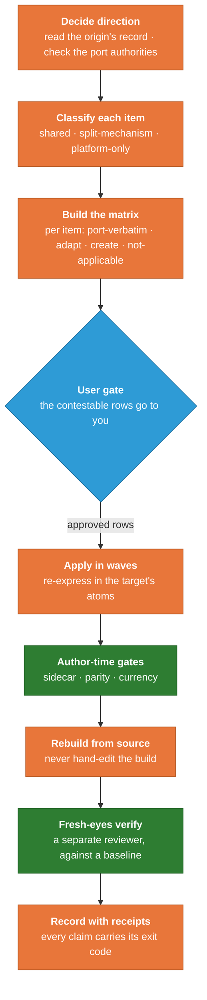

# CROSS_PORTING_GUIDE.machine.md — Porting an Improvement Across the Twin (the cross-porting workflow, worked through a real example)
# STATUS: CURRENT (2026-07-30). Machine root of the CROSS_PORTING_GUIDE guide; human twin in ../human_md/. TWIN CURRENCY RE-VERIFIED 2026-08-09 (PC6b): this root was NOT touched by the 2026-08-09 payload restructure and the twin is LEVEL — probed root-against-twin for every restructure-sensitive token and the two agree hit-for-hit, the sole numeric coincidence (`53`) being a quoted historical incident on both sides, not a roster count.
<!-- SPDX-License-Identifier: MIT · Copyright (c) 2026 Neill Prohaska <forest.microclimate@gmail.com> -->
# FORM: machine-md · durable reference · primary reader = LLM · atom-preserving translation of the human twin (INVARIANT.convert: every rule/fact/step kept; only packaging changes). RESTS ON: the three tiers laid out in the companion twin-architecture guide (assumed, not re-taught). WORKED CASE throughout = **the J-series**, the pass that carried the Claude Code writing-engine upgrades back into the Claude Science bundle.

# ─── PREMISE (a port is not a copy) ────────────────────────────────────────
PREMISE.not-a-copy: suppose you improved something on one side of the twin — the writing detectors on Claude Code just got sharper + you want Claude Science to gain the same sharpening. The move that suggests itself is to copy the improved file across. Do that + you will most likely break it in a way that makes NO noise, because a Claude Code hook or a Claude Science delegation call pasted into the wrong platform cannot run where it lands + the discipline it carried dies quietly. Porting across the twin is NOT a copy — it is a short, ordered workflow whose whole purpose is to move the improvement without dragging a mechanism into a place it cannot execute.
FACT.j-series-teaches: every step below is illustrated by what happened in the J-series pass, INCLUDING where the close went wrong + had to be corrected, because that teaches the final rule better than any tidy version could.

# ─── §0 THE SHAPE OF THE WORKFLOW ──────────────────────────────────────────
SHAPE.fixed-sequence: the workflow is a fixed sequence with ONE point where it pauses for your judgment — decide the direction of the port, classify each item into a tier, lay the items out in a matrix, bring the contestable rows to the user, apply the approved rows in waves, run the target's gates, rebuild from source, verify with fresh eyes, + record the result. The figure marks the user gate as the one place the work waits on a human decision + sets the two checking steps apart from the doing steps. The rest of this guide walks that diagram one step at a time, with the J-series showing each step in practice.

<!--FIG: The cross-porting workflow: from deciding the direction to recording the result, with the single point where the work pauses for your judgment. | 78% -->

# ─── §1 DECIDE THE DIRECTION, AND CHECK THE REGISTRIES ─────────────────────
RULE.direction-not-fixed: port direction is NOT fixed. Shared content can originate on either carrier + flow to the other, so the first thing you settle is which side is the origin — + you settle it by READING the origin's own record rather than assuming a habitual direction. EX (J-series): the writing engine had advanced on Claude Code, where a detector-upgrade pass had split + extended the checks, while Claude Science had not followed ⇒ Code was the origin, Science the target, + the port flowed from Code to Science.
RULE.check-authorities: before you act on a direction you check the port-direction authorities. One document owns the question of whether a given Science feature should cross to Code at all. A second — the record of Science skills deliberately not ported back — lives in a historical tree OUTSIDE this mirror + is not readable from here; where that record comes up, that is exactly what to say about it rather than guessing at its contents.

# ─── §2 CLASSIFY INTO A TIER, THE SAME SESSION ─────────────────────────────
RULE.tier-before-edit-same-session: every item you might port gets a tier BEFORE it gets an edit, + it gets that tier in the SAME session, while the platform reasoning is fresh. EX (J-series): the detector upgrades were SHARED-tier work, because the detector engine is shared exactly across both sides + mirroring a change to it is a standing obligation that had simply come due. The per-profile self-scan clause was SPLIT-MECHANISM work, carried as an always-on rule on Code + a per-profile clause on Science. The install-time coupling gate was PLATFORM-ONLY, a Code build mechanism with no Science object to act on, so it was never a candidate to port.
WHY.name-tier-first: naming the tier first is what tells you, for each item, whether you are mirroring it, re-expressing it, or leaving it alone.

# ─── §3 BUILD THE ADAPTATION MATRIX ────────────────────────────────────────
DEF.matrix: with the tiers assigned you lay the items out in an adaptation matrix, ONE row per item. Each row carries a DISPOSITION — one of port-verbatim, adapt, create, or not-applicable; where the disposition is adapt, the row says HOW + into which target primitive. Each row also carries a target path, its sync-tier, + a JUDGMENT FLAG raised wherever the question "does this even belong on the other side" is genuinely contestable rather than mechanical.
RULE.matrix-read-only-first: the matrix is authored READ-ONLY, from the primary record, BEFORE a single edit lands on the target.
EX.paid-off-twice: that discipline paid off twice in the J-series before anything was changed — reading the actual files caught (1) a sync note gone stale, a line asserting the two detector engines were byte-identical when the record showed they had DIVERGED (Code had advanced, Science had not), + (2) that the Science planner still carried a rule Code had already retired. Both were found by reading the record rather than trusting a description of it — the entire reason the matrix step comes before the editing steps.

# ─── §4 THE USER GATE ──────────────────────────────────────────────────────
RULE.judgment-rows-to-user: the rows flagged as judgment calls go to you BEFORE any of them is applied. This is the one deliberate pause in the workflow + it exists to separate the two kinds of decision a port contains: the MECHANICAL disposition (which primitive a thing maps to + where its target file sits) an analyst can settle alone; the JUDGMENT of whether a change makes sense on the other side at all is yours, + burying it inside an apply-wave would turn a real decision into a silent one.
EX.seven-of-eleven: seven of the eleven J-series rows were judgment calls. The sharpest was whether a message-steering correction written for Claude Code belonged on Claude Science at all, given that the asynchronous Science interface never had the limitation the correction was written to fix. Bringing that to you as an explicit choice, rather than porting it on autopilot, is the gate doing its job. You trimmed the set: fold some conventions into skills that already existed, create one new standalone skill, port one portable document, + hold the rest.

# ─── §5 APPLY IN WAVES, RE-EXPRESSING IN THE TARGET'S ATOMS ─────────────────
MECH.waves: the approved rows become apply-waves, each routed to a separate subagent, with the sources kept disjoint so the waves run in PARALLEL. The J-series ran three at once: the kernel back-port, the profile edits, + the new skills + folds.
RULE.re-express-not-copy: every wave RE-EXPRESSES its content rather than copying it. EX: the Code detector engine is driven from a command line, while the Science kernel (the module Science loads automatically) has NO command line at all, so the port dropped the command-line entry block + renamed a helper whose leading-underscore name the Science loader forbids, arriving at the same functions through the platform's own door. The always-on rule became a per-profile clause. The subagent-tool steering became the Science delegation call.
EX.kernel-crux: the kernel back-port, the crux wave, shows in one stroke why re-expressing beats copying — the Science skill being updated already carried a self-scan section that the Code original did NOT have. A wholesale copy of the Code file over the Science one would have DELETED that section without anyone deciding to delete it. Instead the merge was surgical: the new detectors went in, the Science-only section stayed, + nothing was amputated. Re-express, + you keep what the target already got right; copy, + you overwrite it blind.

# ─── §6 THE GATE BATTERY, AND THE HONESTY RULE ─────────────────────────────
DEF.two-gate-kinds: before a wave's output can be trusted it runs the target's gates, + you have to know which gates can actually run from where you are standing. AUTHOR-TIME gates run against the source in the repository: the sidecar contract that checks each kernel will load, the parity checks that confirm the built bundle is a faithful function of its source, the currency self-test. SHIP-TIME gates cannot run from the repository at all, because they need a live catalog, a cut release, or a served installation to check against.
RULE.honesty: the honesty rule governs the difference — you NAME which gates ran, you never report a gate green that you were unable to run, + you make every claim of "verified" or "passed" carry its RECEIPT (the exit code or the diff or the hash) in the same breath as the claim itself. A gate you could not run is not a gate that passed — it is a gate whose result you do not have, + saying otherwise manufactures a confidence no one inspected.

# ─── §7 REBUILD FROM THE SOURCE, NEVER THE BUILD ───────────────────────────
RULE.rebuild-from-source: a Science change is not finished when its source is edited, because the artifact that actually ships is the built bundle + the bundle is regenerated from the source. You NEVER hand-edit the built bundle, since an artifact edited by hand stops being a function of its inputs + parity can no longer be checked against anything.
CMD.rebuild: the rebuild command is fixed. Every path in this tree contains spaces, so the standing rule is to quote every path in every command; the rebuild itself is run from the bundle directory, where its arguments are plain local names:
`python3 build_crt_science_bundle.py --src bundle_src --config build_config.json --out crt_science_bundle.json`
followed by the parity check in its build mode.
TRAP.bare-builder: run the builder BARE, without those three arguments, + it does not build a stale copy or guess at defaults — it stops with a usage error + builds NOTHING, a detail that looks pedantic here + matters a great deal at the final step.

# ─── §8 VERIFY WITH FRESH EYES ─────────────────────────────────────────────
RULE.fresh-eyes: whoever built a thing is a poor judge of whether it is right, so verification is a SEPARATE pass, by a separate reviewer, against a known baseline. EX (J-series): that reviewer built the bundle into a sandbox — leaving the committed target untouched + PROVING it untouched with a hash — then re-derived the kernel port independently + read every changed profile, skill, + fold against BOTH the baseline + the source it came from.
VERDICT.ship-with-fixes: the verdict was SHIP-WITH-FIXES. The port was faithful + every atom was preserved, with three small currency defects to clear first — the most serious a bundle that would otherwise have shipped a note reading "51 skills" over a TRUE count of fifty-three. None of the three touched the logic; all three were the kind of stale label that goes wrong precisely because no gate recomputes a sentence.

# ─── §9 RECORD THE RESULT, WITH RECEIPTS ───────────────────────────────────
INCIDENT.false-close: the last step writes down what happened + is where the receipts rule earns its keep, so tell the J-series close exactly as it went. The first attempt to close the port wrote into the record that the bundle was "rebuilt at 53, gates green." The printed output sitting directly above that sentence said OTHERWISE: the build had exited with an error + the count still read fifty-one. The BARE-BUILDER trap from two steps earlier had sprung — the build command had been run without its arguments, had stopped at the usage error, + had built nothing, + the closing sentence had been written from what its author INTENDED, not from what the record in front of them actually said.
WHY.caught-same-turn: it was caught the same turn, precisely because the receipts rule requires the receipt to travel BESIDE the claim, so the contradiction sat in plain view the moment the claim was written. A second slip hid in the same block: a line reporting "parity exit: 0" had actually read the exit code of a `tail` command at the end of a pipeline rather than the gate's own exit code.
FIX.real-receipts: once the build was run correctly, the real receipts went into the record in full — the build wrote the bundle at fifty-three skills + exited clean, the parity gate passed, the sidecar check passed, + a corrective entry SUPERSEDED the false one on the record rather than quietly erasing it.
LESSON.receipt-beside-claim: the lesson lands harder as an incident than as a maxim — a claim is only ever as trustworthy as the receipt beside it, + a sentence written from intent will contradict the record about as often as intent + reality diverge, which is often enough that the discipline has to be MECHANICAL rather than earnest.

# ─── §10 WHAT GENERALIZES ──────────────────────────────────────────────────
GEN.any-two-platform-move: strip away the specifics + the workflow ports to any move of shared content across two platforms — a framework migration, a shared library vendored into two applications, a fix that has to flow from either copy back into the other. Each is better served by a per-item DISPOSITION TABLE with a human review of the contestable rows than by a blind copy that silently mis-transforms the cases no one looked at. Re-express in each dialect instead of pasting one across. Verify against a baseline with fresh eyes. Let no claim outrun its receipt.
GEN.specific-is-furniture: what is specific to this twin is only the FURNITURE — the exact gate names, the one rebuild command with its three arguments, the contract a Science kernel has to satisfy to load. That furniture changes from project to project. The ORDER of the steps, + the discipline of never letting a copy stand in for a re-expression or a claim stand in for a receipt, is what you carry with you.
