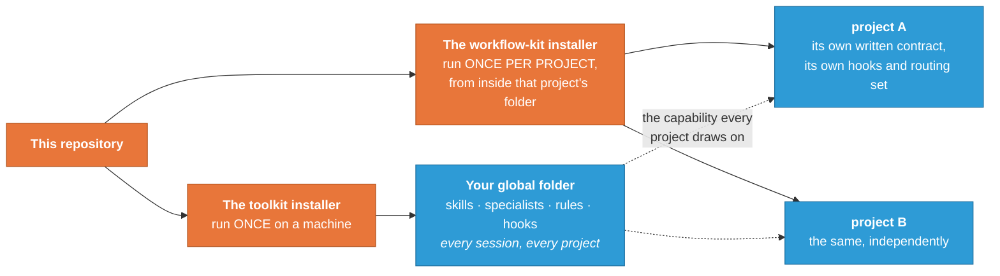

<!-- SPDX-License-Identifier: MIT · Copyright (c) 2026 Neill Prohaska <forest.microclimate@gmail.com> -->
# CC-CS Research Toolkits

**One research methodology, carried on two agent platforms.**

A research job too big for one assistant's working memory has to be split across several, and the
split is where the work quietly goes wrong: results that were never written down, fixes whose effect
nobody measured, claims nobody checked. This repository holds a single body of research practice —
decomposing and routing a piece of work, checking a claim against the record instead of asserting it,
and writing so a reader can follow — together with the two toolkits that carry that practice onto the
two platforms it runs on. What you get is a working loop for supervising the split, the guardrails
that keep it honest, and installers that put both toolkits on your machine.

The two platforms differ in one way that generates everything else. **Claude Code** runs as a program
on your own computer, with real files, a real shell, and checks that can stop an action before it
happens. **Claude Science** runs in a sandbox you reach through a browser, with no such checks, a
software interface for handing work to sub-agents, and a reviewer that reads each turn afterwards.
The **Claude Code Research Toolkit (CCRT)**
expresses that practice in Claude Code's own primitives: files under `~/.claude/`, always-on rules,
hooks that fire on real events, and subagents. The **Claude Science Research Toolkit Bundle
(CSRTB)** expresses the same practice in Claude Science's primitives: skills, agent profiles, and
kernel gates installed into an account from a repl cell. The methodology is authored once, so it
cannot fork; each mechanism stays native to the platform it runs on. That means the two sides do
*not* match line for line, and most of the differences are design rather than gaps.
[`TWIN_ARCHITECTURE`](Documentation/human_md/TWIN_ARCHITECTURE.md) explains how to read any
difference correctly, and is the place to start if you plan to change either side.

Beside the twin sit a portable per-project operating kit and a set of human-facing guides.

## What is here

| Path | What it is |
|---|---|
| [`CCRT/`](CCRT/) | The Claude Code toolkit: skills, agents, rules, hooks, and an idempotent installer that writes into `~/.claude/`. The planner-kit ships inside it, and so does `CCRT_specialists/`, the domain set you install by hand. |
| [`CSRTB/`](CSRTB/) | The Claude Science bundle: skills, agent profiles, and fail-closed kernel gates, installed into a Science account from a repl cell. |
| [`Documentation/`](Documentation/) | The five cross-toolkit guides, in reading order: the twin architecture, cross-porting, the roster comparison, model substitution and verified launch, and the assurance architecture. |
| [`CCRT/planner-kit/`](CCRT/planner-kit/) | A portable kit that teaches any project root how to run a supervised multi-agent job. Its own installer runs per project, separately from the CCRT's global one. |
| [`Documentation/PDF/WORKFLOW_GUIDE.pdf`](Documentation/PDF/WORKFLOW_GUIDE.pdf) | The workflow itself: the planner-and-subagents loop, and how you steer it. |

## Quick start

Two installers live here and they do different jobs. Installing the toolkit equips a *machine*:
run it once, and every session on that computer gains the shared specialists, methodology
documents, rules, and hooks. Installing the planner kit equips a *project*: run it from inside
each project root that adopts the supervised workflow, and it writes that one project's own
operating contract. Installing the wrong one in the wrong place is the first mistake available
here, so the picture below separates them.



The one takeaway: the machine-wide install happens once and is drawn on by every project, while
the per-project install is repeated in each project and never leaves it.

**Claude Code.** From this repository:

```bash
cd CCRT
bash install.sh --all        # add --dry-run first to preview every action, writing nothing
```

Then start a new Claude Code session: rules, skills, agents, and hooks are read at startup. `--all`
is the full replica and includes the personal tier — model, theme, effort level, and the planner
default persona. With no tier flag the installer writes the universal set instead (core, ergonomics,
and the folded memories) and leaves machine-specific defaults alone. The tier table, the selection
flags, and the interactive picker are in [`CCRT/README.md`](CCRT/README.md).

**Claude Science.** Upload `crt_science_bundle.json` and `install_crt_science.py` into your Science
project, then run one repl cell:

```python
exec(open("install_crt_science.py").read()); install_crt_science()
```

That is the non-destructive default. The paste-ready block with its acceptance probes is
[`CS_INSTALL_STARTER_v2.11.md`](CSRTB/CS_INSTALL_STARTER_v2.11.md),
and [`CSRTB/README.md`](CSRTB/README.md) orients you first.

## What is inside, by the numbers

Counted from the trees in this repository, not copied from prose:

- **CCRT** — **33 skills** and **16 agents**, plus 16 always-on rules and 4 slash commands.
  (`ls payload/skills` returns 33 directories, each holding a `SKILL.md`; `payload/agents` holds 16
  `.md` files.)
- **CSRTB** — **57 skills** and **21 profiles**, of which **19 skills carry a `kernel.py` sidecar**
  of fail-closed gate functions. (All three read from the built `crt_science_bundle.json`, whose
  `counts` field reports 57 and 21; the same totals come back from counting `bundle_src/skills` and
  `bundle_src/profiles`, and 19 entries carry `has_sidecar`.)

The totals differ by design, and a matched pair would tell you nothing: every delta traces to a
platform-only item, a role carried in a different form on each side, or a mechanism that only one
platform can host. Counts also drift as the toolkits grow, so recount from the trees before citing a
number rather than trusting one written into prose.

**The Claude Code specialists come in two trees, and the installer places only one of them.** The
counts above are the *general* payload — the cross-domain set that `install.sh` writes into
`~/.claude/`. Beside it sits `CCRT/CCRT_specialists/`, the *domain* set: ecosystem and
plant-physiology modeling, micrometeorology, scientific machine learning, phyllosphere microbial
ecology, philosophy of technology and AI safety, and the probes used to measure the toolkit's own
model dispatch — 18 specialists and 21 skills across four buckets, counted from the toolkit source on
9 August 2026. You install those by copying the ones you want with `cp`, into `~/.claude/` for every
session or into one project's `.claude/` for that project alone; there is no installer flag, and the
flags that once did this now exit with an error naming the folder instead. That folder's own
`README.md` carries the copy commands and the one caveat that catches people: its depth varies, so
list a bucket before copying rather than assuming it holds `agents/` and `skills/` directly.

The split is not housekeeping. The installed payload goes to every user's machine unchanged, so it
must carry no single project's vocabulary — a site code, an instrument, a particular model codebase —
and a gate enforces that by failing the install when such a token survives in payload text. Domain
specialists are useful precisely because they name those things. Keeping them beside the payload
rather than inside it, and installing them by hand, is what lets the shipped payload stay generic
while the specialists keep the vocabulary that makes them worth having.

## Documentation

Every human-facing guide is maintained as a triple — a machine-readable root that is authoritative, a
human translation derived from it, and a rendered PDF.

- [`Documentation/`](Documentation/) holds the five cross-toolkit guides. Read them in this order;
  the PDFs in [`Documentation/PDF/`](Documentation/PDF/) carry the same order in their filenames.
  1. **The twin architecture** (`00_TWIN_ARCHITECTURE.pdf`) — why the two sides diverge, and how to
     read any difference between them correctly. Start here if you plan to change either side.
  2. **The cross-porting guide** (`01_CROSS_PORTING_GUIDE.pdf`) — how to move an improvement from
     one side to the other without dragging a mechanism into a place it cannot run.
  3. **The roster comparison** (`02_TOOLKIT_ROSTER_CCRT_vs_CSRTB.pdf`) — what each side carries,
     item by item, and which specialists and skills are designed to compose.
  4. **Model substitution and verified launch** (`03_MODEL_SUBSTITUTION_AND_VERIFIED_LAUNCH.pdf`) —
     one measured failure, in which subagents were answered by a model nobody asked for, and the
     working construction built around it.
  5. **The assurance architecture** (`04_ASSURANCE_ARCHITECTURE.pdf`) — the five kinds of safeguard
     these toolkits use, which one just acted on you, and where a check of your own belongs.
- Each toolkit also ships its own set. Claude Code's lives at
  [`CCRT/payload/docs/`](CCRT/payload/docs/)
  — a quickstart, a full usage guide, and a 12-document `advanced/` set on the extension
  architecture. Claude Science's lives at
  [`CSRTB/docs/`](CSRTB/docs/)
  — front door, quickstart, full reference, and architecture.
- The planner kit ships inside the Code toolkit at [`CCRT/planner-kit/`](CCRT/planner-kit/). Install
  the CCRT once into `~/.claude` for the global capability, then run the kit's own `install.sh`
  separately in each project root that adopts the supervisory workflow; the two installers are
  deliberately separate — global capability on one side, per-project workflow on the other — and are
  designed to be used together. The kit's reasoning and its step-by-step adoption walkthrough are in
  [`CCRT/planner-kit/docs/`](CCRT/planner-kit/docs/).

If you are new here, read [`WORKFLOW_GUIDE.pdf`](Documentation/PDF/WORKFLOW_GUIDE.pdf) for the working loop, then
[`TWIN_ARCHITECTURE`](Documentation/human_md/TWIN_ARCHITECTURE.md) for the architecture, then the
quickstart for whichever platform you use.

## License

MIT — see [`LICENSE`](LICENSE). Every source and documentation file carries the same grant in its own
comment syntax (`SPDX-License-Identifier: MIT`); data and binary files are covered by the root
`LICENSE` alone.

## Authorship

This toolkit was developed by Neill Prohaska, using Claude (Anthropic's AI assistant) extensively
as a development tool — and the package's own methodology to build itself. Claude is a tool here,
not an author, contributor, or endorser in any official capacity; this repository is not an
Anthropic product and has no affiliation with Anthropic. All content is the work and responsibility
of the copyright holder: © 2026 Neill Prohaska, MIT License.
